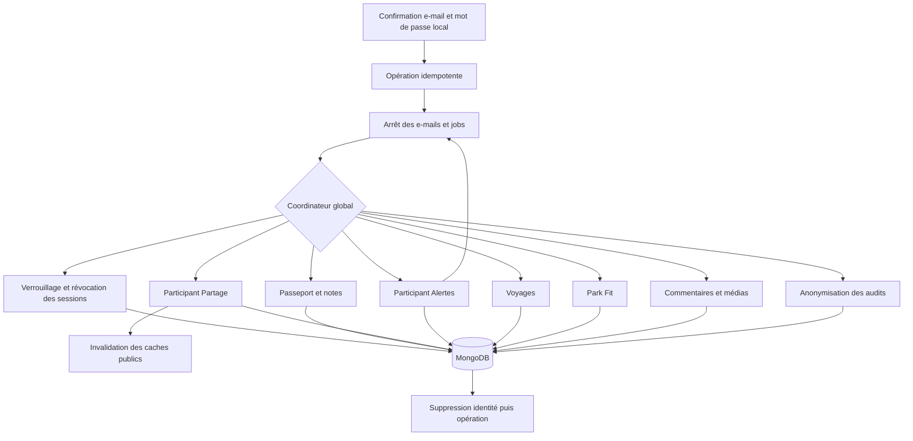

# QUAL-04 — Matrice confidentialité, export et suppression

> Date : 29 septembre 2026  
> Version initiale : 5.4.23
> Couverture export actualisée : 3 octobre 2026, version 5.4.95
> Couverture suppression actualisée : 3 octobre 2026, version 5.4.96
> Portée : inventaire transverse des données personnelles persistées et garde-fou CI  
> Effet sur MongoDB : création automatique de la collection transitoire `account-deletion-operations` et de son index unique

## 1. Résultat métier

QUAL-04 établit un contrat commun pour les données personnelles. QUAL-11 a fermé
l’écart d’export et QUAL-12 ferme désormais l’écart de suppression globale sans
faire coexister deux systèmes de cycle de vie.

Le catalogue versionné couvre actuellement :

- 8 surfaces métier ;
- 117 documents MongoDB ou documents imbriqués ;
- 1 107 champs persistés déclarés dans le code ;
- les champs techniques hérités `Id`, `CreatedAt` et `UpdatedAt`, qui suivent la
  politique de rétention et de suppression de leur document ;
- les 12 dimensions exigées par la roadmap pour chaque champ : finalité,
  nécessité, visibilité, base ou consentement, rétention, export, suppression,
  sous-traitant, analytics, chiffrement, accès support et journal.

Le fichier de référence est
[`docs/privacy/personal-data-catalog.json`](../privacy/personal-data-catalog.json).
Chaque champ d'un document recensé hérite de la politique explicite de sa surface.
L'empreinte de la forme persistée empêche l'ajout silencieux d'un champ après la
revue.

## 2. Matrice de couverture actuelle

| Surface | Visibilité par défaut | Export actuel | Suppression actuelle | Écart principal |
| --- | --- | --- | --- | --- |
| Compte et accès | privée | export fédéré JSON/CSV, sans secret ni identifiant fournisseur | sessions révoquées puis identité supprimée en dernier | durées légales d’audit à maintenir |
| Passeport et notes | privée | export fédéré canonique, sans identifiants internes | purge coordonnée ; notes supprimées par le cas d’usage qui recalcule les agrégats | aucune |
| Partages et comparaisons | désactivée, projection explicite | inclus avec références locales, sans jeton public | participant idempotent raccordé au coordinateur | aucune |
| Favoris et alertes | privée | inclus avec libellés lisibles | participant avec fence raccordé au coordinateur | aucune |
| Voyages | privée aux membres admis | tous les plans accessibles regroupés en format portable | voyages possédés supprimés, participation et préférences retirées ailleurs | impact sur les autres membres expliqué par la propriété du voyage |
| Profils Park Fit | privée | tous les profils du membre regroupés | tous les profils possédés sont purgés | aucune |
| Contributions et support | brouillon privé, publication explicite | commentaires, textes et métadonnées média, signalements historiques et partages regroupés ; demandes sans lien de compte remises séparément | contributions, documents média et binaires rattachables purgés | demandes sans lien de compte traitées séparément |
| Administration et audit | rôles habilités uniquement | exclusion justifiée ou remise séparée | références personnelles anonymisées, preuves opérationnelles conservées | durées chiffrées à formaliser |

## 3. Fonctionnement réel de la suppression

Le coordinateur QUAL-12 réutilise les participants Partage et Alertes et les cas
d’usage de notes existants. Il n’effectue pas une simple suppression du document
utilisateur : il coupe l’accès, purge les données produit, anonymise ce qui doit
rester pour l’intégrité des audits, puis supprime l’identité en dernier.



Le job ne contient que l’identifiant de l’opération transitoire. L’identifiant du
membre reste isolé dans cette opération, protégée par une clé unique hachée, puis
le document est supprimé après succès. Un nouvel essai retrouve la même opération
et les participants tolèrent la reprise après exécution partielle.

## 4. Garde-fou automatisé

Le contrôle `privacy:catalog` est exécuté dans la CI de production avant les tests
Angular. Il :

1. charge le catalogue ;
2. vérifie les 12 dimensions de chaque surface ;
3. lit les propriétés persistées des documents C# ;
4. recalcule une empreinte stable par surface à partir du nom sérialisé BSON, du
   type, de la nullabilité, du caractère requis et des attributs de persistance ;
5. échoue si un document ou un champ a changé sans nouvelle revue ;
6. recherche dans tous les documents MongoDB les marqueurs probables de données
   personnelles (tout suffixe `UserId` ou `UserEmail`, e-mail, IP, jeton, texte
   privé, etc.) ;
7. échoue si un document détecté n'est ni classé ni exclu avec une justification.

Les tests prouvent aussi qu'une dimension supprimée ou une empreinte non revue est
refusée. Une actualisation volontaire se fait après revue humaine avec :

```bash
node tools/privacy/check-personal-data-catalog.mjs --refresh-reviewed-shapes
```

Le changement d'empreinte reste visible dans la PR et doit être accompagné de la
mise à jour de la politique lorsque la finalité ou la visibilité évolue.

## 5. Évolution QUAL-11 : export fédéré du compte

Depuis la version 5.4.95, le moteur asynchrone d'export du Passeport produit un
export fédéré unique au schéma `amusement-park-account` v5. Le membre le demande
depuis son profil ou son Passeport ; le traitement reste borné en taille, expire
automatiquement et n'introduit pas un second moteur concurrent.

L'archive JSON ou CSV rassemble l'identité lisible, les connexions externes sans
identifiant fournisseur, les notes globales, le Passeport, ses partages et
alertes, les voyages accessibles, les profils Park Fit et les contributions
rattachables au compte. Les références entre fichiers sont locales à l'archive.
Les identifiants MongoDB, identifiants de compte, jetons, hashes, secrets et URL
susceptibles de révéler une cible interne n'y figurent jamais.

Deux limites restent explicites : le binaire original des médias n'est pas copié
dans l'archive structurée, qui contient leurs métadonnées et textes ; les demandes
de contact et signalements Park Fit dont le schéma ne porte aucun identifiant de
membre ne peuvent pas être associés automatiquement. Leur accès éventuel passe
par une demande support vérifiée. Les journaux administratifs ou de sécurité
restent exclus ou remis séparément après revue afin de protéger les tiers et le
service.

## 6. Évolution QUAL-12 : suppression globale

Depuis la version 5.4.96, le profil contient une zone de danger volontairement
repliée. Le membre doit recopier son adresse exacte ; un compte avec mot de passe
doit aussi fournir son mot de passe courant. Un compte exclusivement externe ne
doit pas inventer de mot de passe.

L’API répond `202 Accepted` après avoir créé l’opération durable. La session locale
est effacée immédiatement, tous les refresh tokens sont révoqués et le compte est
verrouillé. Le worker reprend ensuite jusqu’à douze fois la même opération lourde,
avec une seule suppression globale simultanée par instance.

Les notes passent une par une par `DeleteUserRatingCommandHandler`, de sorte que
les agrégats, preuves et classements publics soient recalculés. Les projections de
partage sont révoquées avant purge, les abonnements d’alerte sont clôturés derrière
leur fence, les voyages possédés sont supprimés avec leurs enfants et le membre
est retiré des autres collaborations. Les médias possédés sont supprimés du
stockage binaire et de MongoDB. Les références d’administration indispensables
sont anonymisées au lieu d’empêcher l’effacement du produit.

## 7. Ce que QUAL-04 ne prétend pas avoir livré

- pas de durée légale inventée pour les audits ou demandes de support ;
- pas de modification de la visibilité d'une visite, d'un voyage ou d'un profil ;
- pas d’association automatique des demandes de support dont le schéma ne porte
  aucun identifiant de membre ;
- pas de suppression des preuves opérationnelles anonymisées qui restent
  nécessaires à l’intégrité du service.

Le travail continu de cycle de vie consiste à définir des durées chiffrées validées
pour le support et l’audit et à raccorder toute nouvelle surface personnelle au
coordinateur et à ce catalogue dans la même PR.

## 8. Exploitation

- la collection et son index sont créés automatiquement au démarrage, sans script
  MongoDB manuel ;
- déployer l’API avant ou avec le frontend afin que l’action soit acceptée ;
- un rollback du frontend masque l’action, mais les opérations déjà acceptées
  doivent continuer à être traitées par l’API ;
- surveiller les jobs `account-deletion`, leurs reprises et dead letters ;
- toute nouvelle collection personnelle doit rejoindre une surface existante ou
  créer une surface avec les 12 dimensions avant fusion ;
- une exclusion de découverte est réservée aux faux positifs démontrés et doit
  rester explicitement justifiée.
