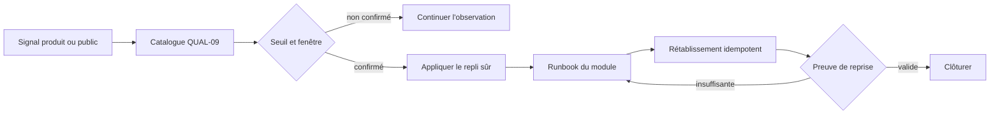
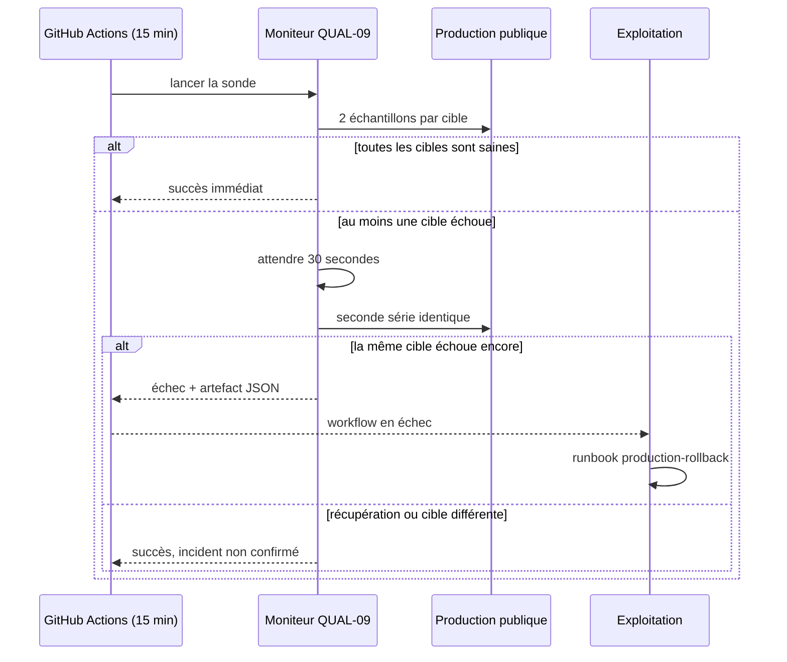

# QUAL-09 — Runbooks et alerting opérables

Date : 30 septembre 2026

Version : 5.4.34

Statut : implémenté

## 1. Résultat métier

Une anomalie n'est plus seulement un écran rouge ou une ligne de log. Les neuf
incidents exigés par la roadmap possèdent maintenant un propriétaire, un seuil,
une fenêtre de confirmation, un repli qui préserve les données et une preuve
explicite de retour à la normale.

La disponibilité publique est sondée automatiquement toutes les quinze minutes.
Un runner ne déclenche l'alerte qu'après avoir observé la même cible en échec deux
fois à trente secondes d'intervalle. Le rapport complet devient un artefact du run
GitHub ; un incident confirmé fait échouer le workflow et utilise donc le canal de
notification d'exploitation déjà attaché au dépôt.

## 2. Autorité commune

[`catalog.json`](../operations/incidents/catalog.json) relie les incidents
`RANK`, `PASS`, `SHARE`, `WATCH`, `LIVE` et `QUAL` à leur runbook. La CI refuse :

- un des neuf incidents absent ou dupliqué ;
- un seuil, une fenêtre, un propriétaire, un repli ou une preuve de reprise vide ;
- un chemin de runbook extérieur au dossier opérationnel ;
- un runbook privé d'une étape de protection, diagnostic ou vérification ;
- une cible automatique liée à un incident déclaré manuel ;
- une alerte confirmée en une seule tentative.

Ce manifeste ne déplace aucune règle métier : il décrit l'exploitation des
diagnostics dont les modules restent propriétaires.



## 3. Détection honnête

Trois modes sont distingués :

- `automated` pour les six cibles publiques mesurables sans compte ;
- `admin-diagnostic` lorsque le signal existe dans un panneau spécialisé ;
- `support-escalation` lorsqu'une preuve privée exige une analyse humaine.

Le jalon n'invente donc ni métrique globale ni accès administrateur automatisé.
Les sondes publiques couvrent accueil, parcs, classements, Park Fit, santé API et
capacités publiques. Elles contrôlent statut, transport, p95 et taille maximale.
Park Fit étant rendu côté client, la sonde charge en plus tous ses scripts et
modules préchargés same-origin, retrouve l'import dynamique de la route exacte et
charge son chunk paresseux. Chaque téléchargement reprend le timeout de huit
secondes, les actifs sont lus par lots bornés de quatre et les imports statiques
transitifs sont parcourus avec un plafond de 64 nouveaux bundles. Une coquille HTML
200 sans graphe JavaScript exécutable ne peut donc pas déclarer ce parcours sain ni
épuiser silencieusement la fenêtre globale du job.

## 4. Séquence d'alerte publique



## 5. Coût, sécurité et confidentialité

Le moniteur n'installe aucune dépendance et n'ajoute aucun service au VPS. Une
exécution saine produit douze mesures de référence, une lecture supplémentaire de
la coquille Park Fit et le téléchargement de ses bundles same-origin, y compris le
chunk dynamique de la route ; la seconde série n'a lieu qu'après un échec. Aucun
compte, cookie, jeton, query string ou
contenu privé n'est collecté. Les rapports sont conservés trente jours dans les
artefacts GitHub.

Les runbooks imposent la minimisation des preuves : trace IDs, routes modèles,
versions, compteurs et heures UTC, jamais les commentaires, e-mails, jetons ou
exports d'un membre.

## 6. Repli et limites

- LIVE utilise le kill switch commun `live:public-experience`.
- Un classement conserve le dernier snapshot publié valide.
- Une distribution WATCH est suspendue sans effacer les abonnements.
- Une visite, un export ou une purge ne sont jamais recréés manuellement.
- Un partage révoqué et un incident cross-user déclenchent le parcours privacy.
- Le rollback suit le journal transactionnel et ne devine jamais la paire saine.

GitHub Actions constitue le canal d'alerte actuel. Le jalon ne promet pas un pager
externe ni un SLA 24/7 qui n'existent pas. Une future intégration devra consommer
le même catalogue au lieu de créer un second système.

## 7. Vérification

Depuis `FRONT/AmusementPark` :

```bash
npm run operations:readiness:test
npm run operations:readiness
```

Le workflow `Production observability` peut aussi être lancé manuellement. Son
artefact `production-alert-report` contient toutes les tentatives et associe chaque
cible confirmée au runbook `production-rollback`.

## 8. Données et migration

Aucune collection, aucun index et aucune migration MongoDB ne sont ajoutés. Aucun
contrat public ou privé de l'application ne change. Le retrait du jalon consiste à
désactiver le workflow planifié ; les runbooks restent une documentation sans effet
sur les données.
