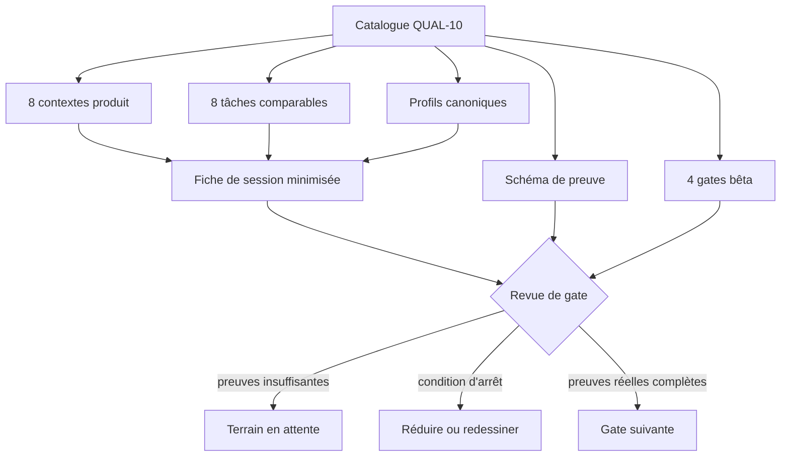
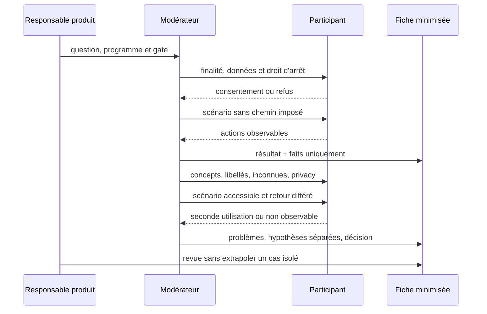

# QUAL-10 — Protocoles bêta et recherche comparables

Date : 30 septembre 2026

Version : 5.4.37

Statut : implémenté

## 1. Résultat métier

Les huit programmes produit peuvent désormais être testés avec la même discipline
sans attendre qu'une communauté soit disponible. `RANK`, `PASS`, `SHARE`, `FIT`,
`WATCH`, `TRIP`, `HIST` et `LIVE` disposent chacun d'une question métier, d'un
premier succès, de profils ciblés, d'un contexte pour les huit tâches communes, de
conditions d'arrêt et de preuves propres à leur généralisation.

Le jalon distingue explicitement deux états :

- **protocole prêt** : l'équipe peut organiser une session reproductible ;
- **preuve terrain en attente** : aucune valeur répétée ni validation utilisateur
  n'est revendiquée en l'absence d'observations consenties.

La seconde information ne bloque pas les travaux techniques et métier
indépendants. Elle interdit en revanche de déclarer une gate terrain acquise ou de
généraliser un produit sans preuves réelles.

## 2. Autorité unique

[`catalog.json`](../product/research/catalog.json) est l'autorité structurée. Il
porte :

- sept profils canoniques, dont usage clavier/technologie d'assistance et appareil
  ou réseau modeste ;
- huit tâches dans un ordre stable ;
- dix dimensions de synthèse séparant faits, problèmes, hypothèses, décisions et
  éléments non conclusifs ;
- quatre gates de bêta ;
- les contextes et critères spécifiques des huit programmes.

Le [guide commun](../product/research/README.md) explique la conduite d'une session
et la [fiche minimisée](../product/research/session-result-template.md) fixe le
format de synthèse. Le protocole historique du Passeport est référencé comme
extension de `PASS` : il ne redéfinit ni les statuts, ni les profils, ni les gates.



## 3. Comparabilité sans uniformiser le métier

Les tâches restent identiques, mais leur objet vient du contexte du programme.
Ainsi, `unknown-data` vérifie un rang sans volume suffisant dans `RANK`, une date
approximative dans `PASS`, une lacune de critère dans `FIT`, une source trop
ancienne dans `LIVE` ou un intervalle historique incertain dans `HIST`.

| Programme | Décision principale observée | Distinction critique |
|---|---|---|
| RANK | comprendre un ordre publié | moyenne, score, rang, absence de rang |
| PASS | tenir un journal réutilisable | note globale, visite, tour |
| SHARE | publier en maîtrisant la portée | privé, public, révoqué |
| FIT | réduire un choix honnêtement | préférence, incompatibilité, inconnue |
| WATCH | suivre un fait contrôlable | favori, abonnement, notification |
| TRIP | décider à plusieurs | rôle, proposition, décision |
| HIST | explorer une évolution sourcée | actuel, historique, approximatif |
| LIVE | agir avec une donnée fraîche | observation, historique, prévision |

Chaque programme exige les profils `assistive-technology` et
`modest-device-network`. Les contrôles mobile, clavier et réseau faible restent
donc une partie du protocole, pas une vérification facultative ajoutée après la
validation fonctionnelle.

## 4. Séquence d'une session



Les résultats autorisés sont `unassisted`, `assisted`, `failed` et
`not-observable`. Cette dernière valeur évite de transformer prématurément une
seconde utilisation ou un événement différé en échec ou en succès fictif.

## 5. Minimisation et consentement

La fiche interdit les identifiants de compte, visite, parc, attraction, partage ou
autre objet technique. Elle ne demande ni nom ni e-mail. Une citation reste courte,
facultative et subordonnée à un consentement explicite.

L'audio ou la vidéo ne constitue pas le comportement par défaut. Une nécessité
documentée impose un consentement distinct, une rétention décidée avant la session
et un stockage à accès restreint. Aucun enregistrement, export membre ou contenu
privé n'entre dans le dépôt.

## 6. Garde-fou automatisé

La CI exécute :

```bash
npm run research:readiness:test
npm run research:readiness
```

Elle refuse notamment :

- un des huit programmes, profils, tâches, champs de preuve ou gates absent ;
- un contexte produit sans cas d'inconnue, retour différé, privacy ou usage
  accessible ;
- un programme qui oublie les profils d'assistance ou d'appareil modeste ;
- une roadmap ou une extension qui sort des dossiers autorisés ;
- une politique qui bloque les livraisons sur la cohorte en attente ;
- une politique qui autorise la généralisation sans preuve ;
- une synthèse qui ne distingue pas succès autonome, succès assisté, échec et
  résultat non encore observable.

Le contrôle est un outil Node sans dépendance ajoutée. Il ne s'exécute qu'en CI ou
à la demande et n'alourdit ni le navigateur ni le VPS.

## 7. Portée architecturale et migration

QUAL-10 documente et vérifie un processus produit. Il ne modifie aucune entité de
domaine, aucun service applicatif, aucun endpoint, aucun composant Angular, aucun
contrat public et aucun comportement SEO/SSR. Aucune collection, aucun index et
aucune migration MongoDB ne sont ajoutés.

Le retrait éventuel consiste à enlever la gate CI et le catalogue. Il ne laisse ni
adaptateur de compatibilité, ni double système de données, ni contenu à migrer.

## 8. Limites honnêtes

Le jalon ne recrute personne, ne conduit pas de session et ne fabrique pas de
preuve. Il ne valide donc aucune généralisation terrain. La collecte future pourra
faire progresser chaque programme indépendamment, sans bloquer les autres, à
condition de conserver les mêmes tâches, résultats et règles de minimisation.
