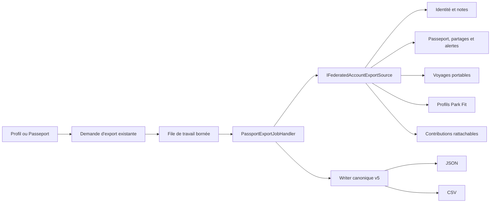

# QUAL-11 — Export fédéré des données du compte

> Date : 3 octobre 2026
> Version : 5.4.95
> Effet MongoDB : aucun changement de schéma et aucune migration

## Résultat métier

Un membre peut demander depuis son profil ou son Passeport un téléchargement
unique de ses données produit. L'export ne se limite plus au journal de visites :
il réunit les informations de compte lisibles, les notes globales, le Passeport,
les partages, les alertes, les voyages accessibles, les profils Park Fit et les
contributions rattachables au compte.

Le résultat existe en JSON et en CSV. Il privilégie les noms de parcs et
d'attractions ainsi que des références locales comme `trip-0001` ou
`comment-0001`. Aucun identifiant MongoDB, identifiant de compte, identifiant de
fournisseur OAuth, hash, secret ou jeton public n'est exposé.

## Architecture

Le moteur d'export asynchrone existant est étendu au lieu de créer un second
système. Le contrat HTTP historique reste compatible, mais l'archive produite
porte le schéma `amusement-park-account` v5 et un nom de fichier orienté compte.

Les couches conservent leurs responsabilités :

- le domaine continue de porter les règles propres à chaque agrégat ;
- l'Application orchestre les sources, applique le budget et construit les
  projections portables ;
- l'Infrastructure lit les collections MongoDB et résout les noms publics ;
- la WebAPI garde l'autorisation, la limitation de débit et le cycle de vie du
  job existants ;
- Angular ne pilote que la demande, son état et le téléchargement.

## Couverture

| Surface | Contenu exporté | Protection |
| --- | --- | --- |
| Identité | e-mail, nom, pseudonyme, langue, avatar et noms des fournisseurs connectés | aucun hash, jeton ou identifiant fournisseur |
| Notes globales | cible lisible, type et note courante | aucun identifiant interne de cible |
| Passeport | visites, passages, statistiques, partages, comparaisons, favoris et alertes | références locales et noms lisibles |
| Voyages | tous les plans que le membre est autorisé à exporter | projection portable, sans audit artificiel par voyage |
| Park Fit | profils de groupe privés | aucun identifiant de compte |
| Contributions | commentaires, textes et métadonnées média, signalements historiques, événements de partage | pas d'URL ou de cible interne |

Le binaire original des médias n'est pas incorporé à l'archive structurée. Les
demandes de contact et signalements Park Fit sans identifiant de membre ne sont
pas attribués automatiquement : une remise éventuelle exige une vérification par
le support. Les journaux administratifs et de sécurité restent exclus ou remis
séparément après revue.

## Robustesse et performance

- Le traitement reste asynchrone et n'alourdit pas la requête HTTP initiale.
- Les collections sont paginées ou plafonnées ; une limite dépassée fait échouer
  explicitement l'export au lieu de produire une archive silencieusement tronquée.
- Un budget commun mesure la projection fédérée avant l'écriture de l'archive.
- Les fichiers et morceaux d'export conservent leur expiration automatique.
- La construction portable d'un voyage n'écrit pas une activité `PlanExported`
  pour chaque voyage ; seul le job de compte représente l'action demandée.

## Preuves automatisées

Les tests vérifient notamment :

- la fédération des différentes sources et le rejet au dépassement du budget ;
- l'absence de secrets et d'identifiants techniques sérialisés ;
- la résolution des contributions vers des noms et références locales ;
- les tables JSON et CSV produites par le writer v5 ;
- la compatibilité du handler de job existant ;
- la construction d'un voyage portable sans audit de voyage indépendant ;
- la cohérence du catalogue de données personnelles.

## Limite suivante

Cette tranche clôt l'écart d'export global identifié par QUAL-04. Elle ne prétend
pas supprimer un compte : le prochain jalon doit fournir un coordinateur global,
idempotent et reprenable couvrant l'identité, les sessions et chaque participant
métier selon ses règles de rétention.
