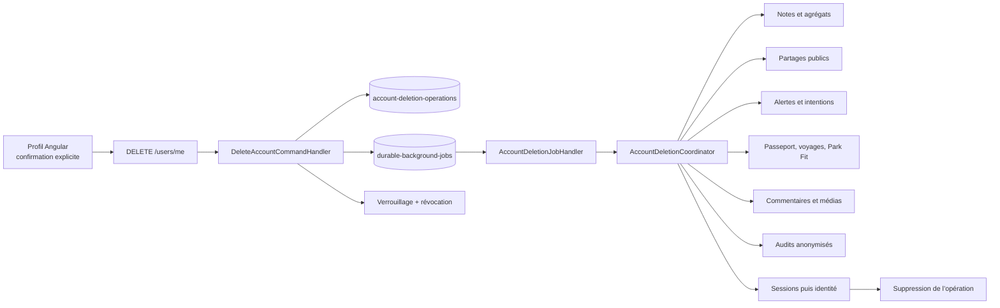
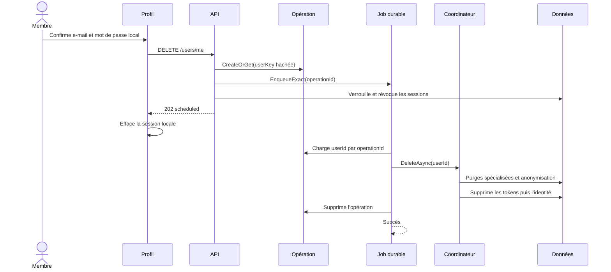
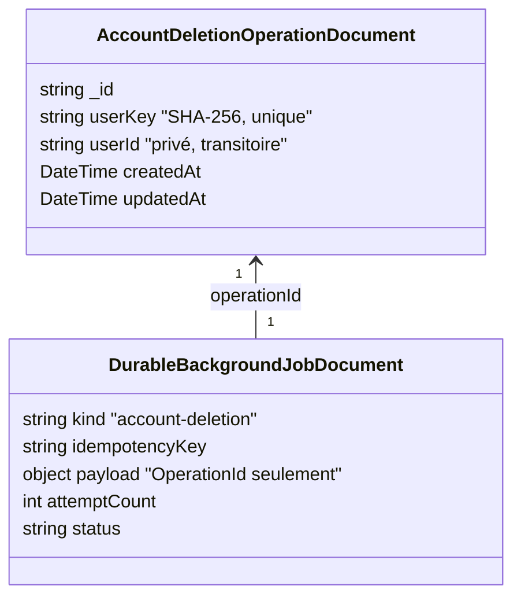

# QUAL-12 — Suppression globale et relançable du compte

> Date : 4 octobre 2026
> Version : 5.4.96
> Portée : profil membre, API Users, orchestration applicative et données MongoDB
> Migration : automatique au démarrage, sans intervention MongoDB manuelle

## 1. Résultat métier

Un membre peut désormais demander depuis son profil la suppression complète de
son compte. Le parcours est volontairement explicite : la zone dangereuse est
repliée, rappelle les conséquences, exige la saisie exacte de l’adresse e-mail et
demande le mot de passe courant seulement lorsqu’un mot de passe local existe.

L’acceptation coupe la session visible immédiatement. La suppression profonde se
poursuit de façon durable côté serveur : fermer le navigateur, redémarrer l’API ou
perdre une réponse réseau ne crée ni double purge ni faux échec définitif.

## 2. Périmètre supprimé

- identité, connexions externes et refresh tokens ;
- visites, passages, opérations, audits et exports du Passeport ;
- notes globales, en passant par le cas d’usage qui recalcule les agrégats ;
- partages, comparaisons et projections publiques ;
- favoris, envies, abonnements, notifications, digests et livraisons ;
- voyages possédés et données enfants ; participation, préférences et
  abonnements du membre dans les autres voyages ;
- profils de groupe Park Fit ;
- commentaires, médias possédés et fichiers binaires ;
- signalements historiques et événements de partage rattachables ;
- jetons personnels de l’éditeur de données.

Les demandes de contact ou signalements sans identifiant de compte ne peuvent pas
être associés automatiquement. Ils restent soumis au processus support vérifié.
Les audits indispensables ne gardent plus l’identité : e-mail, IP, user-agent et
rôles sont supprimés, les références obligatoires utilisent `deleted-account`.

## 3. Architecture

Les frontières restent celles de la Clean Architecture :

- le contrôleur transforme HTTP en commande et ne contient aucune règle de purge ;
- l’Application orchestre l’ordre et dépend de ports ;
- l’Infrastructure implémente les opérations MongoDB et le stockage binaire ;
- Angular appelle un port depuis une façade locale au profil ;
- chaque classe reste dans son propre fichier.

## 4. Séquence et reprise

En cas d’erreur, le job est relancé avec backoff, au maximum douze tentatives. Les
opérations spécialisées sont idempotentes. Si l’identité a déjà disparu, une
reprise conclut sans recréer de données. L’opération transitoire isole le seul
`userId` nécessaire ; le payload durable ne contient que son identifiant opaque.

## 5. Schéma MongoDB ajouté

L’initialiseur crée `account-deletion-operations` et l’index unique
`ux_account_deletion_operations_userKey`. Aucun script manuel ni adaptateur legacy
n’est requis. L’opération est supprimée après succès ; elle ne devient pas une
nouvelle archive personnelle.

## 6. Expérience responsive

La zone est conçue à partir du mobile : tous les conteneurs ont `min-width: 0`,
les textes longs peuvent se couper, les champs passent de deux colonnes à une à
640 px et les actions occupent toute la largeur. Aucun contrôle désactivé inutile
n’est affiché hors du moment où la demande est réellement envoyée.

## 7. Preuves

- tests du handler : confirmation erronée, mot de passe incorrect, compte externe,
  programmation durable et coupure d’accès ;
- test du service de notes : utilisation répétée de la suppression sûre jusqu’à
  épuisement de la page ;
- tests du job : payload invalide et reprise après opération déjà terminée ;
- test de façade Angular : succès, fin de chargement et erreur localisée ;
- tests du service API Angular ;
- build .NET et Angular de production ;
- suite frontend complète, garde d’architecture des façades et contrôle responsive ;
- catalogue de données personnelles recalculé par la garde QUAL-04.

## 8. Exploitation et limites

- surveiller le type de job `account-deletion`, les reprises et dead letters ;
- ne jamais supprimer manuellement une opération active sans avoir vérifié l’état
  de l’identité et des purges ;
- une nouvelle collection portant un identifiant de membre doit être ajoutée au
  coordinateur et au catalogue dans la même évolution ;
- les durées chiffrées des preuves support et sécurité restent une décision
  juridique/opérationnelle, pas une valeur inventée par cette fonctionnalité.
