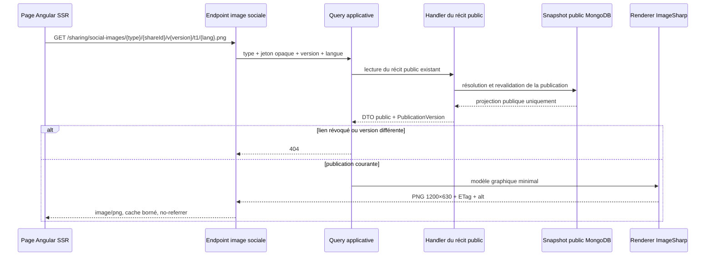
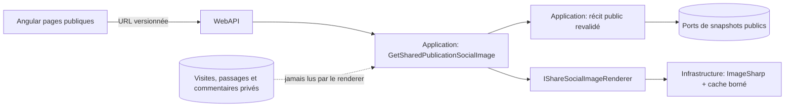

# SHARE-09 — Images sociales versionnées

Date : 13 septembre 2026

Version : 5.3.1

Statut : implémenté

## Résultat métier

Un lien public de visite, d'année ou de passeport présente désormais une carte
visuelle personnalisée lorsqu'il est partagé dans une messagerie ou sur un réseau
social. L'image raconte uniquement ce que le membre a déjà accepté de publier :

- le nom du parc, l'année ou le nom public selon le type de récit ;
- au plus trois compteurs ou moyennes déjà présents dans le snapshot public ;
- un temps fort déjà public ;
- une date dont la précision ne dépasse jamais la politique choisie ;
- une rédaction localisée dans les huit langues servies par l'application.

Le design sans photo constitue le fallback stable du produit : il ne dépend ni
d'une image de parc, ni d'un service externe, ni d'une licence éditoriale variable.
Le partage de classement existant conserve son gabarit, mais son URL est maintenant
liée à la version de publication comme les trois nouveaux récits.

## Flux d'une requête



Le handler graphique réutilise les handlers publics de `SHARE-06`, `SHARE-07` et
`SHARE-08`. Il ne relit jamais une visite privée pour enrichir une image. Cette
composition maintient une seule définition du périmètre visible.

## Frontières d'architecture



- **Core** conserve la policy, la visibilité et les versions de publication.
- **Application** choisit uniquement les champs publics et construit un modèle
  graphique dépourvu d'identifiants de parc, d'attraction, de visite ou de membre.
- **Infrastructure** dessine le PNG de façon déterministe avec la police Bangers
  déjà utilisée par le projet et distribuée sous licence SIL OFL 1.1. Une police
  Noto Sans JP et une police Noto Emoji embarquées et testées, complétées par les
  familles système Noto/DejaVu, assurent le rendu des noms publics en écritures
  non latines et de leurs symboles autorisés. Cette couche gère ensuite le cache
  mémoire.
- **WebAPI** valide la variante d'URL et pose les en-têtes HTTP.
- **Angular** produit l'URL Open Graph exacte à partir de la version renvoyée par
  le contrat public ; il ne calcule aucune règle de confidentialité.

## Contrat et cache

Le nouvel endpoint est :

```text
GET /api/sharing/social-images/{visit|year|passport}/{shareId}/v{publicationVersion}/t1/{language}.png
```

La clé de rendu inclut le type, la version de gabarit, la version de publication,
la langue et toutes les valeurs visibles. Le cache mémoire contient au plus 128
rendus pendant une heure. Il évite les recalculs mais ne contourne pas la résolution
publique : une requête repasse par la publication et son snapshot avant d'accéder
au renderer.

L'API n'accepte que deux rendus simultanés et une file de quatre demandes. Une
rafale de variantes froides ne peut donc pas monopoliser le processeur du VPS.
Une seconde barrière dans le renderer conserve son permis jusqu'à la fin réelle du
PNG : l'abandon d'une requête HTTP ne permet pas de lancer des calculs détachés en
parallèle au-delà de cette limite. Si le rendu attend encore un permis, l'abandon
de tous ses consommateurs annule aussi cette attente : aucun arriéré de calculs
détachés ne peut s'accumuler, sans pénaliser un autre consommateur encore connecté
à la même image coalescée.

La réponse utilise `Cache-Control: public,max-age=300,must-revalidate`, un `ETag`,
`Content-Language`, `Referrer-Policy: no-referrer` et
`X-Content-Type-Options: nosniff`. Après republication, l'URL change. Une ancienne
version est refusée par l'API. Après révocation, le résolveur refuse toute nouvelle
lecture. Une plateforme sociale peut néanmoins conserver une copie qu'elle avait
déjà téléchargée ; le produit ne promet pas l'effacement immédiat de caches tiers.

Le classement personnel historique reste disponible sur sa route compatible :

```text
GET /api/ratings/shared/{shareId}/preview.png?v={publicationVersion}&t=1&language={language}
```

Les anciens appels sans paramètres restent acceptés, mais les pages publiques
émettent désormais systématiquement la variante versionnée.

## Matrice de confidentialité

| Donnée | Entrée possible du renderer | Preuve |
|---|---:|---|
| nom de parc public | oui | issu du snapshot public de visite |
| nom public choisi | oui | champ explicite du passeport public |
| compteurs et notes sélectionnés | oui | métriques créées seulement si le DTO public les contient |
| précision de date autorisée | oui | `ShareSocialImageDate` reprend `ShareDatePrecision` |
| commentaire privé | non | absent des résultats publics et du modèle graphique |
| légende non publiée | non | aucune lecture directe de la source privée |
| identifiant technique interne | non | aucun champ d'identifiant dans `ShareSocialImageModel` |
| jour masqué | non | le formateur ne possède pas le jour lorsque la policy l'a supprimé |

## Persistance et migration

Aucune collection MongoDB ni migration supplémentaire n'est requise. Les snapshots
publics et `PublicationVersion` existaient déjà. Les PNG sont produits à la demande
et seulement conservés dans un cache mémoire borné ; aucun fichier durable n'est
créé sur le VPS.

## Preuves automatisées

- tests Application : sélection des seules métriques publiques, date limitée,
  langue inconnue refusée et ancienne version refusée avant rendu ;
- tests Infrastructure : huit langues, dimensions 1 200 × 630, PNG valide, cache,
  ETag, texte alternatif et empreinte visuelle déterministe ;
- tests WebAPI : route, validation des variantes, réponse 304, en-têtes de cache et
  accès anonyme ;
- tests Angular : URL incluant publication/gabarit/langue, métadonnées Open Graph et
  Twitter exactes, dimensions et contenu MIME ;
- compilation stricte TypeScript et contrôles d'architecture conservés.

## Limites assumées et suite

`SHARE-10` ajoutera l'invalidation explicite et coalescée des rendus dérivés lors
d'une révocation, d'une rotation, d'une republication ou d'une suppression. SHARE-09
garantit déjà qu'un cache interne ne peut pas rendre une publication révoquée
accessible et que toute republication obtient une URL différente. Les copies
externes déjà aspirées restent hors du contrôle technique de l'application.
