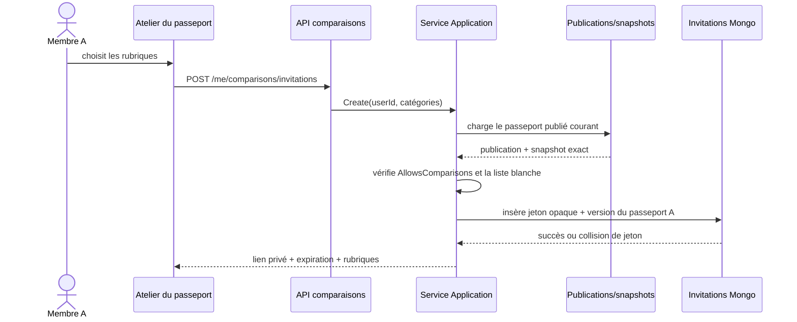
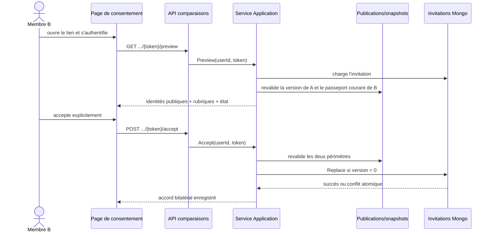

# SHARE-11 — Invitations et consentement bilatéral de comparaison

## Résultat métier

SHARE-11 installe le sas de consentement qui précède toute comparaison entre
deux passeports. Un membre choisit les rubriques qu'il propose de comparer et
obtient une invitation privée valable sept jours. Le destinataire authentifié
voit l'identité publique des deux profils, les rubriques exactes et la date
d'expiration avant de pouvoir accepter.

Ce jalon ne calcule volontairement aucun résultat. Il produit une preuve durable
des deux accords, liée aux versions exactes des passeports publics. SHARE-12
pourra donc construire une comparaison sans relire une intention ambiguë ou une
version de passeport modifiée entre-temps.

```text
Membre A                    Invitation                    Membre B
   │                            │                            │
   ├─ choisit les rubriques ───►│                            │
   ├─ donne son accord ────────►│ en attente, 7 jours        │
   │                            ├─ lien privé ──────────────►│
   │                            │◄─ aperçu de son passeport ─┤
   │                            │◄─ second accord ───────────┤
   │                            │                            │
   └──────── versions exactes + deux accords enregistrés ───┘
                              │
                              └─ matière autorisée de SHARE-12
```

## Conditions obligatoires

La création et l'acceptation sont refusées si l'une des conditions suivantes
n'est pas satisfaite :

- les deux membres sont différents et authentifiés avec un compte actif ;
- chacun possède un passeport `Published`, `Public` ou `Unlisted` ;
- chacun a explicitement activé `AllowsComparisons` dans le snapshot publié ;
- toutes les rubriques demandées font partie de la liste blanche des deux
  publications ;
- le passeport de l'invitant possède encore l'identifiant et la version exacts
  enregistrés à la création ;
- l'invitation n'a pas expiré et n'a pas été acceptée par un autre membre.

Les rubriques disponibles sont :

| Rubrique | Champs publics nécessaires |
|---|---|
| Parcs visités | `GeographicStatistics` |
| Préférences | `GlobalRatings` |
| Années et activité | `GeographicStatistics` et `RideCount` |
| Attractions manquées | `MissedItems` |

Cette correspondance appartient au Core via
`ProfileComparisonCategoryPolicy`. Le frontend l'utilise seulement pour éviter
de proposer une option manifestement indisponible ; l'API reste l'autorité.

## Architecture applicative

```text
Angular page / composant
        │
        ▼
Façades d'état ──► ProfileComparisonInvitationPort
                            │
                            ▼
                 API HTTP authentifiée
                            │
                            ▼
Handlers Application ──► ProfileComparisonInvitationService
                         │             │
                         │             ├─ ISharePublicationRepository
                         │             ├─ IPassportProfileShareSnapshotRepository
                         │             └─ IProfileComparisonInvitationRepository
                         ▼
               Agrégat et politiques Core
                            │
                            ▼
                 Adaptateurs Mongo Infrastructure
```

- le Core possède les invariants, transitions et catégories ;
- l'Application orchestre les deux publications, leurs snapshots et
  l'invitation sans dépendre de Mongo ou de HTTP ;
- Infrastructure persiste les documents et applique la concurrence optimiste ;
- WebAPI ne fait que sécuriser, mapper et transporter les commandes ;
- Angular passe par un port injecté, puis deux façades ciblées, sans appel API
  concret dans les composants.

Chaque classe C# et TypeScript possède son propre fichier. Le contrôle
automatique global ne signale aucune violation.

## Séquence de création



Une collision du jeton opaque déclenche au plus cinq générations. Aucun
identifiant utilisateur, de publication ou de snapshot n'est renvoyé dans le
contrat visible de l'invitation.

## Séquence d'acceptation



L'acceptation est idempotente pour le même membre : une réponse perdue peut être
réessayée sans créer un second accord ni un second identifiant de comparaison.
Deux destinataires concurrents ne peuvent pas gagner simultanément, car le
remplacement Mongo exige la version de persistance attendue.

## Schéma MongoDB

Collection : `profile-comparison-invitations`.

```javascript
{
  _id: "identifiant-interne-opaque",
  token: "jeton-opaque-non-enumerable",
  creatorUserId: "interne",
  creatorPassportPublicationId: "interne",
  creatorPassportPublicationVersion: NumberLong(4),
  categories: ["VisitedParks", "PersonalRatings"],
  status: "Pending" | "Accepted",
  acceptorUserId: "interne",                       // seulement après accord B
  acceptorPassportPublicationId: "interne",       // seulement après accord B
  acceptorPassportPublicationVersion: NumberLong(3),
  comparisonId: "interne",                        // autorité de SHARE-12
  expiresAtUtc: ISODate("2026-09-20T12:00:00Z"),
  acceptedAtUtc: ISODate("2026-09-13T12:05:00Z"),
  purgeAtUtc: ISODate("2026-09-27T12:00:00Z"),    // absent une fois accepté
  version: NumberLong(1),
  createdAt: ISODate("2026-09-13T12:00:00Z"),
  updatedAt: ISODate("2026-09-13T12:05:00Z")
}
```

Indexes créés par `MongoDatabaseInitializer` :

- unicité de `token` pour empêcher toute collision ;
- `{ creatorUserId: 1, createdAt: -1 }` pour les futurs écrans de gestion ;
- TTL sur `purgeAtUtc` pour supprimer les invitations restées en attente sept
  jours après leur expiration.

Une invitation acceptée n'a plus de `purgeAtUtc` : elle devient la preuve de
consentement que SHARE-12 utilisera. Aucune migration ou commande MongoDB
manuelle n'est nécessaire ; le démarrage applicatif crée la collection et les
indexes de façon idempotente.

## Confidentialité et révocation

- Le lien transporte un jeton aléatoire opaque, jamais un identifiant de membre.
- L'aperçu HTTP expose uniquement les noms d'affichage déjà publics, les
  rubriques, l'état et l'expiration.
- Les commentaires privés, dates exactes, coordonnées, identifiants de parc,
  d'attraction, de membre et de publication n'entrent pas dans le DTO d'aperçu.
- La rotation, la révocation ou la republication du passeport de A change sa
  version ou son état et invalide l'invitation en attente.
- Le passeport de B est vérifié au moment de l'aperçu puis de l'acceptation.
- Les endpoints réutilisent les limites de débit de prévisualisation et de
  confirmation, interdisent le cache HTTP et exigent un compte activé.
- La page est une route de compte rendue côté client et `noindex`, jamais une
  nouvelle page publique SSR.

La révocation d'une comparaison déjà acceptée sera ajoutée avec l'objet résultat
de SHARE-12. SHARE-11 ne prétend donc pas rendre visible un résultat qui n'existe
pas encore.

## Responsive et expérience

Le créateur utilise des cartes explicatives plutôt qu'une liste administrative.
Les rubriques indisponibles restent expliquées mais ne peuvent pas être cochées.
La page du destinataire représente visuellement les deux personnes et leur état
de consentement.

Les deux surfaces utilisent `minmax(0, 1fr)`, `min-width: 0`, la coupure des mots
longs et un repli mono-colonne sous 480/520 px. Les liens et boutons passent en
pleine largeur sur mobile, et la page borne explicitement le débordement
horizontal. Un test responsive inspecte ces contrats.

## Preuves automatisées

| Niveau | Preuve |
|---|---|
| Core | catégories normalisées, expiration, refus de l'auto-acceptation, état restauré cohérent |
| Application | passeport comparable obligatoire, invalidation après rotation, double référence persistée |
| Infrastructure | aller-retour Mongo, conservation de l'accord, TTL limité aux invitations en attente, filtre de version |
| WebAPI | identité authentifiée imposée, aucun identifiant interne dans l'aperçu, rate limits et no-store |
| Angular | création, aperçu avant acceptation, même jeton utilisé, contrat responsive étroit |
| Architecture | façades derrière des ports et zéro fichier contenant plusieurs classes |

## Suite

SHARE-12 partira exclusivement des invitations `Accepted`. Il matérialisera le
résultat comparatif, appliquera les seuils de données communes, refusera tout
pourcentage trompeur sous seuil et ajoutera la révocation par l'un ou l'autre des
participants.
