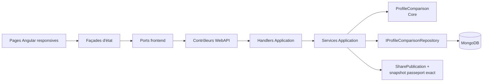
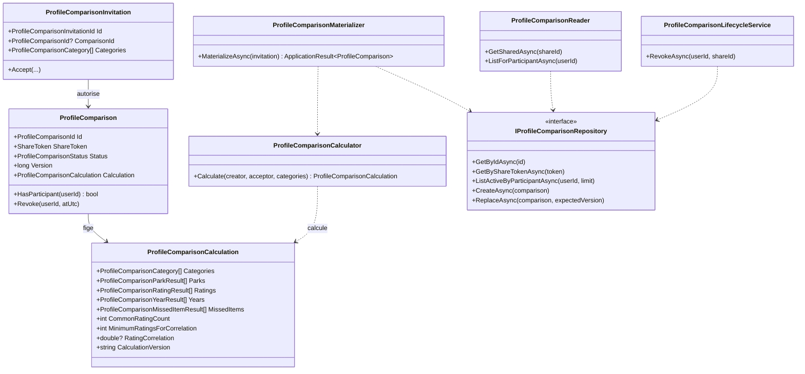
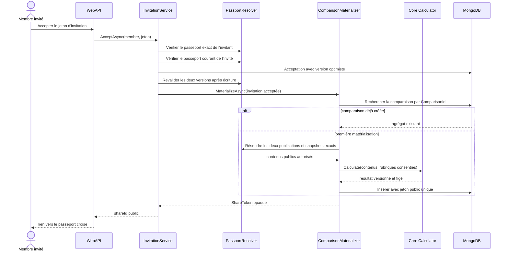
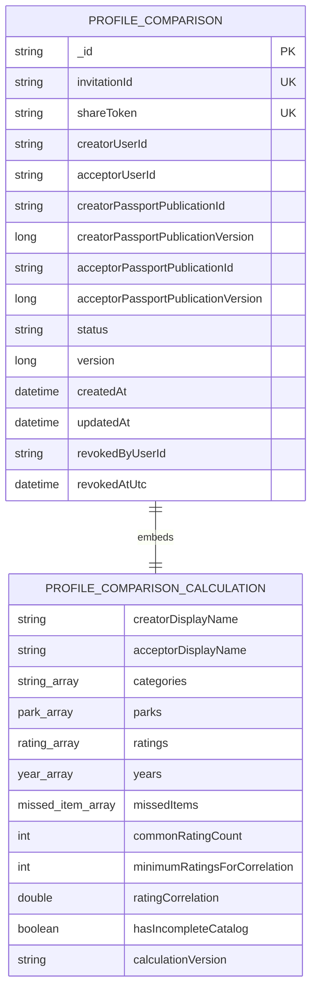
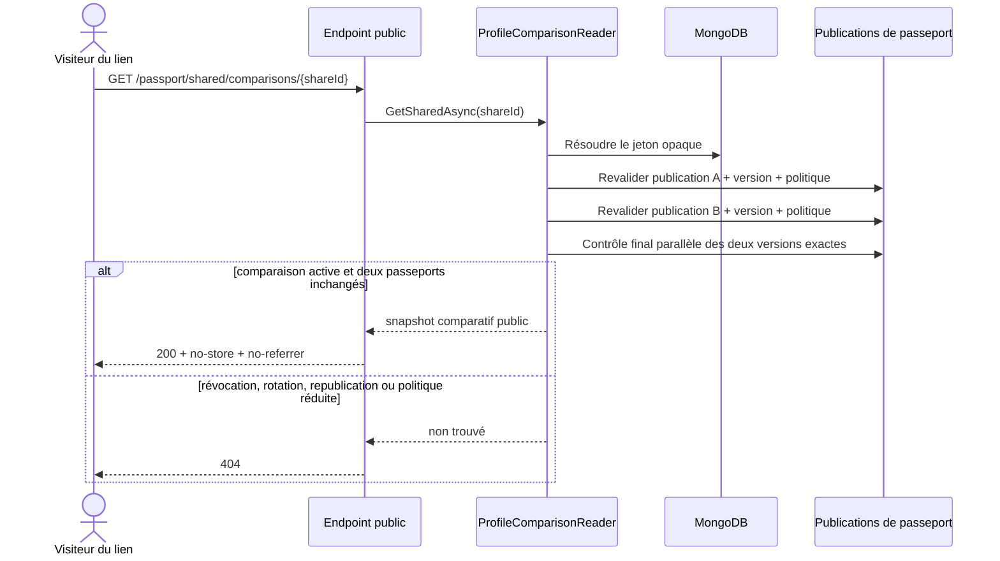
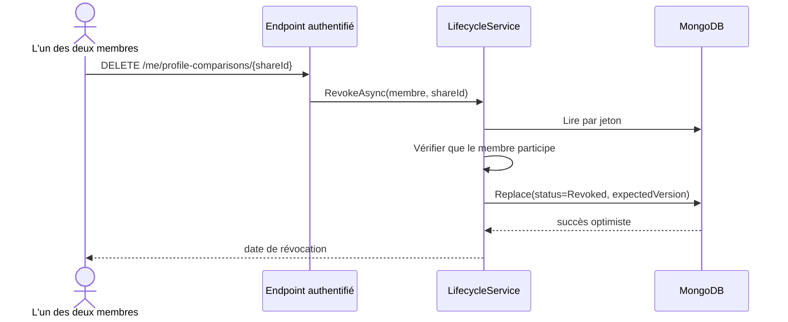

# SHARE-12 — Résultats de comparaison de passeports

Date : 13 septembre 2026

Version : 5.3.4

Roadmap : `SHARE-12`

## 1. Résultat métier

Une invitation acceptée par deux membres produit désormais un passeport croisé
consultable par un lien opaque. Le récit rapproche uniquement les rubriques que
les deux personnes ont publiées et accepté de comparer :

- parcs présents dans les deux sélections publiques et volumes de visites partagés ;
- parcs visibles dans une seule sélection, sans les présenter comme « non visités »
  par l'autre personne ;
- notes globales rendues publiques par les deux membres, classées en accords,
  nuances et divergences ;
- années visibles dans les deux passeports, avec visites et tours publiés par chacun ;
- expériences manquées visibles des deux côtés, avec motif public et occurrences
  partagées par chacun ;
- avertissement lorsque des références historiques ne sont plus reliées au catalogue.

Le résultat ne donne pas une note aux membres et n'affiche aucun pourcentage de
compatibilité. Il expose le nombre de notes réellement communes et n'interprète
une tendance générale qu'à partir de cinq notes communes variées.

Après acceptation, le destinataire est dirigé vers le résultat. Les deux membres
retrouvent leurs comparaisons actives dans l'atelier de partage du passeport,
peuvent ouvrir ou copier le lien et peuvent arrêter la comparaison avec une
confirmation explicite. La révocation par l'un coupe immédiatement le lien pour
les deux.

## 2. Limites volontaires

- La comparaison n'utilise que les snapshots publics exacts acceptés ; elle ne lit
  jamais les commentaires, dates précises ou observations privées.
- Une rubrique absente d'un passeport ne peut pas être reconstruite depuis les
  données privées.
- L'absence d'un parc d'une sélection publique signifie seulement « non visible
  ici ». Elle ne prouve ni une absence de visite, ni un projet futur.
- Les notes temporelles de visites et de passages ne deviennent pas des voix
  communautaires et ne participent pas à ce rapprochement de préférences globales.
- La version 5.3.4 ne formule pas encore de recommandation de prochain parc. Ce
  choix explicable appartient à la roadmap `FIT`, qui possède ses propres règles
  de couverture et de contraintes.

## 3. Architecture applicative

Le calcul pur et les invariants vivent dans Core. Application résout les versions
publiques, orchestre la matérialisation, la lecture et la révocation. Infrastructure
persiste l'agrégat MongoDB. WebAPI ne fait que contrôler l'accès et mapper des DTO
sans identifiants techniques. Angular sépare ses accès réseau, ses façades d'état
et ses composants de présentation.



### 3.1 Diagramme de classes



Chaque classe C# ou TypeScript écrite à la main possède son fichier dédié. Le
contrôle automatique global annonce zéro violation sur l'ensemble du dépôt.

## 4. Matérialisation après le second consentement



La matérialisation est idempotente : le `ComparisonId` fixé lors de l'acceptation
et l'index unique sur `invitationId` empêchent deux résultats pour le même accord.
Un conflit de jeton public déclenche au plus cinq générations. Une acceptation
rejouée par le même destinataire retrouve le résultat existant.

## 5. Règles de calcul et preuves

### 5.1 Identité fonctionnelle

Les identifiants MongoDB ou catalogue ne sont jamais copiés dans le résultat
public. Les rapprochements sont effectués sur des clés fonctionnelles normalisées :

- parc : `code pays + nom du parc` ;
- note : `type de cible + nom du parc + nom de la cible` ;
- année : année civile ;
- expérience manquée : statut public + nom.

Les espaces de bord sont retirés et les clés sont comparées sans différence de
casse. Cette représentation convient aux snapshots publics actuels et évite toute
fuite d'identifiant. La présence du même nom dans deux parcs reste distinguée par
le nom du parc.

### 5.2 Accords, nuances et divergences

Pour chaque note globale commune :

```text
écart = |note membre A - note membre B|

écart <= 0,5       => accord
0,5 < écart < 1,5 => nuance
écart >= 1,5       => divergence
```

Les trois groupes sont rendus dans l'interface : aucun cas intermédiaire n'est
silencieusement perdu. Les barres restent une représentation directe des notes
sur 5 et les valeurs textuelles sont conservées pour l'accessibilité.

### 5.3 Tendance globale

La corrélation de Pearson n'est calculée que si au moins cinq cibles sont communes :

```text
r = Σ((Ai - moyenneA)(Bi - moyenneB))
    / √(Σ(Ai - moyenneA)² × Σ(Bi - moyenneB)²)
```

Si l'un des deux profils a la même note sur toutes les cibles, le dénominateur est
nul et aucune tendance n'est produite. Le coefficient est borné entre -1 et 1,
arrondi à trois décimales dans le snapshot puis traduit en formulation qualitative
dans l'interface. Il n'est jamais transformé en « pourcentage de compatibilité ».

Les tests Core prouvent notamment :

- quatre notes communes donnent une corrélation absente ;
- cinq séries identiques et variées donnent une corrélation de 1 ;
- les seuils exacts 0,5 et 1,5 classent correctement accord et divergence ;
- l'intervalle intermédiaire est conservé comme nuance.

## 6. Schéma MongoDB

La collection `profile-comparisons` est créée automatiquement au démarrage avec
ses indexes. Aucune commande ni mise à jour MongoDB manuelle n'est nécessaire.



Indexes :

- `shareToken` unique : un lien ne résout qu'une comparaison ;
- `invitationId` unique : un accord ne produit qu'un résultat ;
- `{ creatorUserId, status, createdAt desc }` ;
- `{ acceptorUserId, status, createdAt desc }`.

Le résultat calculé est embarqué dans l'agrégat afin que sa preuve, son état et sa
version soient lus atomiquement sur MongoDB autonome.

## 7. Lecture et révocation





Un tiers reçoit le même `404` qu'un jeton inconnu. Il ne peut donc pas utiliser
l'endpoint de révocation pour confirmer l'existence d'une comparaison.

## 8. Contrats publics et confidentialité

Le DTO public contient seulement : noms publics facultatifs, rubriques, noms et
codes pays, volumes explicitement partagés, notes publiques, écarts, années,
statuts publics d'expériences manquées, couverture et version de calcul.

Il ne contient pas : identifiant membre, identifiant de publication, identifiant
de comparaison interne, identifiant de parc ou d'attraction, adresse électronique,
commentaire privé, date précise de visite ou texte privé. La réponse d'acceptation
expose désormais le `shareId` opaque à la place de l'ancien `comparisonId`
technique.

La page est rendue côté serveur mais reste non indexable. Elle utilise des entêtes
`no-store` et `Referrer-Policy: no-referrer`, une URL canonique localisée et un fil
d'Ariane visible cohérent avec son `BreadcrumbList` JSON-LD.

## 9. Responsive et accessibilité

Les surfaces de résultat et de gestion imposent `min-width: 0`, des colonnes
`minmax(0, 1fr)`, des cartes limitées à `100%`, la coupure des chaînes longues et
un confinement horizontal. Les grilles passent en une colonne à 700, 480 ou 420
pixels selon leur densité. La bande des années utilise un défilement horizontal
interne contrôlé : elle ne peut pas élargir le viewport.

Les informations portées par les graphiques sont répétées en texte. Les états de
chargement, erreur et indisponibilité utilisent des rôles adaptés. La révocation
demande une confirmation lisible et ne repose ni sur une couleur ni sur un geste
seul.

## 10. Vérifications

- tests ciblés Core, Application, Infrastructure et WebAPI ;
- 1 813 tests Angular sur 393 fichiers ;
- build Angular SSR/production réussi ;
- TypeScript applicatif sans erreur ;
- traductions générées et contrôlées sur huit langues ;
- 116 façades conformes à leurs ports ;
- zéro violation C#/TypeScript de la règle « une classe = un fichier ».

La CI reste l'autorité finale pour la suite .NET complète, la couverture frontend
et le build de production reproductible.

## 11. Prochaine tranche

`SHARE-13` ajoutera le signalement et la modération minimale des champs publics.
Cette tranche ne modifiera ni le calcul ci-dessus ni le consentement bilatéral :
elle rendra le contenu public opérable lorsqu'un nom public, une légende ou une
autre donnée sélectionnée enfreint les règles du service.
