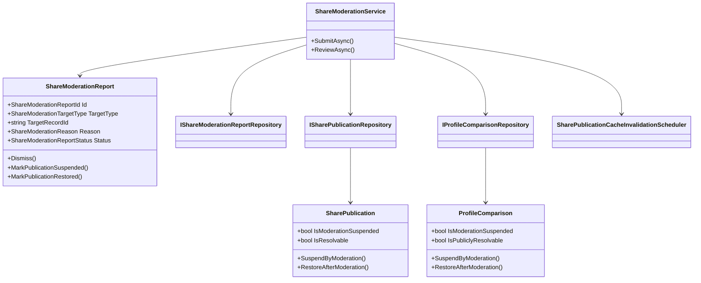
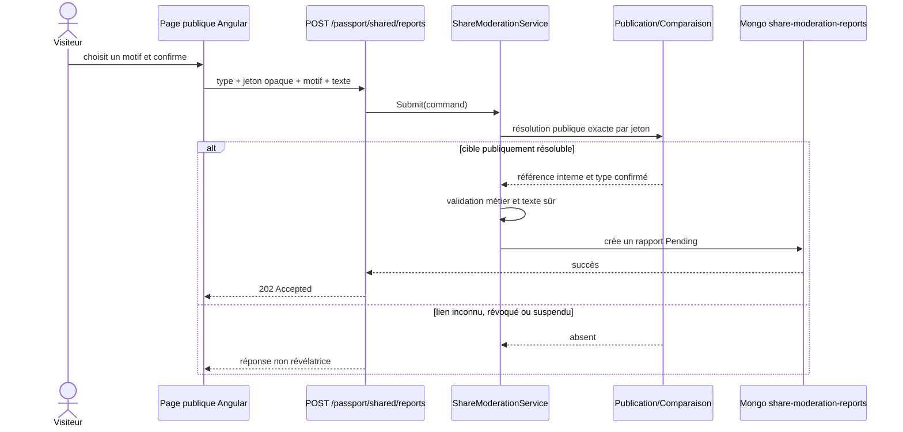
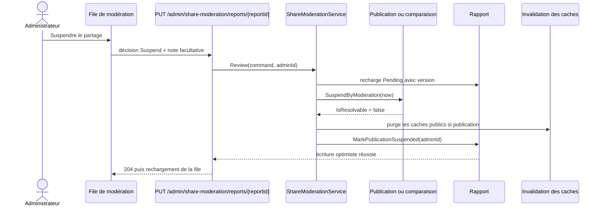
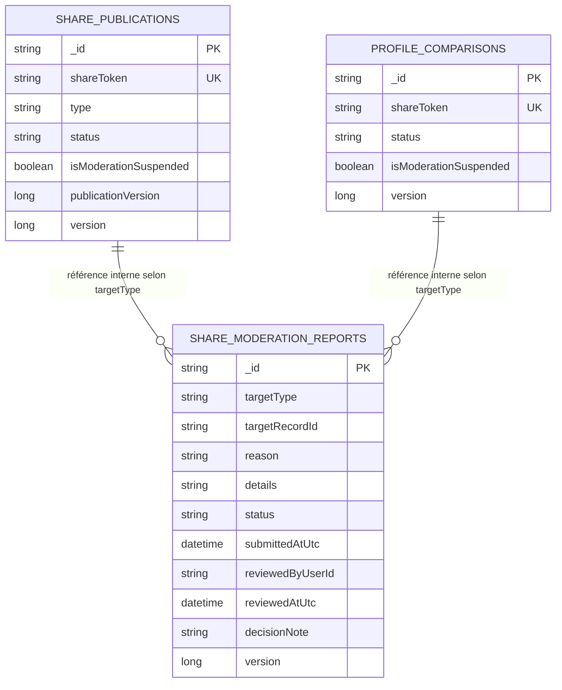

# SHARE-13 — Signalement et modération des partages publics

## Résultat métier

Chaque page publique de visite, d'année, de passeport, de classement personnel et
de comparaison permet de transmettre un signalement structuré. L'administration
dispose d'une file responsive pour classer le signalement, suspendre immédiatement
le partage ou le rétablir. La suspension ne modifie ni les visites, ni les notes,
ni le passeport privé du propriétaire.

## Invariants de confidentialité

- le navigateur transmet le jeton opaque uniquement pour désigner la page visible ;
- la collection des signalements ne persiste pas ce jeton public, mais la référence
  interne de la publication résolue côté serveur ;
- les réponses admin n'exposent ni cette référence interne, ni l'identité technique
  du modérateur, ni le jeton public ;
- le texte libre est limité à 500 caractères, rendu comme texte et refuse les
  balises, schémas exécutables et liens ;
- une page déjà privée, révoquée, expirée ou suspendue ne peut pas recevoir un
  nouveau signalement par son ancien lien ;
- les signalements publics sont limités à trois par heure et par adresse IP ;
- les mutations admin restent authentifiées, autorisées, auditées et sérialisées.

## Architecture de classes

Les règles et transitions appartiennent au Core. L'Application résout la cible et
orchestre les écritures. Infrastructure persiste et migre. WebAPI ne contient que
les contrats, l'autorisation, la limitation de débit et le mapping HTTP. Angular
place l'orchestration dans des façades derrière des ports.

## Séquence d'un signalement

## Séquence d'une suspension admin

Le rétablissement effectue la transition inverse depuis le même rapport. Le jeton,
le snapshot et `PublicationVersion` sont conservés : le contenu revient à l'identique
sans créer un second système de partage.

## Schéma MongoDB

Index :

- `status + submittedAtUtc desc + _id desc` pour la file stable ;
- `targetType + targetRecordId + submittedAtUtc desc` pour l'historique ;
- les recherches publiques existantes ajoutent `isModerationSuspended = false`.

Au démarrage, `MongoDatabaseInitializer` met à `false` le champ absent sur les
publications et comparaisons existantes avant de créer les index. Il s'agit d'une
migration de l'autorité existante, pas d'un adaptateur ou d'une double lecture.

## Contrats et interface

- `POST passport/shared/reports` : anonyme, `202`, limité par IP ;
- `GET admin/share-moderation/reports` : admin, paginé et filtrable ;
- `PUT admin/share-moderation/reports/{reportId}` : admin, audité, décisions
  `Dismiss`, `Suspend`, `Restore`.

Le composant public est replié par défaut. La page admin utilise des cartes qui
s'adaptent à 320 px, des champs à largeur bornée, du retour à la ligne pour les
textes et des actions empilées sur les écrans étroits. Le module admin reste chargé
en lazy loading et n'alourdit pas le bundle public initial.

## Preuves automatisées

- transitions, conservation des versions et séparation public/privé dans le Core ;
- rejet des balises et liens dangereux ;
- orchestration de la résolution, de la suspension et de l'invalidation ;
- aller-retour Mongo, index de file et absence de jeton dans les rapports ;
- mappings HTTP sans références internes ;
- façades Angular, prévention des doubles envois et contrats responsive ;
- validation des huit catalogues de traduction et de l'architecture des ports.
