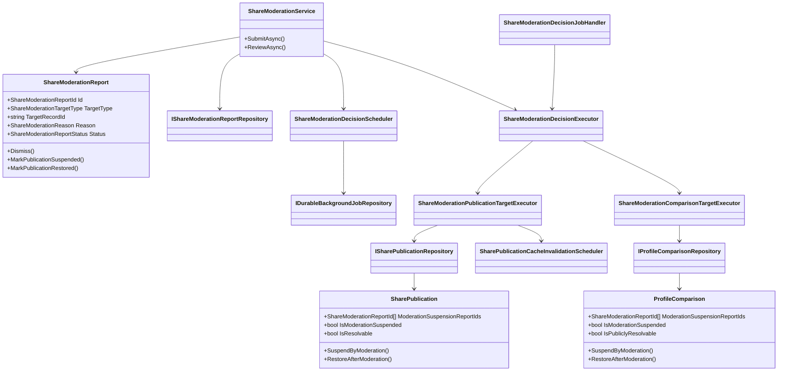
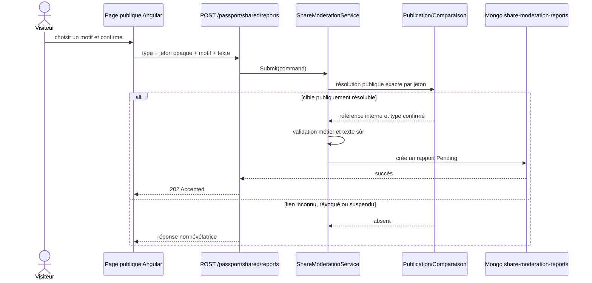
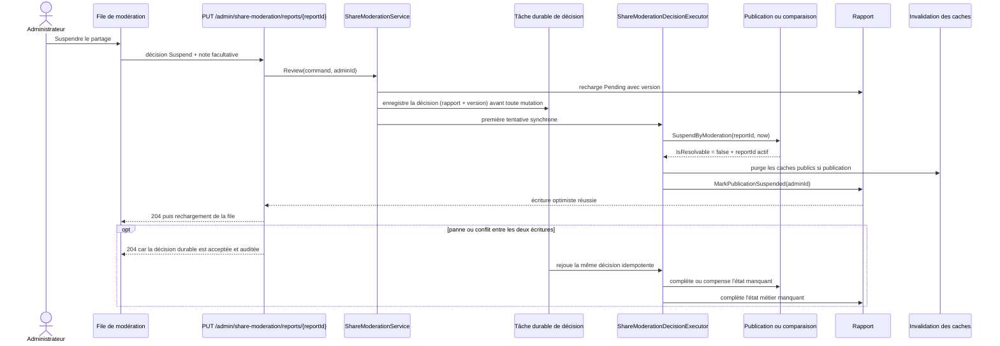
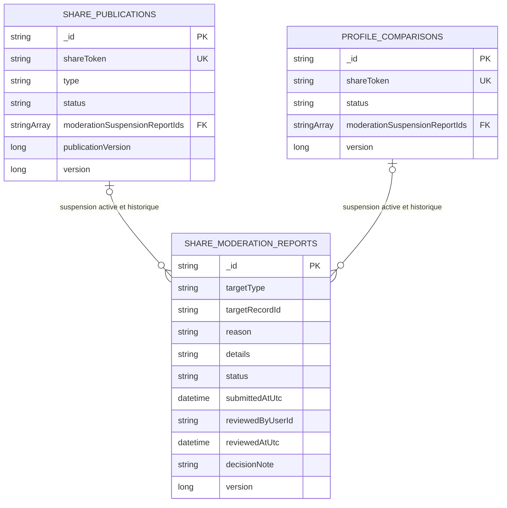

# SHARE-13 — Signalement et modération des partages publics

## Résultat métier

Chaque page publique de visite, d'année, de passeport, de classement personnel et
de comparaison permet de transmettre un signalement structuré. L'administration
dispose d'une file responsive pour classer le signalement, suspendre immédiatement
le partage ou le rétablir. La suspension ne modifie ni les visites, ni les notes,
ni le passeport privé du propriétaire.

## Invariants de confidentialité

- le navigateur transmet le jeton opaque uniquement pour désigner la page visible ;
- la collection des signalements ne persiste pas ce jeton public, mais la référence
  interne de la publication résolue côté serveur ;
- les réponses admin n'exposent ni cette référence interne, ni l'identité technique
  du modérateur, ni le jeton public ;
- le texte libre est limité à 500 caractères, rendu comme texte et refuse les
  balises, schémas exécutables et liens ;
- une page déjà privée, révoquée, expirée ou suspendue ne peut pas recevoir un
  nouveau signalement par son ancien lien ;
- les signalements publics sont limités à trois par heure et par adresse IP ;
- les mutations admin restent authentifiées, autorisées, auditées et sérialisées.

## Architecture de classes

Les règles et transitions appartiennent au Core. L'Application résout la cible et
orchestre les écritures. Infrastructure persiste et migre. WebAPI ne contient que
les contrats, l'autorisation, la limitation de débit et le mapping HTTP. Angular
place l'orchestration dans des façades derrière des ports.

## Séquence d'un signalement

## Séquence d'une suspension admin

Le rétablissement retire uniquement le blocage posé par son propre rapport. Les
autres blocages actifs restent attachés à la cible : un rapport ancien ne peut donc
pas lever une suspension plus récente. Le jeton, le snapshot et
`PublicationVersion` sont conservés : le contenu revient à l'identique sans créer
un second système de partage. Une révocation demandée par le propriétaire conserve
également ces blocages ; il ne peut pas contourner la modération en révoquant puis
en recréant immédiatement le même partage. Si la révocation ou le remplacement a
lieu avant l'exécution du signalement, l'exécuteur retrouve la publication active
de la même source et lui transmet le blocage. Un remplacement encore en brouillon
ne peut pas être publié avant son rétablissement explicite. Un index MongoDB unique
sur `(propriétaire, type, source)` considère à la fois la publication active et
toute publication historique qui porte un blocage : une republication et une
suspension concurrentes ne peuvent donc pas gagner ensemble. Le conflit est rejoué
avant que le rapport ne soit déclaré suspendu, puis le blocage converge vers le
remplacement éventuel. MongoDB fonctionne en instance simple en production ; la
tâche durable, créée avant toute mutation, assure la
compensation et la convergence sans supposer des transactions multi-documents
indisponibles.
Deux suspensions visant la même cible coexistent donc dans la même autorité métier.
Les remplacements optimistes et le rejeu durable convergent vers leur liste
commune, et la cible ne redevient publiquement résoluble que lorsque chaque rapport
actif a été explicitement rétabli.
Une fois la tâche durable enregistrée, un conflit ou une indisponibilité pendant
la première tentative reste une décision acceptée : l'API répond avec succès afin
que l'action administrative et son auteur soient bien inscrits dans l'audit HTTP,
puis le worker converge vers cette décision. Cela inclut le cas où un autre
signalement suspend déjà temporairement la même cible : la nouvelle décision reste
explicitement acceptée au lieu de renvoyer un conflit tout en laissant sa tâche
exécutable. Une cible ou un rapport définitivement absent reste en revanche refusé.
Le classement sans suite suit le même chemin durable. Si la requête est interrompue
après l'écriture du rapport, le worker retrouve l'état déjà appliqué et inscrit la
preuve d'achèvement manquante. Lorsqu'une même décision est soumise deux fois, le
scheduler restitue le payload réellement persisté par la première demande : auteur,
note et horodatage ne peuvent donc pas diverger entre le rapport et l'audit du
worker. La clé durable réunit le signalement et sa version métier, sans inclure la
décision : deux décisions opposées soumises sur la même version ne créent jamais
deux jobs concurrents. La première reste canonique et la seconde reçoit un conflit
explicite. Le rétablissement utilise la version suivante et reste donc un nouveau
jalon autorisé du cycle de vie. Son horodatage ne peut jamais précéder celui de la
suspension, même si l'horloge de l'hôte recule entre les deux décisions.
Chaque rejeu programme aussi l'invalidation du cache public, y compris lorsque la
cible porte déjà la décision attendue : une coupure entre l'écriture MongoDB et la
création de cette invalidation ne peut donc pas laisser durablement une ancienne
page publique en cache. Le worker écrit enfin une trace d'achèvement idempotente,
indépendante du cycle de vie de la requête HTTP, afin de conserver la preuve de la
mutation même si le navigateur admin s'est déconnecté après sa mise en file.
Si une dépendance reste indisponible pendant toute la fenêtre de rejeu, la tâche
crée une continuation durable avant de terminer : la convergence n'est donc pas
abandonnée après un nombre fixe de tentatives.

## Schéma MongoDB

Index :

- `status + submittedAtUtc desc + _id desc` pour la file stable ;
- `targetType + targetRecordId + submittedAtUtc desc` pour l'historique ;
- les recherches publiques existantes exigent une liste
  `moderationSuspensionReportIds` vide.
- l'unicité `(ownerUserId, type, sourceScopeKey)` couvre une publication active ou
  une ancienne publication qui porte encore un blocage de modération.

Au démarrage, `MongoDatabaseInitializer` ajoute une liste vide lorsque le champ de
suspension est absent sur les publications et comparaisons existantes avant de
créer les index. La migration consolide aussi les éventuels blocages historiques
sur l'unique publication active de leur source, puis remplace l'ancien index limité
aux seuls statuts actifs. Il s'agit d'une migration de l'autorité existante, pas
d'un adaptateur ou d'une double lecture.

## Contrats et interface

- `POST passport/shared/reports` : anonyme, `202`, limité par IP ;
- `GET admin/share-moderation/reports` : admin, paginé et filtrable ;
- `PUT admin/share-moderation/reports/{reportId}` : admin, audité, décisions
  `Dismiss`, `Suspend`, `Restore`.

Le composant public est replié par défaut. La page admin utilise des cartes qui
s'adaptent à 320 px, des champs à largeur bornée, du retour à la ligne pour les
textes et des actions empilées sur les écrans étroits. Le module admin reste chargé
en lazy loading et n'alourdit pas le bundle public initial.
Après l'acquittement d'une décision durable, la façade relit immédiatement la file,
puis utilise un backoff léger jusqu'à ce que `Pending` ou `PublicationSuspended`
ait réellement changé. L'action devenue obsolète reste verrouillée pendant cette
convergence et le suivi s'arrête au changement de filtre ou à la destruction de la
page.
Dans l'espace propriétaire, une publication suspendue reste identifiée comme une
publication existante : un encart explique que seul son accès public est coupé,
masque les actions inapplicables et conserve la révocation. Le propriétaire ne peut
donc ni confondre la suspension avec une mise en privé, ni être poussé vers une
nouvelle publication qui serait refusée par la règle de modération.

## Preuves automatisées

- transitions, conservation des versions et séparation public/privé dans le Core ;
- rejet des balises et liens dangereux ;
- orchestration de la résolution, de la suspension et de l'invalidation ;
- liaison de chaque suspension à son rapport exact, rejeu après conflit et
  compensation d'une décision concurrente ;
- coexistence de plusieurs blocages, restauration ciblée et conservation des
  blocages pendant une révocation, pour les publications comme pour les
  comparaisons ;
- payload d'audit canonique lors d'une décision dupliquée et preuve durable d'un
  classement sans suite déjà appliqué ;
- sérialisation des décisions opposées par version du rapport, transfert du blocage
  vers un remplacement publié ou en brouillon et refus de publication du brouillon ;
- verrou MongoDB au niveau de la source pendant une course entre remplacement et
  suspension, et horodatage monotone entre suspension et restauration ;
- reprogrammation de l'invalidation après une panne intermédiaire et audit
  d'achèvement idempotent par le worker ;
- acquittement auditable d'une décision durable et refus explicite de republier
  un partage encore suspendu ;
- aller-retour Mongo, index de file et absence de jeton dans les rapports ;
- rejet d'une pagination dont le décalage dépasserait la limite MongoDB ;
- mappings HTTP sans références internes ;
- façades Angular, suivi différé des trois décisions, prévention des doubles envois
  et contrats responsive ;
- validation des huit catalogues de traduction et de l'architecture des ports.
