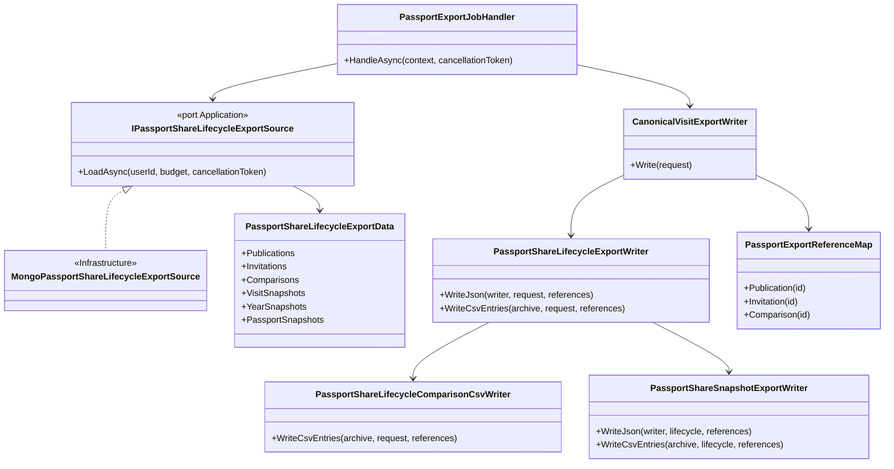
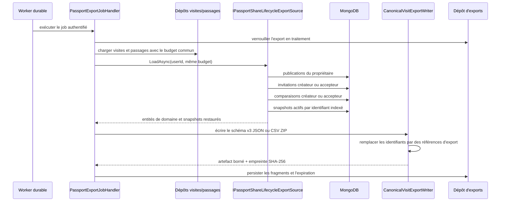
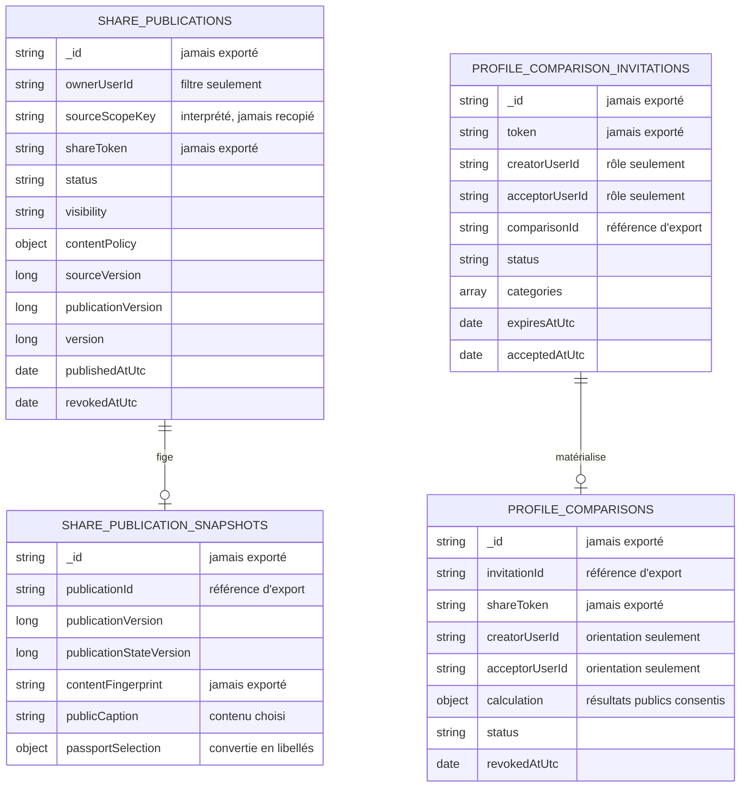

# SHARE-14A — Export privé du cycle de vie des partages

## Résultat métier

L'export du passeport restitue désormais, en plus des visites et notes privées :

- chaque publication du membre, sa visibilité, son état et sa politique de contenu ;
- les versions de source, de publication et de persistance ;
- les dates de création, mise à jour, publication et révocation ;
- les invitations de comparaison créées ou acceptées par le membre ;
- les comparaisons matérialisées, actives ou révoquées, avec leurs résultats complets.
- les légendes publiques et la sélection lisible figées dans les snapshots de
  récapitulatif et de passeport.

Le fichier reste privé, authentifié et temporaire. Cette évolution ne rend aucune
donnée publique et ne modifie pas le contenu d'un partage existant.

## Frontières d'architecture

- Core conserve les entités et règles de cycle de vie existantes.
- Application définit le port de lecture, orchestre le job et possède le format
  canonique de l'export.
- Infrastructure lit les documents MongoDB et les convertit par les mappers
  existants ; elle ne décide pas ce qui doit être exposé.
- WebAPI ne reçoit aucun nouveau raccourci vers MongoDB et le contrat HTTP de
  téléchargement ne change pas.

## Séquence de génération

Les six lectures sont séquentielles. Les publications, invitations et comparaisons
sont lues par leurs index de participants sans tri bloquant côté serveur, puis
ordonnées en mémoire après consommation du budget. Les snapshots conservés sont
recherchés par le préfixe indexé `publicationId`, puis le plus récent dont la version
ne dépasse pas celle de la publication est retenu. Une révocation ou un passage en
« à revoir » ne fait ainsi pas disparaître le dernier contenu approuvé de l'export.
Chaque document BSON consomme le même
`PassportExportSourceBudget` que les visites et passages. Le worker conserve sa
concurrence maximale à un et l'artefact final reste borné à 64 Mio.

## Schéma MongoDB lu

MongoDB crée automatiquement l'index partiel
`idx_profile_comparison_invitation_acceptor_created` sur
`acceptorUserId + createdAt`. Les index propriétaire des publications et participants
des comparaisons existaient déjà. Aucune migration de document ni intervention
manuelle n'est requise.

## Contrat d'export v3

### JSON

Les nouvelles racines sont :

- `sharePublications` ;
- `comparisonInvitations` ;
- `comparisons`, avec `results.parks`, `results.ratings`, `results.years` et
  `results.missedItems` ;
- `shareSnapshots`, avec la légende publique et, pour le passeport, les années,
  parcs et notes sélectionnés sous forme lisible.

### CSV ZIP

Les six tables historiques sont conservées et neuf tables sont ajoutées :

| Fichier | Contenu |
| --- | --- |
| `share-publications.csv` | politique, versions, état et dates |
| `comparison-invitations.csv` | rôle, catégories, consentement et expiration |
| `comparisons.csv` | état, versions consenties et synthèse du calcul |
| `comparison-parks.csv` | compteurs de visites comparés |
| `comparison-ratings.csv` | notes consenties, écart et affinité |
| `comparison-years.csv` | activité comparée par année |
| `comparison-missed-items.csv` | expériences manquées comparées |
| `share-snapshots.csv` | métadonnées figées et légendes publiques |
| `passport-share-selections.csv` | années, parcs et notes choisies avec leur type de cible, sans clé interne |

Chaque table enfant porte uniquement une `comparisonReference` propre à l'archive.
La neutralisation des formules CSV reste appliquée aux cellules commençant par
`=`, `+`, `-` ou `@`.

## Matrice de confidentialité

| Donnée source | Exportée | Forme exportée |
| --- | --- | --- |
| identifiant MongoDB | non | référence séquentielle éphémère |
| identifiant de membre | non | rôle `Creator` ou `Acceptor` |
| jeton de publication/invitation/comparaison | non | aucune valeur de remplacement |
| clé de scope source | non | type lisible, année ou référence de visite |
| empreinte de contenu | non | jamais nécessaire à l'utilisateur |
| identifiants et clés de sélection du passeport | non | années et libellés résolus depuis le catalogue privé borné de l'export |
| identifiants de signalements | non | booléen `isModerationSuspended` seulement |
| politique de partage | oui | précision de date et champs inclus |
| versions consenties | oui | nombres de versions métier |
| résultats de comparaison | oui | orientation `your...` / `otherMember...` |
| légende publique figée | oui | texte effectivement approuvé par le membre |
| dates de cycle de vie | oui | horodatages UTC ISO 8601 |

Un identifiant de visite contenu dans un scope n'est converti que s'il appartient
au même propriétaire et correspond à une visite du fichier. Sinon, la référence
reste nulle : la clé technique n'est jamais utilisée comme repli.

Les parcs choisis restent exportés même lorsque la politique ne publie pas les
statistiques géographiques et que le snapshot public omet donc volontairement sa
liste de parcs. Le writer résout leurs identifiants depuis le catalogue privé déjà
chargé et borné pour l'export. Une cible historique devenue introuvable produit le
libellé neutre `Unavailable park`, jamais son identifiant persistant.

## Preuves automatisées

- les sorties JSON et CSV contiennent les nouvelles sections et références ;
- quatre types de jetons et tous les identifiants techniques injectés dans les
  fixtures sont absents du contenu final ;
- l'orientation des résultats reste celle du membre exporteur ;
- les légendes et sélections publiques figées sont présentes sans identifiant ni
  clé technique ;
- une sélection de parc reste lisible lorsque les statistiques géographiques sont
  exclues du snapshot public ;
- le job partage une seule instance de budget entre visites, passages et partages ;
- les filtres MongoDB couvrent propriétaire, créateur et accepteur, tandis que les
  snapshots sont résolus par leur préfixe de publication indexé ;
- les états publié, révoqué et « à revoir » conservent tous le dernier snapshot
  approuvé compatible avec leur borne de version ;
- l'index accepteur est partiel et ne surcharge pas les invitations en attente ;
- l'enregistrement DI résout le port Application vers son implémentation Infrastructure.

## Suite du jalon SHARE-14

- `SHARE-14B` : révoquer tous les liens avant la purge d'un compte, expirer les
  invitations, rendre les comparaisons inaccessibles et invalider les caches ;
- `SHARE-14C` : mesurer uniquement les événements de cycle de vie autorisés, sans
  notes exactes, dates exactes, identités comparées ni contenu public complet.
