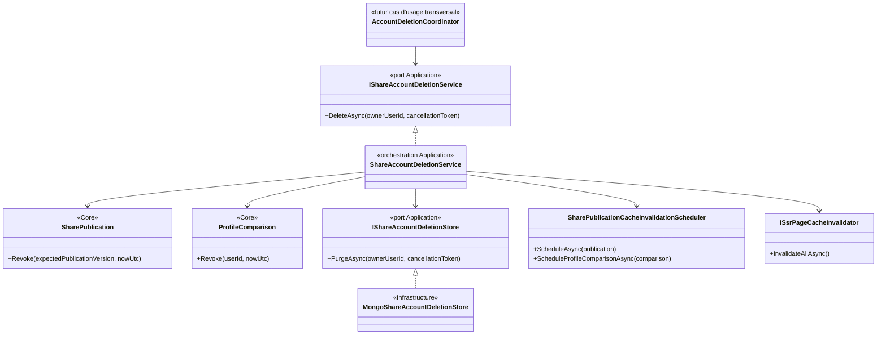
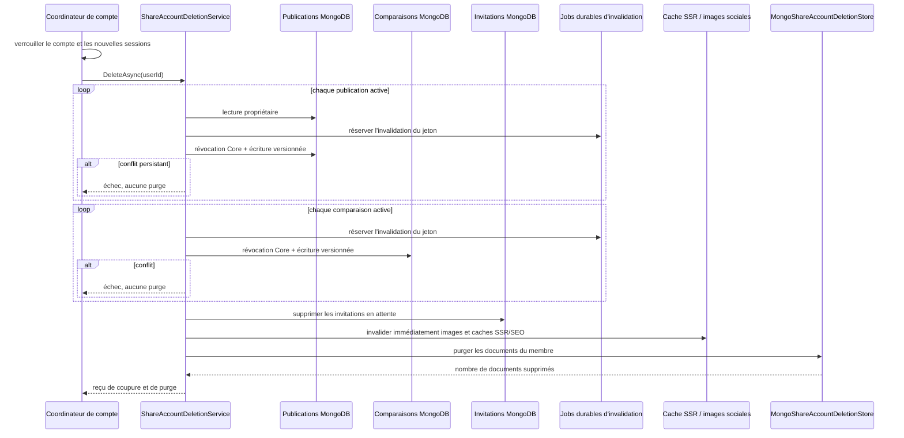
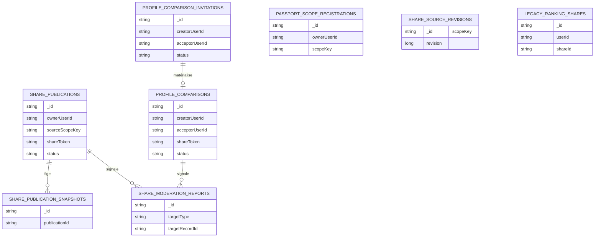

# SHARE-14B — Coupure et purge des partages à la suppression d'un compte

## Résultat métier

Le sous-système de partage fournit désormais un participant unique au workflow de
suppression d'un compte. Dès que le coordinateur global a verrouillé le compte pour
empêcher toute nouvelle écriture, ce participant :

1. révoque toutes les publications encore actives ;
2. révoque toutes les comparaisons auxquelles le membre participe ;
3. supprime les invitations encore en attente, qui expirent ainsi immédiatement ;
4. invalide les images sociales et toutes les pages SSR, documents SEO compris ;
5. purge ensuite seulement les snapshots et les documents privés de partage.

Une concurrence non résolue sur une publication ou une comparaison arrête le flux
avant la purge. L'état public est donc fermé ou l'opération échoue explicitement ;
elle ne peut jamais effacer les preuves avant d'avoir coupé les liens.

Le projet ne propose pas encore d'action utilisateur de suppression globale du
compte. `IShareAccountDeletionService` est volontairement un port interne : le futur
coordinateur transversal devra verrouiller le compte, l'appeler, puis poursuivre la
purge des visites, notes, commentaires, jetons et du compte lui-même. Cette frontière
évite de présenter une suppression partielle comme une suppression de compte.

## Frontières d'architecture

- Core reste l'unique propriétaire des transitions `Published/NeedsReview ->
  Revoked` et `Active -> Revoked`.
- Application fixe l'ordre irréversible des étapes et les reprises de concurrence.
- Infrastructure ne décide d'aucune visibilité ; elle efface physiquement des
  documents déjà rendus inaccessibles.
- WebAPI traduit le type `ProfileComparison` vers sa route SSR exacte, comme les
  quatre autres types de partage.

## Séquence fail-closed

Les jobs durables sont créés avant chaque écriture de révocation. Le worker relit
ensuite la source versionnée correspondante : une publication doit avoir atteint la
version attendue et une comparaison doit en plus être effectivement révoquée. Il
réessaie tant que cette barrière n'est pas franchie ; une écriture concurrente active
de même version ne peut donc pas acquitter prématurément l'invalidation. Si le
serveur SSR est momentanément indisponible, le worker reprend le travail sans jamais
réactiver la résolution publique. La comparaison possède son propre jeton et son
propre contrôle d'état, tout en utilisant le même chemin durable que les publications
centrales.

## Schéma MongoDB purgé

L'ordre de purge est : snapshots, signalements liés, invitations, comparaisons,
registres de scopes, révisions de source (y compris celles d'un aperçu, d'une note
ou d'un avatar jamais publié),
sauvegarde gelée de l'ancien classement,
puis publications centrales. Les identifiants des publications restent donc
disponibles tant que leurs dépendances n'ont pas été traitées. Les images sociales
ne sont pas persistées dans MongoDB : elles sont dérivées en mémoire et supprimées
par leurs jetons avant la purge.

Les pages partagées sont déjà exclues des fournisseurs de sitemap applicatifs et
portent `noindex`. L'invalidation globale avec `includeSeoDocuments=true` garantit
qu'aucun document SSR ou SEO antérieur ne survit au retrait.

## Preuves automatisées

- le service teste que publications et comparaisons sont révoquées avant
  l'expiration des invitations, l'invalidation des caches et la purge ;
- cinq conflits successifs sur une publication renvoient une erreur stable et
  interdisent tout appel au store de purge ;
- les filtres MongoDB couvrent les deux rôles d'une comparaison, séparent les
  signalements de publication de ceux d'une comparaison et recensent tous les
  scopes de source propres au membre ;
- le job durable refuse d'invalider une comparaison encore active, même si une
  écriture concurrente lui a déjà donné la version numérique attendue ;
- la traduction d'invalidation SSR couvre les huit routes localisées des
  comparaisons publiques ;
- le build Release vérifie les dépendances Application -> Core et Infrastructure ->
  Application sans accès MongoDB depuis WebAPI.

## Exploitation

Aucune migration MongoDB manuelle n'est requise. Le store travaille sur les
collections et index existants. L'opération est idempotente : après une première
purge réussie, une reprise ne trouve plus de document et retourne zéro suppression.
