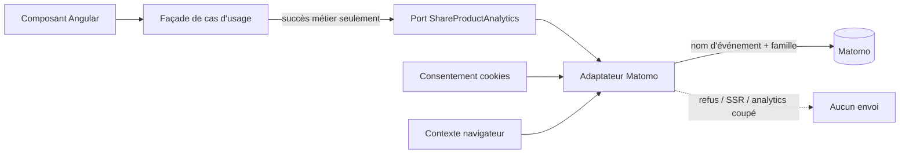
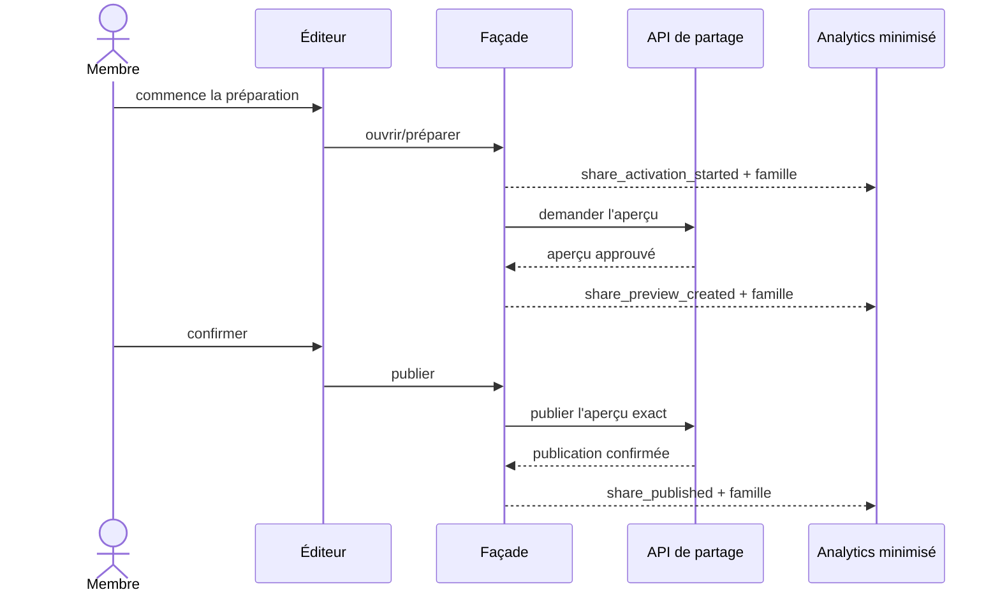

# SHARE-14C — Mesure minimisée du cycle de vie des partages

Date : 14 septembre 2026
Version : 5.3.11

## Résultat métier

Le produit peut maintenant répondre à des questions simples sans observer le
contenu personnel : les membres trouvent-ils l'aperçu, publient-ils réellement,
les liens s'ouvrent-ils correctement et un destinataire commence-t-il son propre
Passeport ?

La mesure couvre les cinq récits partageables : récapitulatif de visite, bilan
annuel, Passeport public, classement personnel et comparaison de profils. Elle
n'ajoute ni écran, ni cookie, ni base de données et ne modifie aucun contrat HTTP.

## Catalogue canonique

| Événement | Preuve métier | Moment exact |
|---|---|---|
| `share_activation_started` | Le membre commence à préparer un partage | ouverture de l'éditeur ou lancement valide de la préparation |
| `share_preview_created` | L'aperçu figé a été produit | réponse d'aperçu acceptée par la façade |
| `share_published` | L'activation a réussi | réponse de publication réussie ; pour une comparaison, acceptation bilatérale réussie |
| `share_revoked` | Le lien a été coupé | réponse de révocation réussie |
| `share_rotated` | Un nouveau lien opaque a remplacé l'ancien | réponse de rotation réussie |
| `share_opened` | Le récit public a réellement été résolu | premier chargement public réussi |
| `share_cta_passport_started` | Le destinataire a choisi de commencer son Passeport | clic sur le CTA présent dans le récit public |
| `share_render_failed` | Le récit n'a pas pu être rendu | erreur publique autre qu'un lien absent ou révoqué (`404`) |

Chaque événement porte exactement un `recapType` parmi :

- `visit-recap` ;
- `year-recap` ;
- `passport-profile` ;
- `personal-ranking` ;
- `profile-comparison`.

## Flux applicatif

La dépendance va de la façade vers un port abstrait du cœur frontend. L'adaptateur
Matomo reste l'unique endroit connaissant l'outil de collecte. Les composants se
limitent à signaler le clic explicite sur un CTA ; ils ne construisent aucune
donnée analytics.

## Séquence d'une publication

Une erreur API n'émet jamais un faux succès. Une réponse obsolète ignorée par la
protection de concurrence de la façade n'émet pas non plus d'événement.

## Preuve de minimisation

L'URL de collecte contient seulement :

- une catégorie fixe `Share` ;
- une action appartenant au catalogue fermé ci-dessus ;
- un label `recap-type=<famille>` ;
- les paramètres techniques Matomo déjà utilisés par l'application.

Elle ne reçoit jamais :

- un identifiant de publication, lien, visite, parc, attraction ou membre ;
- une date ou une précision temporelle issue du récit ;
- une note, une liste d'attractions ou un nombre personnel ;
- un nom, une identité comparée, une légende ou un commentaire public ;
- un jeton d'invitation ou de comparaison.

Le pixel utilise en plus la politique navigateur `no-referrer`. Même si l'adresse
du collecteur devenait un jour de même origine, l'URL publique et son jeton opaque
ne seraient pas transmis dans l'en-tête de provenance.

Les types TypeScript ferment les valeurs possibles avant l'adaptateur. Les tests
inspectent l'URL réellement construite et interdisent les marqueurs d'identifiants,
notes et commentaires. Ils prouvent aussi l'absence d'envoi sans consentement et
pendant le rendu serveur.

## Ouverture publique et erreurs

`share_opened` n'est émis qu'après résolution réussie du DTO public, jamais au seul
affichage d'un squelette. Chaque façade publique le borne à la première résolution
utile de son instance afin que pagination et filtres ne gonflent pas les ouvertures.

Un `404` signifie qu'un lien est inconnu, révoqué ou volontairement indisponible :
il conserve le comportement fonctionnel « introuvable » sans devenir une panne.
Les autres erreurs produisent au plus un `share_render_failed` par instance.

## Conversion vers le Passeport

Les pages publiques de visite, d'année et de Passeport possèdent déjà un CTA vers
la création ou l'ouverture du Passeport. Le clic produit
`share_cta_passport_started`. Le funnel peut ensuite être rapproché des événements
Passport existants, notamment `passport_opened`, `visit_creation_started` et
`visit_created`, dans la même session consentie. Aucun identifiant utilisateur
n'est nécessaire pour ce chemin agrégé.

## Données et exploitation

Ce jalon ne crée aucune collection MongoDB et ne demande aucune migration. Matomo
reste soumis aux paramètres existants de l'environnement et au consentement des
cookies facultatifs. Le rendu SSR ne déclenche jamais de pixel : un robot, un cache
ou un aperçu social ne compte donc pas comme une ouverture humaine.

Les métriques donnent des tendances produit, pas une preuve individuelle. Elles ne
doivent pas être utilisées pour reconstruire un Passeport, une relation entre deux
membres ou le contenu d'un partage.

## Vérifications automatisées

- contrat typé des huit événements et cinq familles ;
- URL Matomo limitée aux valeurs catégorielles ;
- refus de collecte sans consentement et en SSR ;
- succès, révocation et rotation émis après réponse API ;
- ouverture, CTA et erreur couverts sur les façades publiques ;
- `404` explicitement exclu des erreurs de rendu ;
- contrôles d'architecture `facade-ports` et `one-class-per-file` conservés.
