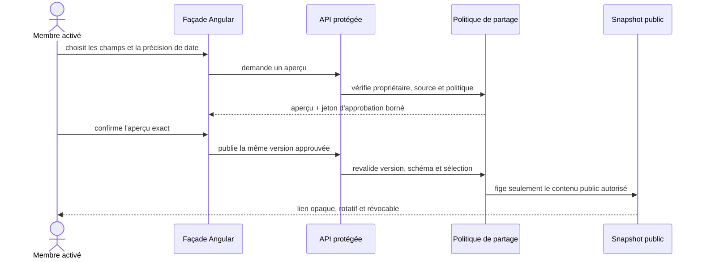

# SHARE-15 — Généralisation technique du partage

Date : 14 septembre 2026  
Version : 5.3.13

## Résultat métier

Les cinq récits partageables deviennent une capacité normale du produit :

- récapitulatif d'une visite ;
- bilan annuel ;
- passeport public sélectionnable ;
- classement personnel ;
- comparaison de deux passeports avec accord bilatéral.

Un déploiement candidat ne peut plus rendre artificiellement indisponibles les
aperçus, publications, rotations, révocations ou invitations avec une réponse
`503`. Les vraies protections restent actives : compte authentifié et activé,
limitation de débit, aperçu exact avant publication, visibilité privée par défaut,
jetons opaques, révocation, absence de cache privé et modération.

## Décision de généralisation

La phase communautaire n'est pas une dépendance de livraison. Sur instruction
produit explicite, SHARE-15 ne prétend donc pas qu'une cohorte réelle a démontré
une adoption ou une compréhension mesurée. La décision repose sur les preuves
techniques, métier, de confidentialité, d'accessibilité, de responsive et
d'exploitation accumulées par SHARE-01 à SHARE-14C.

Cette exception ne retire aucune garantie fonctionnelle. L'utilisateur voit le
périmètre public dans l'aperçu et doit confirmer exactement sa version, sa
précision de date et ses champs. Toute modification invalide cette approbation.

## Retrait complet du mécanisme transitoire

Le réglage `Sharing:SharePublicationPreview` a été supprimé, plutôt que conservé
comme second état dormant :

```text
avant
configuration de déploiement
    └── flag de préversion
          ├── false → 503 avant le cas d'usage
          └── true  → règles métier normales

après
route protégée
    └── contrôleur HTTP
          └── handler Application
                └── politique Core + persistance autoritative
```

Le type de configuration, son enregistrement DI, les branches des deux
contrôleurs, les réponses OpenAPI `503`, la variable Compose et la surcharge du
candidat de déploiement sont retirés ensemble. Le test de déploiement interdit
désormais de réintroduire ce nom de réglage dans le candidat. L'isolation des jobs
durables du conteneur candidat reste inchangée.

## Parcours conservé



La suppression du flag ne court-circuite donc ni le domaine, ni l'Application,
ni le consentement. Elle supprime uniquement une barrière de déploiement devenue
obsolète.

## Preuves du gate `SHARE-G`

| Garantie | Preuve active |
|---|---|
| Privé par défaut | `SharePublication` naît privée et aucune route ne publie sans confirmation. |
| Champs explicitement choisis | Politique typée, aperçu et jeton d'approbation lié au schéma et aux champs. |
| Dates et commentaires protégés | Précision bornée ; commentaires privés absents des contrats publics. |
| Même périmètre partout | Snapshots versionnés communs à l'API, au SSR et aux images sociales. |
| Liens contrôlables | Jetons opaques, rotation, révocation et invalidation durable des caches. |
| Source modifiée | État de revue requis ; aucune nouvelle donnée n'est publiée silencieusement. |
| Comparaison consentie | Invitation opaque et acceptation des deux participants avant résultat public. |
| Faible volume honnête | Compatibilité précise masquée sous le seuil métier. |
| Cycle de vie complet | Export SHARE-14A, suppression SHARE-14B et mesure minimisée SHARE-14C. |
| Passage vers le Passeport | CTA explicite sur un récit valide, sans compter les liens morts. |
| Sans réseau social | Liens Web autonomes, aucun fil social ni chat requis. |
| Compréhension avant confirmation | Aperçu exact et résumé de confidentialité ; cohorte réelle volontairement non requise par la décision produit. |

## Sécurité, responsive et exploitation

Les attributs `Authorize`, `RequireActivatedUnblockedUser`, `ResponseCache(NoStore)`
et les politiques de rate limiting ciblées restent en place sur les contrôleurs.
Les lectures publiques continuent de valider le jeton contre l'autorité centrale.

SHARE-15 ne change aucun DOM ni style. Les contrats responsive existants couvrent
les éditeurs, récits publics, invitation, comparaison, modération et classement
partagé jusqu'à 320 px, avec césure des chaînes longues et absence de débordement
horizontal. La CI conserve le build Angular SSR et la suite frontend complète.

Le retour arrière s'effectue en redéployant l'image applicative précédente. Un
interrupteur dormant n'est pas conservé : il recréerait deux états d'exploitation
et pourrait masquer une régression derrière une indisponibilité générale. Les
protections ciblées, la révocation propriétaire et la modération restent les
mécanismes opérationnels appropriés.

## Données et migration

Aucune collection, aucun document et aucun index MongoDB ne change. Il n'y a donc
ni migration de données ni coexistence de modèles. Seule une configuration de
préversion sans valeur métier est supprimée.

## Vérifications ciblées

- tests des contrôleurs de publications et d'invitations ;
- conservation de l'authentification, de l'activation, du `no-store` et du rate
  limiting par réflexion ;
- validation de la configuration de production sans variable obsolète ;
- validation du candidat de déploiement : jobs durables coupés, partage non coupé ;
- garde globale « une classe = un fichier » ;
- suites complètes backend, frontend, SSR, sécurité et images Docker dans la CI.

## Fichier supprimé intentionnellement

- `API/AmusementPark.WebAPI/Configuration/SharePublicationRolloutSettings.cs` :
  ancien modèle du flag de préversion, désormais sans rôle.
