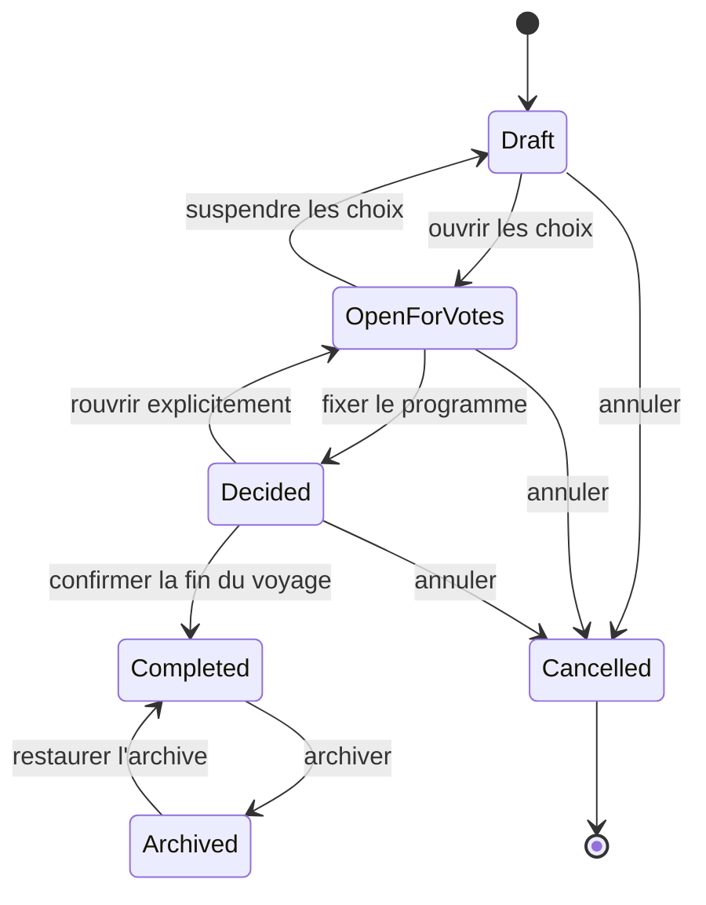
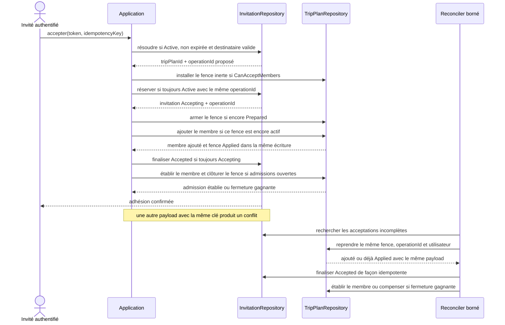
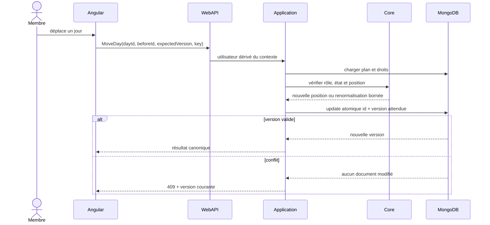
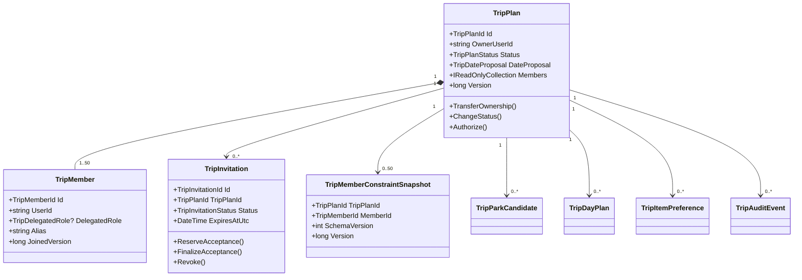

# TRIP-01 — Agrégat, rôles et confidentialité des voyages collaboratifs

Date : 2026-09-17

Statut : accepté pour implémentation progressive, sans voyage ni invitation créés par cet ADR

Version : 5.3.58

Roadmap : `docs/roadmaps/product-growth/06-collaborative-trip-planning-roadmap.md`

## Résultat métier

Un voyage sera d'abord un espace privé appartenant à une seule personne. Cette
personne pourra préparer seule son projet, puis inviter des membres avec des droits
compréhensibles. Chaque membre restera maître de ses propres contraintes et pourra
les retirer. Un vote, une préférence ou un horaire choisi par le groupe ne sera
jamais présenté comme un fait officiel du parc.

L'invitation montrera seulement un aperçu minimal avant connexion. Elle ne donnera
accès ni aux contraintes, ni aux votes, ni aux notes privées des autres membres.
Deux modifications simultanées ne pourront pas s'écraser silencieusement et les
actions rejouées après une coupure resteront idempotentes.

Cette décision ne crée aucune collection, route, page, invitation ou donnée
utilisateur. Elle fixe les invariants que `TRIP-02` à `TRIP-13` devront prouver.
Conformément à la décision produit, aucune cohorte réelle ne bloque les jalons
techniques suivants ; aucune preuve d'usage communautaire ne sera toutefois
revendiquée sans observation réelle.

## Contexte et décisions FOUNDATION réutilisées

Le projet dispose déjà de briques adaptées :

- les identifiants restent des chaînes opaques aux frontières et deviennent des
  value objects typés dans le Core ;
- MongoDB autonome impose de ne pas inventer de transaction multi-collections ;
- les opérations longues ou réparables utilisent des jobs à lease et des
  idempotency keys ;
- les listes réordonnables utilisent un `SortPosition` 64 bits espacé ;
- `FIT` peut fournir un snapshot explicable, jamais une vérité définitive ;
- `WATCH` peut notifier un changement important sans devenir le moteur du voyage ;
- `SHARE` reste le seul mécanisme de publication volontaire et révocable ;
- le Passeport reste privé et ne reçoit aucune visite sans confirmation
  individuelle.

Le prototype de roadmap qui utilisait des `Guid` est remplacé par cette décision.
Aucune migration générale d'identifiants n'est autorisée.

## Décision 1 — frontière de l'agrégat `TripPlan`

`TripPlan` est la racine d'autorité pour l'identité du voyage, son propriétaire,
ses membres, ses dates proposées, son état et sa version de concurrence.

```text
TripPlan
├── Id : TripPlanId (chaîne opaque typée)
├── OwnerUserId : chaîne opaque
├── Title : texte borné
├── AccessScope : MembersOnly
├── Status : Draft | OpenForVotes | Decided | Completed | Archived | Cancelled
├── DateProposal : None | Fixed | Range | Candidates
├── DestinationTimeZoneId : IANA facultatif tant qu'aucune date n'est fixée
├── Members[1..50] : sous-documents bornés, propriétaire inclus
├── MemberAdmissionFence : état, invitation, opération, génération et échéance
├── AdmissionClosure : Open | Closing(cible, opération réclamée) | Closed
├── ChildMutationEpoch : long, commence à 1
├── ActiveChildMutationLeases[0..32] : acteur, sujet, epochs et échéance
├── DeletionState : None | Pending | Purging | Purged
├── Version : long, commence à 1
├── CreatedAtUtc / UpdatedAtUtc
└── ActiveMutation : lease courte facultative pour les mutations composées
```

Le propriétaire est toujours un membre et `OwnerUserId` est l'unique autorité de
propriété. Son sous-document membre porte `DelegatedRole = null`; les autres portent
exclusivement `Editor`, `Participant` ou `Viewer`. Le rôle effectif `Owner` est
dérivé lorsque l'identifiant du membre correspond à `OwnerUserId`. Il n'existe donc
pas deux sources de vérité pour la propriété.

Les membres sont embarqués dans le document `TripPlan`, avec une limite de 50.
Cette taille est bornée et permet de rendre atomiques l'ajout d'un membre, le
changement de rôle, le transfert de propriété et le départ. Les données à forte
cardinalité — préférences par attraction, candidats, jours et audit — restent dans
des collections séparées.

Les objets enfants ne peuvent pas contourner la racine : toute commande charge un
`TripAccessContext` depuis le plan, vérifie le rôle et la version, puis acquiert une
lease de mutation enfant portant `ChildMutationEpoch` avant d'appeler le port
spécialisé. WebAPI ne décide jamais des permissions et Infrastructure ne
reconstruit jamais une règle métier.

## Décision 2 — états et dates sans déduction

### Cycle de vie



- aucune transition n'est déclenchée par l'horloge seule ;
- `Decided` exige au moins un jour décidé et des dates cohérentes ;
- `Completed` n'est possible qu'après le dernier jour fixé dans le fuseau de
  destination ;
- `Completed` ne crée aucune visite et propose seulement une confirmation privée à
  chaque membre ;
- `Archived` masque le voyage des listes actives sans le supprimer ;
- `Cancelled` est terminal et révoque les invitations actives ;
- `CanAcceptMembers` est vrai uniquement en `Draft`, `OpenForVotes` ou `Decided`,
  lorsque `DeletionState = None` et `AdmissionClosure = Open` ; toute transition
  qui ferme cette capacité réclame atomiquement le fence d'admission et retire un
  éventuel membre encore provisoire avant de compenser les invitations concernées ;
- la suppression reste distincte d'une annulation et suit la politique décrite
  plus bas.

### Sémantique des dates

`TripDateProposal` conserve exactement ce que le groupe sait :

- `None` : aucune date ;
- `Fixed` : début et fin inclus, précision jour ;
- `Range` : fenêtre possible, sans prétendre que tous les jours seront utilisés ;
- `Candidates` : 1 à 31 dates locales uniques, ordonnées et bornées.

Le fuseau IANA est celui de la destination. Une date d'invitation, un horaire du
navigateur ou la date de création du plan ne deviennent jamais une date de voyage.
Les jours décidés exigent une date fixe comprise dans la proposition. Les heures
officielles restent des faits sourcés ; les heures d'arrivée souhaitées restent des
choix du groupe.

## Décision 3 — rôles et permissions

Les rôles effectifs sont `Owner`, `Editor`, `Participant` et `Viewer`. L'option
`EditorsCanInvite` appartient au plan et vaut `false` par défaut.

| Action | Owner | Editor | Participant | Viewer |
|---|---:|---:|---:|---:|
| Lire le plan accepté | Oui | Oui | Oui | Oui |
| Renommer et modifier les dates | Oui | Oui | Non | Non |
| Ajouter ou ordonner des candidats et des jours | Oui | Oui | Option explicite | Non |
| Ouvrir les votes ou décider | Oui | Oui | Non | Non |
| Inviter et révoquer | Oui | Si option | Non | Non |
| Changer un rôle | Oui | Non | Non | Non |
| Voter et définir ses priorités | Oui | Oui | Oui | Non |
| Créer, remplacer ou retirer ses propres contraintes partagées | Oui | Oui | Oui | Oui |
| Modifier les données personnelles d'un autre membre | Non | Non | Non | Non |
| Exporter le plan commun | Oui | Oui | Oui | Oui |
| Supprimer le voyage | Oui | Non | Non | Non |
| Quitter le voyage | Après transfert | Oui | Oui | Oui |

Règles supplémentaires :

- le propriétaire ne peut ni se rétrograder ni partir sans transférer la propriété
  à un membre accepté ;
- le transfert choisit le rôle délégué de l'ancien propriétaire et met à jour, dans
  la même écriture du plan, `OwnerUserId` et les deux sous-documents concernés ;
- un rôle ne donne jamais accès aux champs que leur auteur n'a pas partagés ;
- le rôle `Viewer` interdit les décisions collectives, mais ne retire jamais à une
  personne le contrôle de son propre snapshot ni son droit de le supprimer ;
- un membre révoqué perd l'accès immédiatement, même si un rendu local existe ;
- les permissions sont vérifiées dans Application à chaque cas d'usage, jamais
  seulement dans Angular ;
- le client reçoit des capacités calculées et peut adapter l'interface, mais ces
  capacités ne constituent pas une autorisation.

## Décision 4 — contrôle des données par chaque membre

Le plan ne copie pas un profil `FIT` complet. Lorsqu'une personne choisit de
partager des contraintes, Application construit un snapshot dédié au voyage avec
une liste blanche :

```text
TripMemberConstraintSnapshot
├── MemberId
├── MemberDataEpoch
├── SchemaVersion
├── SharedFields : taille, mobilité, intensité, accessibilité… selon opt-in
├── Values : uniquement les valeurs explicitement sélectionnées
├── SourceRevision : révision FIT d'origine
├── CapturedAtUtc
└── Version
```

- aucun nom réel, courriel, date de naissance, donnée médicale libre ou commentaire
  privé n'est copié ;
- l'absence d'un champ signifie « non partagé », jamais « compatible » ;
- seul le membre concerné peut créer, remplacer ou supprimer son snapshot ;
- quitter ou demander l'effacement coupe immédiatement l'accès, bloque les nouvelles
  leases portant ce membre comme acteur ou sujet, attend ou expire les leases déjà
  accordées, puis supprime ses contraintes et préférences actives ;
- le propriétaire ne peut pas bloquer cet effacement ;
- les décisions historiques conservent le fait qu'une décision a existé, mais
  retirent l'identifiant de compte, l'alias et les valeurs personnelles. L'interface
  affiche alors « ancien participant » sans pseudonyme corrélable ;
- un snapshot `FIT` périmé est signalé et n'est jamais actualisé sans consentement.

## Décision 5 — invitations opaques et aperçu minimal

Une invitation est un agrégat séparé car elle existe avant l'adhésion au plan.

```text
TripInvitation
├── Id : TripInvitationId
├── TripPlanId
├── TokenHash : SHA-256 du jeton aléatoire, jamais le jeton brut
├── TokenHint : préfixe non résolvable pour le support
├── ProposedRole : Editor | Participant | Viewer, jamais Owner
├── InviterMemberId
├── TargetEmailHmac : facultatif
├── Status : Active | Accepting | RevocationPending | Accepted | Declined | Revoked | Expired
├── ExpiresAtUtc / AcceptedAtUtc / RevokedAtUtc
├── UseCount : 0 puis 1 (invitation strictement mono-usage)
├── Version et lease d'acceptation
└── CreatedAtUtc / UpdatedAtUtc
```

Le jeton contient au moins 256 bits générés par CSPRNG et encodés en Base64 URL
canonique. Seul son hash est persisté. Une invitation ciblée compare le courriel
vérifié du compte à un HMAC versionné issu d'un trousseau rotatif ; un simple hash
de courriel n'est pas accepté. Une adresse éventuellement nécessaire à l'envoi est chiffrée, séparée et
supprimée après la durée annoncée.

La première version ne crée que des invitations mono-usage. Une invitation de
groupe réutilisable exigerait un autre agrégat et une nouvelle décision
d'architecture ; elle ne sera pas simulée par un `MaxUses` supérieur à 1.

L'aperçu public ne demande pas de compte et renvoie uniquement :

- titre borné du voyage ;
- alias public choisi de l'invitant, ou libellé neutre ;
- rôle proposé ;
- période approximative selon une politique explicite ;
- nombre total de membres sous forme bornée ;
- expiration et actions connexion/création de compte.

Il ne contient ni liste de membres, ni parc candidat, ni vote, ni contrainte, ni
note, ni jour détaillé, ni identifiant interne. Jeton inconnu, expiré, consommé ou
révoqué produit le même `404` public et aucune route ne permet l'énumération.

## Décision 6 — acceptation idempotente sur MongoDB autonome

L'acceptation touche l'invitation séparée et le membre embarqué. Elle suit donc une
saga bornée et réparable, sans prétendre à une transaction distribuée :



Une panne après l'ajout du membre ne permet pas une seconde adhésion :
`operationId` est conservé dans le sous-document du membre et l'index logique
`(TripPlanId, UserId)` reste unique dans l'agrégat. Le fence est installé avant la
réservation, mais il reste inerte : lui seul ne permet ni l'ajout ni l'accès. La
commande attend obligatoirement que l'écriture conditionnelle de réservation ait
réussi avant de tenter l'ajout. Si une révocation gagne pendant cette première
fenêtre, l'invitation n'est plus `Active`, la réservation retardée échoue et le
fence `Prepared` orphelin est annulé par la commande ou le reconciler sans avoir
ajouté de membre. Après la réservation, l'invitation est définitivement liée à
l'identifiant du compte acceptant et à `operationId`. L'armement est une écriture
conditionnelle `Prepared -> Active` ; une compensation ayant déjà écrit
`Cancelled` la rend donc définitivement inapplicable.

Un fence `Prepared` persiste l'identifiant d'invitation, `operationId`, le compte
candidat, une génération et `LeaseExpiresAtUtc`. Le reconciler balaye aussi les
plans portant un fence `Prepared` expiré, pas seulement les invitations
`Accepting`. Si l'invitation est encore `Active`, il écrit `Cancelled` avec la même
génération ; si elle est `Accepting` pour cette opération, il reprend la saga ;
sinon il compense. Une commande reprend avec une annulation liée à l'échéance du
fence et ne peut armer qu'un fence `Prepared` de même opération et génération avant
son expiration. Une commande suspendue au-delà de la lease échoue donc sans
réactiver le fence, tandis que l'annulation rend immédiatement la place disponible
pour une nouvelle génération.

L'installation, l'armement, l'ajout provisoire et l'établissement définitif du
membre exigent tous `CanAcceptMembers = true`. Après le passage conditionnel de
l'invitation de `Accepting` à `Accepted`, l'admission n'est confirmée à l'appelant
que si une dernière écriture sur le plan transforme le membre provisoire en membre
établi et clôture le fence `Applied` de la même opération. Cette écriture est le
point de linéarisation de l'adhésion.

Une transition vers `Completed`, `Archived` ou `Cancelled`, comme le début d'une
suppression, commence par une écriture du plan `Open -> Closing`. Elle rend
`CanAcceptMembers` faux, capture l'`operationId` du fence courant, annule ce fence
et retire dans la même écriture le membre encore provisoire. Elle compense ensuite
toutes les invitations `Active` et, pour l'opération capturée, l'invitation
`Accepting` **ou déjà `Accepted`** en la passant par `RevocationPending`. L'état
métier cible et `AdmissionClosure = Closed` ne sont publiés qu'après cette
compensation ; une panne laisse `Closing` au reconciler.

Si la fermeture gagne après l'écriture `Accepted` mais avant l'établissement du
membre, cette dernière écriture échoue, l'appelant ne reçoit aucune confirmation
et l'invitation `Accepted` capturée est compensée. Si l'établissement du membre
gagne avant `Closing`, le fence est déjà clôturé : l'adhésion est réellement
acquise et la transition terminale est linéarisée après elle. Il n'existe donc
aucune fenêtre où une réponse confirme une adhésion que le plan avait déjà
refusée.

Une lease expirée ne remet jamais l'invitation en état `Active` : le reconciler
reprend exclusivement la même opération et le même payload jusqu'à finalisation ou
révocation demandée. Le `MemberAdmissionFence` vit dans le document `TripPlan` :
l'ajout du membre vérifie que son état est `Active` puis ajoute le membre et passe
le fence à `Applied` dans une seule écriture conditionnelle.

Une révocation pendant `Accepting` passe d'abord l'invitation en
`RevocationPending`. Elle annule ensuite le fence et retire, dans la même écriture
du plan, le membre portant cet `operationId` s'il avait déjà été ajouté. MongoDB
ordonne ces deux écritures concurrentes sur le même document : si l'ajout gagne,
l'annulation le retire ; si l'annulation gagne, l'ajout retardé échoue car le fence
n'est plus `Active`. L'invitation ne devient `Revoked` qu'après confirmation de
cette compensation. Une erreur permanente conserve `RevocationPending` pour le
reconciler ; elle ne déclare jamais la révocation terminée prématurément. Il faut
créer une nouvelle invitation pour recommencer. Le payload du job ne contient
aucune donnée de profil ni jeton brut.

## Décision 7 — concurrence et opérations fines

Chaque mutation privée reçoit :

- la version `long` attendue du plan ou de l'objet spécialisé ;
- une `IdempotencyKey` opaque et bornée pour les créations et batchs rejouables ;
- une commande fine : renommer, proposer une date, ajouter un candidat, déplacer
  un bloc, voter ou changer un rôle, jamais remplacer tout le plan ;
- un `OperationId` corrélé à l'audit minimisé.

Une version obsolète produit un conflit métier avec la version courante et invite
le client à recharger. Aucun « dernier écrivain gagnant » n'est utilisé. Un retry
avec la même clé et le même hash de payload renvoie le premier résultat ; la même
clé avec un payload différent est un conflit.

Les éléments ordonnés portent un `SortPosition: long`. Des positions espacées sont
utilisées et seule une fenêtre locale est renormalisée lorsqu'il n'existe plus
d'espace. Le drag-and-drop n'est qu'une interaction cliente au-dessus de la même
commande accessible au clavier ; il n'est jamais nécessaire à une fonction
critique.



## Décision 8 — faits officiels et choix du groupe

Trois catégories sont physiquement et visuellement distinctes :

| Catégorie | Exemple | Autorité | Effet d'une mise à jour |
|---|---|---|---|
| Fait officiel | parc fermé, horaire, attraction indisponible | données publiques sourcées | crée un avertissement, ne modifie pas le choix |
| Snapshot explicatif | résultat `FIT` calculé le 12/09 | méthode et sources versionnées | devient périmé et peut être recalculé |
| Choix du groupe | parc retenu, arrivée souhaitée, priorité | membres autorisés | change uniquement par commande du groupe |

Un avertissement officiel ne supprime jamais automatiquement un candidat, un jour
ou un vote. Une préférence majoritaire ne transforme jamais une incompatibilité en
compatibilité. La synthèse conserve les inconnues et les désaccords.

## Décision 9 — architecture cible



- **Core** : value objects, agrégats, états, transitions, matrice de permissions,
  propositions de dates, ordre stable et règles de minimisation représentables ;
- **Application** : ownership, autorisation, orchestration des ports, idempotence,
  saga d'acceptation, anonymisation, export et suppression ;
- **Infrastructure** : documents et indexes Mongo, CSPRNG, hash/HMAC, chiffrement,
  leases, jobs et reconciliation ;
- **WebAPI** : utilisateur dérivé du contexte, contrats bornés, `409`, `404`
  uniforme, rate limits et Problem Details ;
- **Angular** : facades et ports, capacités présentées sans recalculer les droits,
  conflits explicites et interface responsive.

Chaque classe, interface, record et enum aura son propre fichier. Aucun composant
n'injectera directement un service API si un port existe.

## Décision 10 — persistance Mongo cible

`TRIP-01` ne crée rien. Les tranches suivantes pourront introduire :

```text
trip-plans
  _id, ownerUserId, title, accessScope, status, dateProposal,
  destinationTimeZoneId, members[], options, memberAdmissionFence?,
  admissionClosure, childMutationEpoch, activeChildMutationLeases[], deletionState,
  activeMutation?, version,
  createdAtUtc, updatedAtUtc

trip-invitations
  _id, tripPlanId, tokenHash, tokenHint, proposedRole, inviterMemberId,
  targetEmailHmac?, status, useCount, acceptanceLease?,
  expiresAtUtc, version, createdAtUtc, updatedAtUtc

trip-member-constraints
trip-park-candidates
trip-day-plans
trip-item-preferences
trip-audit-events
trip-idempotency-operations
```

Indexes minimaux à prouver :

- plans `{ ownerUserId, status, updatedAtUtc desc }` ;
- plans `{ members.userId, status, updatedAtUtc desc }` multikey ;
- plans `{ memberAdmissionFence.leaseExpiresAtUtc }` partiel pour les fences actifs ;
- plans `{ deletionState, updatedAtUtc }` pour la reprise des purges ;
- invitations `tokenHash` unique et TTL sur `expiresAtUtc` pour les états
  purgeables ;
- invitations `{ tripPlanId, status, updatedAtUtc }` ;
- contraintes `(tripPlanId, memberId)` unique ;
- candidats `(tripPlanId, parkId)` unique par cible canonique ;
- jours `(tripPlanId, localDate)` unique lorsqu'une date est fixée ;
- préférences `(tripPlanId, memberId, parkItemId)` unique ;
- audit `(tripPlanId, sequence)` unique et `(tripPlanId, occurredAtUtc)` ;
- idempotence `(ownerScope, key)` unique avec TTL borné après état terminal.

Les indexes ne suffisent pas à autoriser : chaque lecture reste filtrée par le plan
accessible. Aucun index ni endpoint ne permet de lister des voyages publics.

## Décision 11 — audit, export, suppression et rétention

L'audit append-only explique une mutation sans recopier ses textes ou contraintes :

- type d'action, voyage, séquence, rôle acteur au moment de l'action ;
- identifiant de membre interne tant que la personne reste membre ;
- références techniques minimales, anciennes et nouvelles versions ;
- aucune adresse, aucun jeton, aucune valeur de contrainte, aucune note libre ;
- l'état courant ne sera jamais reconstruit depuis l'audit.

Chaque membre peut exporter le plan auquel il a accès et ses propres données.
L'export commun respecte les droits au moment de la génération et exclut les
contraintes non partagées. L'export personnel inclut ses votes et contraintes avec
des libellés métier, jamais les identifiants internes seuls.

Lors d'un départ ou d'un effacement :

1. accès, abonnements `WATCH` et invitations personnelles sont révoqués ;
2. contraintes et préférences actives sont supprimées ;
3. alias et identifiant de compte sont retirés des décisions historiques ;
4. les compteurs collectifs sont recalculés ou invalidés par job idempotent ;
5. les décisions du groupe restent lisibles avec « ancien participant » ;
6. un reconciler reprend toute étape interrompue avant la fin de la lease.

Supprimer le voyage exige une version attendue et une confirmation récente. Toutes
les écritures dans une collection enfant suivent une barrière commune :

1. l'Application acquiert atomiquement sur le plan une lease bornée contenant
   `OperationId`, `ChildMutationEpoch` et `LeaseExpiresAtUtc` ; aucune lease n'est
   accordée lorsque `DeletionState != None` ;
2. le délai d'annulation du client Mongo et `maxTimeMS` sont inférieurs au temps
   restant de la lease, avec une marge fixe. Une commande suspendue au-delà de son
   échéance ne peut donc pas démarrer une écriture tardive ;
3. chaque document enfant porte l'epoch et l'opération qui l'ont écrit. Le port
   refuse une commande dont la lease est expirée ou annulée avant d'appeler Mongo.
   La création réserve d'abord une coquille `Reserved` sans contenu utilisateur,
   contenant seulement identifiants techniques, epoch et échéance, avec TTL. Le
   contenu est ensuite matérialisé et passé à `Committed` par `UpdateOne` sans
   upsert. Son filtre exige simultanément `State = Reserved`, le même
   `OperationId`, le même `ChildMutationEpoch`, la même génération de lease et la
   garde serveur `$expr: $$NOW < LeaseExpiresAtUtc`. Les mises à jour utilisent la
   même identité de fence sans upsert et les lectures ignorent toute coquille non
   `Committed`. Si la coquille a été purgée, remplacée par une nouvelle génération
   ou si l'échéance est passée, il n'existe donc aucune branche capable de
   matérialiser ou recréer l'ancien contenu privé ;
4. une modification d'un document `Committed` installe d'abord, par `UpdateOne`
   sans upsert, version attendue et garde serveur
   `$expr: $$NOW < LeaseExpiresAtUtc`, un sous-document `PendingMutation` sans
   nouveau contenu. Il porte la nouvelle opération, les epochs, la génération et
   l'échéance. Un second `UpdateOne` sans upsert exige cette identité exacte et
   applique le nouveau contenu tout en retirant `PendingMutation`. Son filtre
   répète obligatoirement la garde serveur
   `$expr: $$NOW < PendingMutation.LeaseExpiresAtUtc`. Pendant ce temps, les
   lectures continuent à voir l'ancien contenu `Committed`. Une mutation expirée
   est abandonnée et son sous-document technique est retiré par le reconciler ;
5. l'écriture libère sa lease de façon idempotente, avec reprise par reconciler.

La suppression passe atomiquement le plan à `Pending`, place
`AdmissionClosure = Closing`, incrémente `ChildMutationEpoch`, réclame tout
`MemberAdmissionFence` et interdit toute nouvelle lease ou admission. Elle rend
immédiatement le plan inaccessible, puis marque `RevocationPending` les invitations
`Active`, ainsi que l'invitation `Accepting` ou `Accepted` de l'opération réclamée,
et reprend leur compensation ; aucun token ne peut rejoindre un plan dont la
suppression a commencé. Elle attend ensuite la fin des leases de l'ancien epoch ou leur
expiration, puis une durée de sûreté supérieure au délai serveur maximal. Le job
purge invitations et enfants d'un epoch antérieur, refait un balayage après la
barrière et passe à `Purged` seulement si aucune lease, invitation active ou donnée
ancienne ne subsiste. Le tombstone du plan est conservé pendant la durée
de rétention annoncée ; pendant cette période, le reconciler supprime également
toute coquille technique tardive de l'ancien epoch, que son TTL aurait aussi
éliminée. Une panne conserve `Pending` ou `Purging`, ne réactive jamais le plan et
ne déclare jamais la purge terminée prématurément. Les délais exacts seront fixés
avec l'implémentation et documentés dans la politique de confidentialité avant
activation.

Le départ ou l'effacement d'un seul membre utilise la même barrière à portée
réduite. Chaque `TripMember` porte `MemberDataEpoch` et un état de participation.
La demande passe le membre à `Leaving`, incrémente son epoch et refuse toute
nouvelle lease dont `ActorMemberId` ou `SubjectMemberId` le désigne. Le job attend
ou expire les leases où il est acteur, ainsi que celles de son ancien epoch où il
est sujet, purge contraintes, préférences et coquilles de ce membre, effectue un
second balayage, puis retire ou anonymise le membre. L'opération ne devient
terminale qu'après ce second balayage ; une panne reste reprenable et le membre ne
récupère jamais son accès entre-temps.

## Décision 12 — contrat UX, accessibilité et responsive

Les futures pages doivent fonctionner dès 320 px sans débordement horizontal :

- cartes en une colonne sur mobile, zones cliquables d'au moins 44 px ;
- textes longs dans les huit langues avec `min-width: 0` et retour à la ligne ;
- actions principales proches du contexte, menus secondaires regroupés ;
- contrôles non applicables masqués plutôt qu'affichés désactivés sans information ;
- matrices transformées en cartes filtrables sur petit écran ;
- réordonnancement disponible par boutons clavier et menu, même si le drag-and-drop
  est proposé ;
- focus restauré après mutation, erreurs reliées aux champs et statuts annoncés ;
- faits officiels, choix et avertissements distingués par libellé, icône et texte,
  jamais par la couleur seule ;
- aucune donnée privée dans le HTML SSR d'une invitation avant résolution sûre.

Chaque page responsive sera couverte au minimum aux largeurs 320, 360, 390, 768 et
1280 px. Les routes privées restent `noindex`; la preview publique est
`noindex, nofollow` et ne rejoint ni sitemap ni hreflang tant que toutes les
variantes ne sont pas réellement servies.

## Preuves exigées dans les prochaines tranches

### Core et Application

- identifiants chaîne typés, titre et dates bornés ;
- un seul propriétaire, transfert atomique et départ refusé sans transfert ;
- matrice complète des permissions et refus croisés ;
- transitions valides et invalides pour chaque état ;
- aucune transition automatique depuis l'horloge ;
- snapshot de contraintes en liste blanche et suppression par son auteur ;
- version optimiste, dépassement de `long` et idempotence payload-identique ;
- même clé avec payload différent refusée ;
- ordre stable et renormalisation locale bornée ;
- aucune visite créée par `Completed`.

### Infrastructure et WebAPI

- allers-retours Mongo et indexes réels ;
- transfert de propriété dans une seule écriture du plan ;
- acceptation interrompue à chaque étape puis réparée sans doublon ;
- fence `Prepared` installé avant réservation puis rendu inoffensif si une
  révocation gagne avant son armement ;
- fence `Prepared` expiré après panne balayé par génération sans annuler une
  commande dont la lease reste valide ;
- écriture retardée après expiration de lease incapable d'autoriser un second
  compte ou de réactiver l'invitation ;
- révocation concurrente à une écriture retardée laissant le plan sans membre
  admis par l'opération révoquée avant l'état terminal `Revoked` ;
- suppression passant `Pending` atomiquement avec la fermeture des admissions et
  compensant toute invitation déjà `Accepting` ;
- transition vers `Completed`, `Archived` ou `Cancelled` fermant et compensant les
  admissions en cours avant son état terminal ;
- finalisation `Accepted` concurrente à une fermeture, sans confirmation si le
  fence `Applied` n'a pas pu établir le membre avant `Closing` ;
- token brut absent de Mongo, des logs, jobs et réponses privées ;
- expiration, révocation, rotation, rate limit et `404` uniforme ;
- preview dépourvue de membres, contraintes, votes et identifiants ;
- suppression et anonymisation reprenables ;
- suppression bloquant les nouvelles leases, attendant les écritures de l'ancien
  epoch et repurgeant toute écriture ambiguë avant `Purged` ;
- création enfant retardée incapable de matérialiser du contenu sans une coquille
  `Reserved` de mêmes opération, epoch et génération encore valide, et coquilles
  tardives purgées par TTL ;
- mise à jour d'un enfant existant réservant une nouvelle `PendingMutation` sans
  masquer le contenu validé ni réutiliser le fence de création ;
- départ d'un membre invalidant son epoch, attendant ses leases et repurgeant ses
  données avant l'état terminal, qu'il soit acteur ou sujet de l'écriture ;
- absence de lecture N+1 sur les listes et synthèses.

### Angular, SSR et mobile

- capacités par rôle, conflit `409` visible et recharge explicite ;
- parcours clavier complet, y compris réordonnancement ;
- aperçu minimal sans compte puis acceptation authentifiée ;
- textes des huit langues sans clé manquante ;
- aucune largeur fixe provoquant un débordement à 320, 360, 390, 768 ou 1280 px ;
- contrôles non pertinents absents plutôt que désactivés ;
- faits, choix et inconnues lisibles sans dépendre de la couleur.

## Décisions rejetées

- `Guid` imposé aux routes ou migration générale des identifiants ;
- collection participante séparée faisant coexister deux propriétaires possibles ;
- voyage public par défaut ou partage implicite depuis une invitation ;
- copie complète d'un profil `FIT` ;
- propriétaire autorisé à modifier ou conserver les contraintes d'autrui ;
- jeton brut, token dérivé, hash simple d'adresse ou endpoint d'énumération ;
- transaction Mongo supposée disponible entre plusieurs collections ;
- dernier écrivain gagnant ou remplacement complet du plan ;
- index entier réécrit après chaque déplacement ;
- drag-and-drop comme seule interaction ;
- SignalR, CRDT ou broker avant mesure d'un besoin ;
- majorité transformant une incompatibilité en recommandation ;
- fait officiel modifiant automatiquement une décision ;
- visite Passeport créée automatiquement à la fin du voyage ;
- audit contenant les textes ou contraintes privées.

## Retour arrière

TRIP-01 est documentaire. Son retour arrière retire cet ADR et les précisions de
roadmap. Aucune collection, donnée, route, interface, invitation ou publication
n'est affectée.
