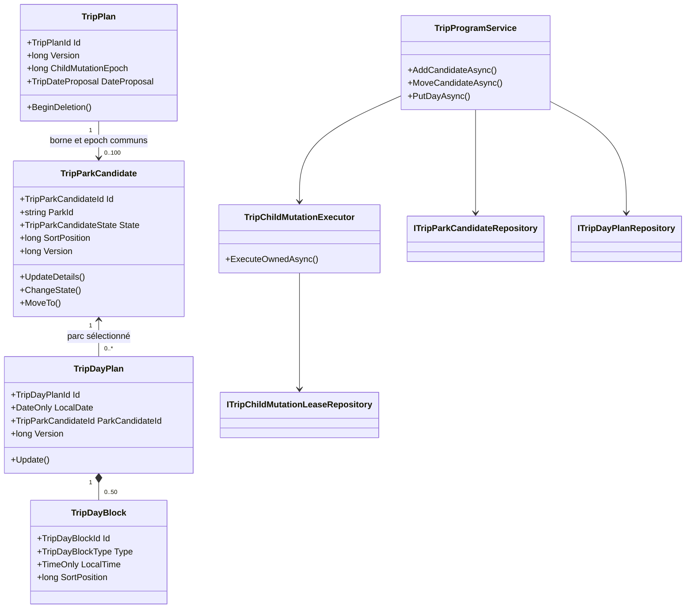
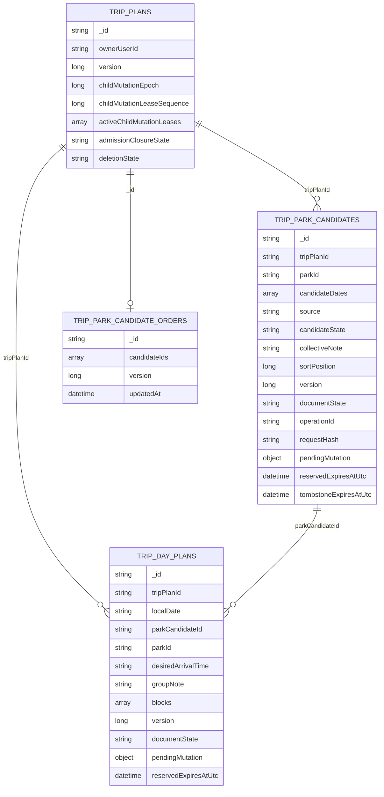
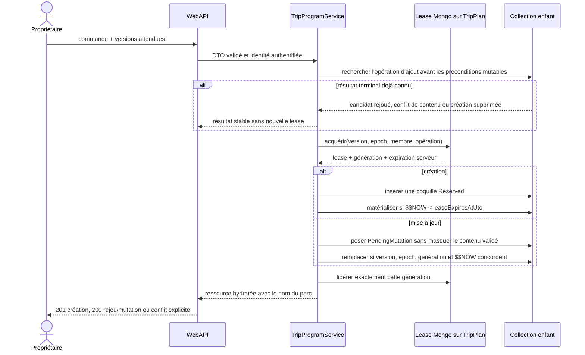
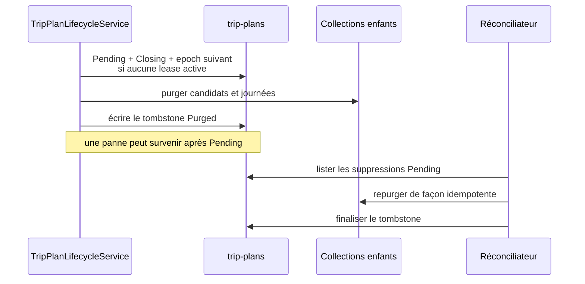

# TRIP-03 — Parcs candidats et programmation des journées

Date : 17 septembre 2026

Statut : implémenté

Version : 5.3.60

## Résultat métier

`TRIP-03` transforme le voyage privé créé par `TRIP-02` en programme structuré.
Le propriétaire peut constituer une liste ordonnée de parcs, faire évoluer chacun
de l'idée à la sélection, puis affecter un parc sélectionné à chaque journée d'une
période confirmée. Une journée conserve seulement les choix du groupe : heure
d'arrivée souhaitée, note et blocs simples. Elle ne copie ni horaires officiels,
ni météo, ni données `FIT` courantes.

Les règles essentielles sont les suivantes :

- 100 candidats au maximum par voyage et un seul candidat par parc ;
- état explicite `Proposed`, `Shortlisted`, `Selected` ou `Rejected` ;
- dates candidates incluses dans la proposition du voyage ;
- journée autorisée uniquement sur une période `Fixed` et pour un candidat
  `Selected` compatible avec cette date ;
- 50 blocs au maximum par journée, avec identifiant et position uniques ;
- notes bornées à 1 000 caractères pour un candidat et 2 000 pour une journée ;
- version optimiste sur chaque candidat et chaque journée ;
- aucune visite Passeport créée et aucune publication implicite.

## Architecture applicative

Le Core porte les limites, normalisations, transitions, règles de dates et calculs
d'ordre. Application orchestre les permissions du propriétaire, les lectures de
parcs et les ports. Infrastructure est seule responsable des documents, indexes,
leases et écritures MongoDB. WebAPI se limite aux contrats, au mapping strict et
aux codes HTTP.

## Schéma MongoDB

Indexes structurants :

- `trip-park-candidates`: uniques `{ tripPlanId, parkId }` et
  `{ tripPlanId, operationId }`, lecture de repli
  `{ tripPlanId, documentState, sortPosition, _id }`, TTL des coquilles réservées
  et des preuves de création supprimées ;
- `trip-park-candidate-orders`: un document borné par voyage, dont le remplacement
  atomique porte l'ordre canonique des cent candidats au maximum ;
- `trip-day-plans`: unique `{ tripPlanId, localDate }`, lecture chronologique
  `{ tripPlanId, documentState, localDate }`, TTL des coquilles réservées ;
- `trip-plans`: `{ deletionState, updatedAt }` pour la reprise des suppressions.

La migration de démarrage ajoute aux plans antérieurs l'epoch initial, la séquence
de lease et la liste de leases vide. Elle met aussi à niveau leur snapshot de
création. Il s'agit d'une migration du modèle existant, pas d'un adaptateur durable.

## Écriture sûre dans une collection enfant

La capacité active initiale est volontairement d'une lease exclusive par voyage.
Deux appels, même porteurs de la même clé idempotente, ne partagent jamais la même
génération : le second rejoue le résultat terminal ou attend une nouvelle tentative.
La forme
stockée reste une liste bornée afin de permettre une évolution mesurée, mais la
sérialisation actuelle donne une sémantique simple sur un VPS modeste et empêche
deux réordonnancements partiels de se concurrencer.

Les créations utilisent `Reserved`, puis `Committed`. Une réservation abandonnée
est invisible aux lectures et supprimée par TTL. Les modifications utilisent
`PendingMutation` : le contenu `Committed` précédent reste lisible, et une mutation
expirée peut être remplacée par l'opération suivante. Toutes les décisions de
validité temporelle reposent sur `$$NOW` côté MongoDB.

Le rejeu d'un ajout réussi est recherché avant la version actuelle du voyage et
avant la visibilité courante du parc : une réponse réseau perdue reste donc
rejouable après un renommage, un changement de dates ou le masquage du parc. Quand
le candidat est retiré, son document devient pendant 24 heures une preuve minimale
`Deleted`. Dates, note, snapshot FIT, parc et membre sont effacés ; la clé
d'opération et son empreinte restent seules capables de refuser un ancien retry.
Un nouvel ajout volontaire du même parc avec une nouvelle clé reste possible.

## Ordre stable des candidats

Le planificateur du Core calcule toujours l'ordre voulu à partir de positions
espacées de 1 024 et de gardes `(id, version, ancienne position)`. Infrastructure
projette ensuite ce résultat en une liste canonique d'identifiants dans un seul
document `trip-park-candidate-orders`. Le remplacement de ce document est atomique
et versionné : même une coupure en pleine requête ne peut produire un ordre
partiellement appliqué. Un candidat absent du document, par exemple après un ajout
dont la réponse réseau a été perdue, est ajouté en repli déterministe ; un identifiant
de candidat supprimé est ignoré. La prochaine écriture compacte naturellement la
liste sans transaction multi-collection.

## Changement sûr du calendrier

La modification des dates acquiert la lease exclusive du voyage, charge candidats
et journées, puis demande au Core de valider tout le programme contre la nouvelle
proposition. Si une date candidate ou une journée deviendrait invalide, la commande
est refusée sans écriture. Sinon la version et l'epoch racine avancent dans la même
écriture MongoDB qui consomme la génération exacte de la lease ; aucune mutation
enfant ne peut se glisser entre la validation et ce commit.

## Suppression et reprise après incident

Le tombstone final ne garde ni propriétaire, ni membres, ni titre, ni dates, ni
note. Seule la preuve minimale empêchant le rejeu d'une ancienne création subsiste
pendant la rétention annoncée. Le worker traite 25 plans par minute au maximum.

## API livrée

| Méthode | Route | Usage |
|---|---|---|
| `GET` | `/me/trips/{tripId}/program` | candidats et journées, noms de parcs résolus en lot |
| `POST` | `/me/trips/{tripId}/parks` | ajout idempotent d'un parc candidat |
| `PATCH` | `/me/trips/{tripId}/parks/{candidateId}` | dates et note collective |
| `POST` | `/me/trips/{tripId}/parks/{candidateId}/state` | changement d'état explicite |
| `POST` | `/me/trips/{tripId}/parks/{candidateId}/move` | ordre clavier ou drag-and-drop futur |
| `DELETE` | `/me/trips/{tripId}/parks/{candidateId}` | retrait si aucune journée ne le référence |
| `PUT` | `/me/trips/{tripId}/days/{yyyy-MM-dd}` | création ou remplacement idempotent d'une journée |
| `DELETE` | `/me/trips/{tripId}/days/{yyyy-MM-dd}` | retrait explicite d'une journée |

Les DTO conservent les identifiants nécessaires aux mutations et aux liens, mais
le libellé visible est toujours `parkName`. Les routes sont authentifiées, privées,
sans cache, et n'ouvrent aucun partage public.

## Preuves automatisées

- Core : limites, dates, états, blocs, positions et renormalisation ;
- Application : libération de lease, hydratation en lot sans identifiant affiché,
  validation globale avant changement de dates, libération best-effort après un
  commit, rejeu avant préconditions mutables, blocage du rejeu après suppression,
  ordre purge/finalisation et reprise de suppression ;
- Infrastructure : indexes uniques et TTL, gardes `$$NOW`, documents de mutation
  et remplacement atomique de l'ordre canonique ;
- WebAPI : parsing strict des dates/heures/énumérations, identifiants stables des
  blocs et conservation du nom de parc.

Les premiers écrans arrivent dans `TRIP-04`. Ils devront respecter le contrat
global à 320, 360, 390, 768 et 1280 px, masquer les contrôles non applicables,
permettre le réordonnancement au clavier et ne jamais utiliser un identifiant comme
texte de remplacement.
