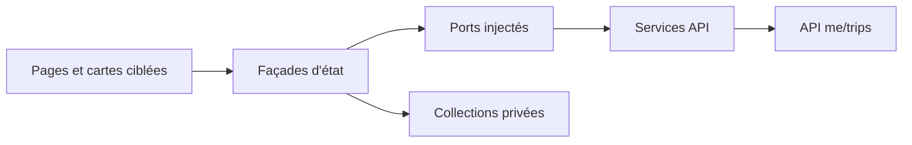
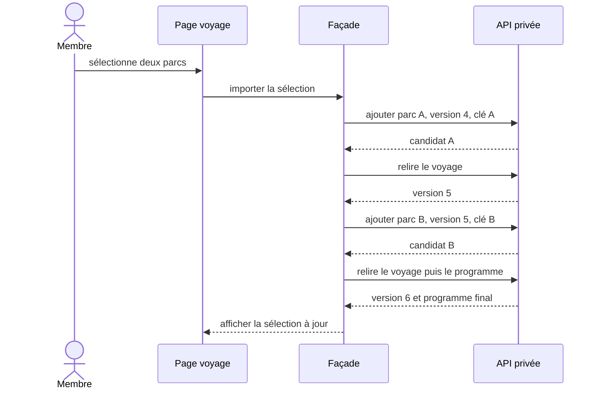

# TRIP-04 — Interface individuelle et import des envies

## Valeur métier livrée

Un compte authentifié peut désormais préparer seul un voyage depuis son profil,
avant toute collaboration :

1. créer un voyage avec un titre et, facultativement, des dates fixes ;
2. retrouver et rouvrir ses voyages privés ;
3. importer plusieurs parcs déjà enregistrés comme `WantToVisit` ou `Planned` ;
4. distinguer les idées, les parcs à retenir, les choix et les parcs écartés ;
5. classer les cartes par glisser-déposer ou par boutons accessibles ;
6. affecter un parc choisi, une heure d'arrivée et une note à chaque journée.

Une journée enregistrée peut être effacée avant de modifier les dates du voyage.
Les notes privées des collections ne sont jamais transformées en notes collectives
lors de l'import : elles restent dans leur contexte privé d'origine.

Lorsqu'un voyage est daté, le fuseau IANA de la destination est affiché et reste
modifiable. Le fuseau du navigateur n'est qu'une proposition visible à la création :
il n'est jamais substitué silencieusement au fuseau du parc.

Les attractions et préférences par membre appartiennent à `TRIP-07`. Les
invitations et rôles collaboratifs appartiennent à `TRIP-05` et `TRIP-06`.

## Architecture Angular

- les composants ne connaissent pas les services HTTP concrets ;
- les façades orchestrent chargement, idempotence, concurrence et signaux d'état ;
- les services API ne font que construire les requêtes typées ;
- les routes `profile/trips` et `profile/trips/:tripId` sont lazy et protégées par
  `authGuard` ;
- les images réutilisent le composant partagé `ImageDisplayComponent`.

## Import en lot et concurrence

L'API avance la version racine du voyage après chaque parc ajouté. Les réponses
d'ajout ne renvoyant pas cette version racine, l'interface recharge le plan entre
deux ajouts. Cela évite d'envoyer le deuxième parc avec une version déjà périmée.
Le programme complet n'est relu qu'une fois à la fin du lot.

Une réponse HTTP `409` produit un message explicite et recharge le voyage et son
programme. L'interface ne réessaie pas aveuglément une écriture conflictuelle.

## Responsive et accessibilité

- toutes les racines appliquent `min-width: 0`, `max-width: 100%` et un bornage
  horizontal ;
- les grilles utilisent `minmax(min(100%, …), 1fr)` pour rester contenues à
  320 px ;
- la liste d'envies défile horizontalement dans sa propre zone, sans agrandir le
  viewport ;
- les champs repassent sur une colonne en mobile ;
- un espace bas inclut la navigation fixe et `safe-area-inset-bottom` ;
- les textes longs peuvent se couper naturellement ;
- le glisser-déposer possède quatre alternatives clavier/pointeur explicites ;
- les boutons d'état exposent `aria-pressed` et les commandes iconiques conservent
  un libellé lecteur d'écran.

## Preuves automatisées

- contrats des services HTTP, encodage des segments et clé d'idempotence ;
- création avec titre normalisé et dates facultatives ou fixes ;
- énumération calendaire inclusive indépendante du fuseau du navigateur ;
- filtrage des collections indisponibles, déjà importées ou non pertinentes ;
- import séquentiel avec versions 1 puis 2 et clés d'opération distinctes ;
- suppression d'une journée avec les versions attendues du voyage et de la journée ;
- import d'une note de collection strictement privé, quelle que soit sa longueur ;
- rechargement après conflit optimiste ;
- routes lazy et authentifiées ;
- navigation depuis le profil ;
- contrats CSS de confinement, reflow mobile et zone sûre.

## Limites volontaires

- aucune invitation ni participant supplémentaire dans ce jalon ;
- aucun vote ou arbitrage collectif ;
- aucun horaire officiel ni trajet estimé ;
- aucun passage automatique vers le Passeport ;
- une préférence de date issue des collections n'est pas recopiée comme contrainte
  du voyage tant que ce jalon ne permet pas de la modifier ou de la retirer ;
- aucune dépendance à un volume réel de visites ou à un signal communautaire.
