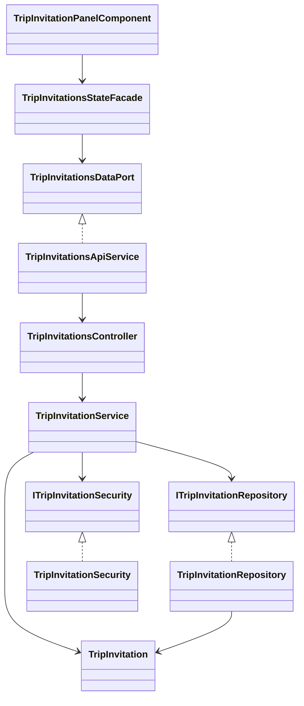
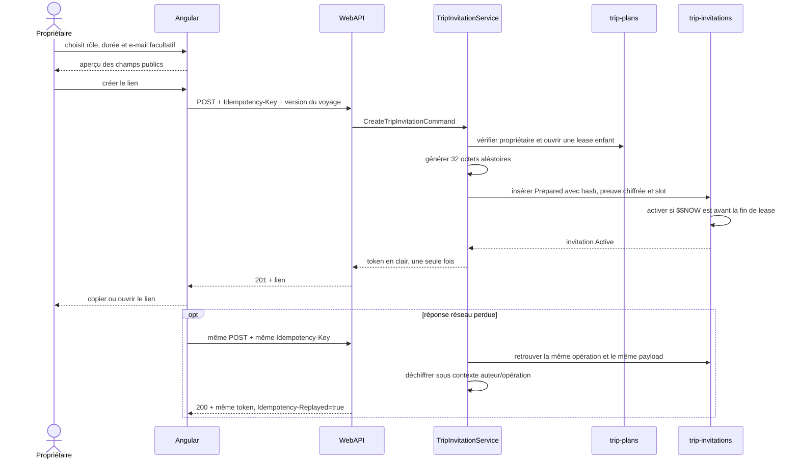
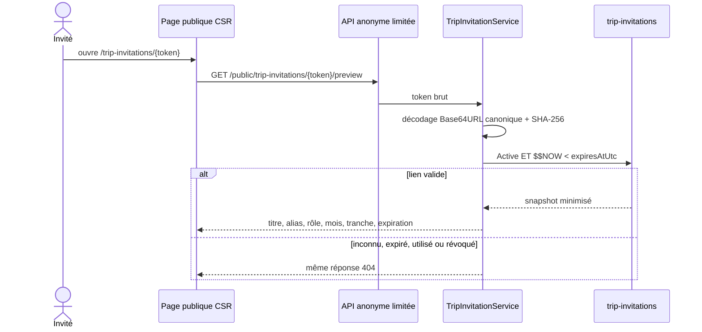

# TRIP-05 — Invitations opaques et aperçu minimisé

## Résultat métier

Le propriétaire d'un voyage privé peut générer et révoquer un lien d'invitation
à usage unique. L'invité consulte un aperçu sans créer de compte. Cette étape ne
l'ajoute pas encore au voyage : l'acceptation, le refus et les rôles actifs sont
livrés par `TRIP-06`.

L'écran propriétaire propose trois intentions compréhensibles : co-organiser,
participer aux choix ou seulement consulter. Il montre avant l'envoi le contenu
de l'aperçu public et liste les liens actifs sans afficher leur identifiant Mongo,
leur condensat ou leur indice technique. Le lien en clair n'est restitué qu'au
moment de la création ou du rejeu strictement identique de cette opération.

## Frontières d'architecture



- Core définit les invariants, états, tranches d'effectif et période approximative.
- Application vérifie le propriétaire, orchestre la lease enfant et ne connaît ni
  MongoDB ni AES-GCM.
- Infrastructure produit les secrets, chiffre la preuve de rejeu et applique les
  écritures conditionnelles MongoDB.
- WebAPI dérive l'utilisateur de la session et ne transmet au public que le DTO
  d'aperçu.
- Angular respecte `API -> port -> façade -> composant`; le composant ne décide
  d'aucune règle de sécurité.

## Schéma MongoDB

Collection `trip-invitations` :

```text
{
  _id: string opaque,
  tripPlanId: string opaque,
  tripTitle: string borné,
  tokenHash: base64(SHA-256(token)),
  tokenHint: string non résolvable,
  proposedRole: Editor | Participant | Viewer,
  inviterMemberId: string opaque,
  inviterDisplayName: string borné,
  targetEmailHmac?: HMAC-SHA-256,
  targetEmailHmacKeyVersion?: string,
  status: Prepared | Active | Accepting | RevocationPending |
          Accepted | Declined | Revoked | Expired,
  previewPolicy: ApproximatePeriod,
  periodKind: Unspecified | SingleMonth | MonthRange,
  startMonth?: yyyy-MM,
  endMonth?: yyyy-MM,
  memberCountBand: One | TwoToFive | SixToTen | ElevenToFifty,
  expiresAtUtc: date,
  retentionExpiresAtUtc: date,
  revokedAtUtc?: date,
  operationKeyHash: SHA-256(actor + operation),
  requestHash: version + HMAC dédié(role + durée + destinataire normalisé),
  sealedToken?: AES-256-GCM(token),
  sealedTokenKeyVersion?: string,
  childMutationEpoch: long,
  leaseGeneration: long,
  leaseExpiresAtUtc: date,
  activeSlot?: 0..19,
  reservedExpiresAtUtc?: date,
  version: long,
  createdAt: date,
  updatedAt: date
}
```

Indexes structurants :

| Index | Garantie |
|---|---|
| unique `tokenHash` | aucun lien ne partage le même secret |
| unique `(tripPlanId, inviterMemberId, operationKeyHash)` | rejeu idempotent |
| unique partiel `(tripPlanId, activeSlot)` | au plus vingt créations actives ou préparées |
| `(tripPlanId, status, createdAt desc)` | liste propriétaire bornée |
| TTL `retentionExpiresAtUtc` | conservation de la preuve d'idempotence 24 h après expiration |
| TTL partiel `reservedExpiresAtUtc` | nettoyage d'une préparation interrompue |

La collection et les indexes sont créés par l'initialiseur MongoDB au démarrage ;
aucune mise à jour manuelle de la base ni second modèle transitoire n'est requis.

## Création et rejeu réseau



Une même clé avec un autre rôle, une autre durée ou une autre cible est refusée.
Une opération expirée, révoquée ou dont la clé de rotation n'est plus disponible
ne restitue jamais un lien ancien. À l'expiration, le slot actif et le token scellé
sont retirés, mais la preuve d'opération reste conservée vingt-quatre heures : un
rejeu tardif ne peut donc pas fabriquer silencieusement une nouvelle invitation.

## Aperçu public et révocation



La révocation exige le propriétaire, la version de l'invitation, une clé
d'idempotence et la même lease de mutation enfant. Elle retire atomiquement le
slot actif et la copie chiffrée du token.

## Confidentialité et sécurité

- 256 bits produits par un générateur cryptographique ;
- Base64URL canonique, sans variante acceptée ;
- comparaison du condensat après déchiffrement ;
- HMAC d'adresse séparé du JWT et versionné pour la rotation ;
- aperçu anonyme soumis au rate limit des aperçus de partage ;
- absence de cache HTTP et de transfer cache Angular ;
- page de token en rendu client et `noindex,nofollow,noarchive` ;
- période limitée au mois et effectif limité à une tranche ;
- aucun parc, membre, vote, jour, note ou contrainte dans le contrat public ;
- suppression d'un voyage qui purge aussi ses invitations.

## Responsive et preuves

Les deux écrans bornent grilles, champs, liens et textes par `min-width: 0`,
`max-width: 100%` et `overflow-wrap`. Les trois cartes de rôle deviennent une
colonne sur téléphone. Le lien long est tronqué visuellement sans modifier la
valeur copiée. Le contrôle Chromium vérifie l'absence de débordement horizontal à
320, 360, 390, 768 et 1280 px, ainsi que la réserve sous la navigation mobile.

Les tests couvrent les invariants Core, le token canonique et son rejeu chiffré,
les HMAC, les indexes et l'heure serveur MongoDB, le contrat HTTP Angular, les
façades propriétaire/publique, les routes CSR/noindex et le responsive.
