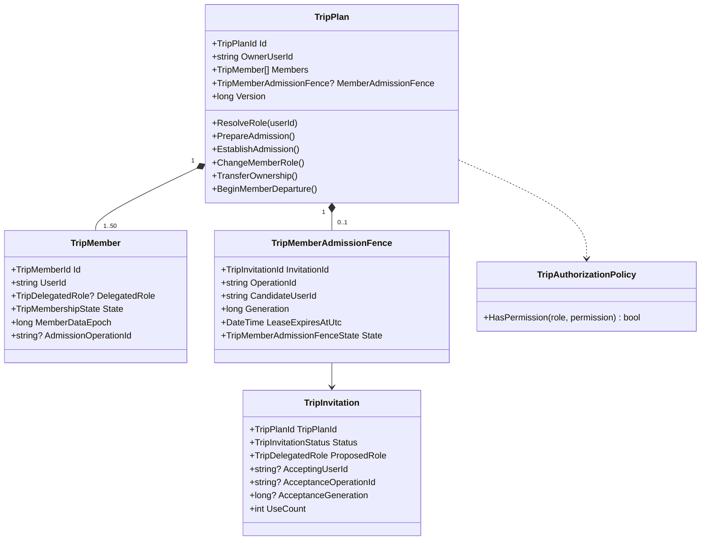
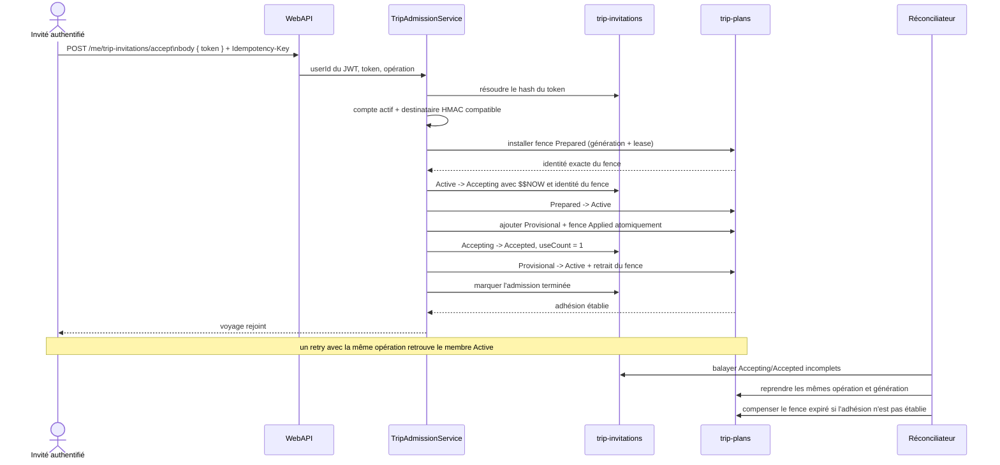
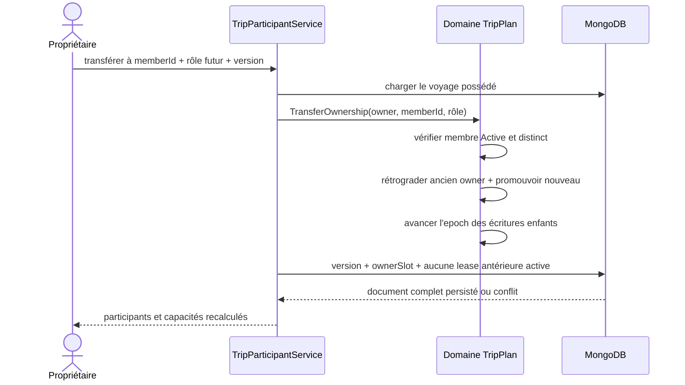

# TRIP-06 — Participants, rôles et acceptation réparable

Date : 18 septembre 2026

Version : 5.3.66

Roadmap : [`06-collaborative-trip-planning-roadmap.md`](../roadmaps/product-growth/06-collaborative-trip-planning-roadmap.md)

## Résultat métier

Le lien créé par `TRIP-05` devient une vraie entrée dans un voyage privé. L'invité
peut accepter ou refuser après connexion. Une fois l'acceptation établie, il voit le
voyage selon son rôle. Le propriétaire dispose d'une liste lisible des personnes,
peut ajuster leurs rôles et transférer la propriété. Chaque membre non propriétaire
peut quitter le groupe.

Le rôle n'est pas un simple réglage d'interface. Il décide côté serveur qui peut
modifier les informations générales et le programme :

| Capacité | Owner | Editor | Participant | Viewer |
|---|---:|---:|---:|---:|
| Lire le voyage | oui | oui | oui | oui |
| Renommer et modifier les dates | oui | oui | non | non |
| Ajouter, classer et programmer les parcs | oui | oui | non par défaut | non |
| Inviter | oui | non par défaut | non | non |
| Changer les rôles / transférer | oui | non | non | non |
| Voter | oui | oui | oui | non |
| Quitter | après transfert | oui | oui | oui |

Les options futures « un éditeur peut inviter » et « un participant peut ajouter
un candidat » restent explicites dans la politique, mais sont désactivées par
défaut. Aucun écran ne peut les activer implicitement.

## Frontières d'architecture

- **Core** : états d'adhésion, rôle effectif, matrice de permissions, transfert et
  départ, fence d'admission et invariants de l'agrégat ;
- **Application** : validation de l'identité du destinataire, orchestration de la
  saga, contrôle des permissions, résolution en lot des alias et concurrence
  optimiste ;
- **Infrastructure** : écritures MongoDB conditionnelles, heure serveur `$$NOW`,
  index de reprise et réconciliateur borné ;
- **WebAPI** : identité issue du JWT, contrats bornés, jeton dans le corps, erreurs
  HTTP normalisées ;
- **Angular** : ports injectés, façades, capacités calculées par le serveur et rendu
  responsive en lecture ou édition.

Chaque classe, interface, record et enum possède son propre fichier. Le contrôle
d'architecture automatique ne relève aucune violation C# ou TypeScript.

## Modèle de classes



`Owner` n'est jamais stocké comme un second rôle. Il est dérivé lorsque
`TripMember.UserId == TripPlan.OwnerUserId`; le membre propriétaire conserve donc
`DelegatedRole = null`. Le transfert modifie le propriétaire et les deux rôles dans
la même écriture versionnée du document racine.

## Schéma MongoDB utile à ce jalon

```text
trip-plans
├── _id: string opaque
├── ownerUserId: string opaque
├── ownerSlot: int
├── members[]
│   ├── memberId: string opaque
│   ├── userId: string opaque
│   ├── delegatedRole?: Editor | Participant | Viewer
│   ├── state: Provisional | Active | Leaving
│   ├── joinedAtUtc: date
│   ├── memberDataEpoch: long
│   └── admissionOperationId?: provenance opaque de l'admission
├── memberAdmissionGeneration: long
├── memberAdmissionFence?
│   ├── invitationId: string opaque
│   ├── operationId: hash opaque
│   ├── candidateUserId: string opaque
│   ├── generation: long
│   ├── leaseExpiresAtUtc: date
│   └── state: Prepared | Active | Applied | Cancelled
├── admissionClosureState
├── childMutationEpoch
├── version
└── updatedAt

trip-invitations
├── _id / tripPlanId / tokenHash
├── proposedRole
├── status: Active | Accepting | Accepted | Declined | Revoked | Expired
├── useCount: 0 | 1
├── acceptingUserId?
├── acceptanceOperationId?
├── acceptanceOperationKeyHash?
├── acceptanceGeneration?
├── acceptanceLeaseExpiresAtUtc?
├── admissionCompletedAtUtc? (sortie de la file de reprise)
├── acceptedAtUtc? / declinedAtUtc?
├── version
└── retentionExpiresAtUtc
```

Indexes concernés :

- `trip-plans`: `(members.userId, members.state, deletionState, updatedAt, _id)` ;
- `trip-plans`: index partiel du fence par échéance et état ;
- `trip-invitations`: `tokenHash` unique ;
- `trip-invitations`: index de reprise par statut, marqueur d'admission terminée,
  échéance de lease et date de mise à jour ;
- `trip-invitations`: TTL de rétention, sans dépendre d'un nettoyage applicatif.

La lecture privée utilise un `ElemMatch` exigeant simultanément le bon `userId` et
`state = Active`. Deux éléments différents du tableau ne peuvent donc pas satisfaire
chacun une moitié du filtre. Un membre `Provisional` présent physiquement dans le
document ne dispose d'aucun accès. La liste conserve son tri stable par dernière
modification sans réutiliser le quota de 50 créations du propriétaire. Une limite
de sécurité dédiée de 100 adhésions récentes borne cependant chaque réponse et la
mémoire consommée sur le VPS ; elle reste distincte du quota de possession.

## Séquence d'acceptation



Le point de linéarisation métier est la dernière écriture sur `trip-plans`. Avant
elle, le membre reste `Provisional`; après elle, un retry constate le membre actif et
renvoie le résultat sans rejouer les étapes. Le marqueur `admissionCompletedAtUtc`
retire ensuite l'invitation terminale des lots de reprise sans participer à la
décision métier. Le réconciliateur ne révoque jamais une
invitation `Accepted` dont le membre est déjà actif grâce à cette même opération,
même après l'expiration de la lease technique. Le membre actif conserve uniquement
cette provenance opaque interne, jamais exposée par l'API : une adhésion ultérieure
obtenue avec un autre lien ne peut pas valider l'ancienne invitation.

La compensation expirée revalide `$$NOW` dans MongoDB puis ne révoque l'invitation
que si elle a effectivement retiré le fence de même génération. Si un autre nœud a
établi le membre entre la lecture et la compensation, l'invitation reste acceptée.
Une réponse perdue après la préparation retrouve également le même fence au retry ;
un refus rejoué avec la même clé renvoie le résultat acquis. Si le processus tombe
après avoir retiré un fence expiré mais avant d'avoir révoqué l'invitation, le passage
suivant reconnaît l'état déjà compensé et termine la révocation. Toute mutation
ordinaire du voyage exige enfin l'absence de fence et ne réécrit jamais ce champ :
une copie chargée avant l'admission ne peut donc effacer ni le membre provisoire ni
le verrou de reprise.

## Séquence de transfert de propriété



Après succès, le panneau participants demande à la vue d'ensemble de recharger le
voyage. Les droits, la version et les actions visibles changent immédiatement, sans
laisser d'anciens contrôles de propriétaire à l'écran.

Un changement de rôle, un transfert ou un départ avance le même epoch racine que
les écritures enfants. MongoDB n'accepte cette transition qu'après la fin des leases
déjà accordées. La réponse de changement de droits ne peut donc pas réussir puis
laisser une ancienne autorisation terminer une modification de candidat ou de jour.

## API et confidentialité

Les routes d'acceptation et de refus sont authentifiées :

```text
POST   /api/me/trip-invitations/accept
POST   /api/me/trip-invitations/decline
GET    /api/me/trips/{tripPlanId}/participants
PATCH  /api/me/trips/{tripPlanId}/participants/{memberId}/role
POST   /api/me/trips/{tripPlanId}/participants/{memberId}/transfer-ownership
DELETE /api/me/trips/{tripPlanId}/participants/me?expectedVersion=...
```

Le token n'apparaît pas dans l'URL authentifiée. Les réponses de participants
contiennent `memberId`, alias public, rôle, indicateur « moi » et date d'arrivée ;
elles n'exposent ni adresse, ni identifiant de compte, ni empreinte technique. Les
utilisateurs sont résolus en une requête par lot afin d'éviter un N+1.

## Compatibilité et évolution MongoDB

Il ne faut ni migration destructive ni deuxième adaptateur. Les champs ajoutés sont
facultatifs ou possèdent une valeur par défaut lors du mapping :

- un ancien membre sans `memberDataEpoch` est relu avec l'epoch initial ;
- un plan sans fence reste un plan normal ;
- une invitation antérieure sans données d'acceptation reste active, expirée ou
  révoquée selon son statut existant ;
- les nouveaux indexes sont créés par l'initialisation MongoDB habituelle.

Ainsi, le déploiement met à niveau le schéma de façon additive et l'écriture suivante
persiste le format courant. Aucun ancien et nouveau système d'adhésion ne coexistent.

## UX responsive

La page affiche le nombre de membres et le rôle courant. Les éditeurs obtiennent les
outils de dates et de programme. Pour `Participant` et `Viewer`, les champs,
poignées de glisser-déposer et boutons de déplacement sont absents, pas simplement
désactivés. Les dates, parcs et journées restent lisibles.

L'aperçu public associe aussi chaque décision à la génération et au token affichés.
Une réponse tardive d'un ancien lien ne peut donc ni remplacer le nouveau voyage,
ni afficher une erreur qui ne concerne plus la page courante.

Le panneau des participants borne toutes ses colonnes avec `minmax(0, 1fr)`, coupe
les mots longs et empile identité, rôle et actions à 42 rem puis l'en-tête à 22,5
rem. Le contrôle navigateur couvre réellement 320, 360, 390, 768 et 1280 px.

## Preuves automatisées

- matrice des permissions et options explicites ;
- membre provisoire invisible avant établissement ;
- transfert de propriété et impossibilité pour l'owner de partir directement ;
- départ d'un membre ;
- saga d'acceptation et retry après résultat accepté ;
- réconciliation conservant une adhésion déjà établie ;
- résolution des alias en un seul batch ;
- refus serveur d'un changement de rôle par un non-propriétaire ;
- capacités Angular, opération d'acceptation stable, navigation concurrente et lecture seule ;
- architecture façades/ports et une classe par fichier ;
- huit langues et viewports réels.

Les préférences individuelles, votes, synthèses de désaccords, audit détaillé et
export ne sont pas simulés ici : ils appartiennent respectivement à `TRIP-07` à
`TRIP-11`.
