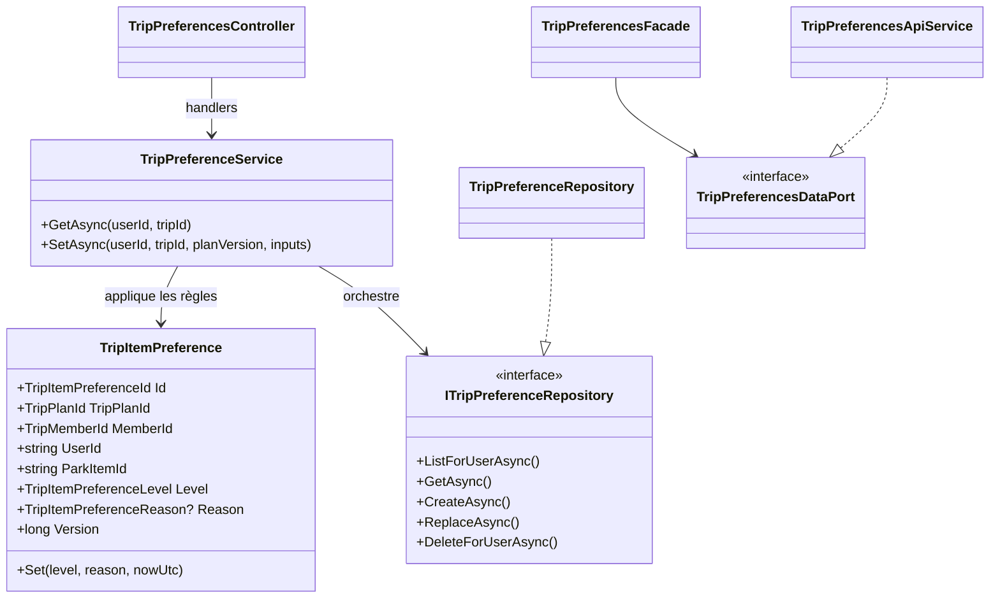
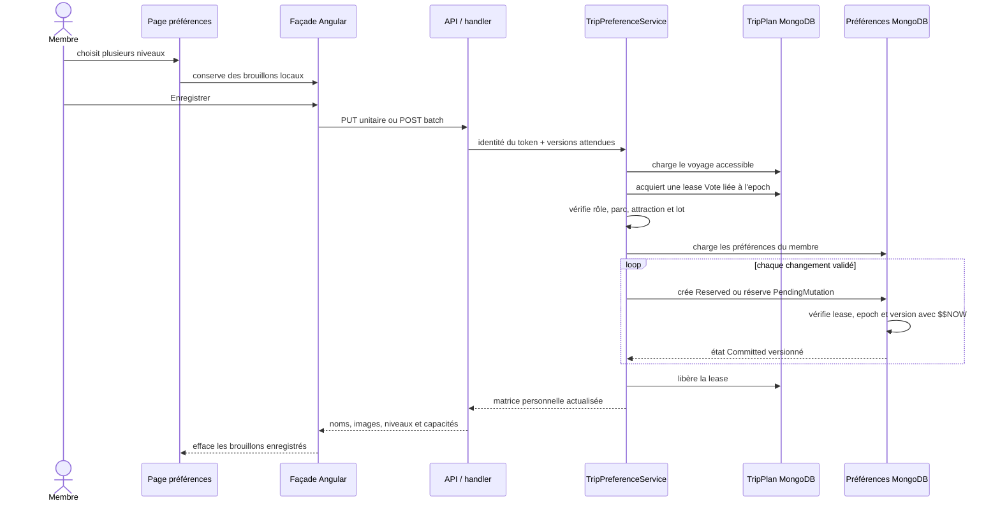

# TRIP-07 — Préférences personnelles par attraction

## 1. Résultat métier

`TRIP-07` donne à chaque membre d'un voyage un espace personnel pour exprimer ses
envies sur les attractions des parcs encore envisagés :

- `MustDo` : indispensable ;
- `WantToDo` : souhaitée ;
- `Optional` : facultative ;
- `NotForMe` : pas pour moi ;
- `Unknown` : pas encore décidé.

Une raison structurée peut accompagner une préférence décidée : sensations,
taille, déjà fait, indisponible ou autre. Aucun commentaire libre n'est collecté.
Ce jalon n'essaie pas encore de décider pour le groupe : il produit les choix
individuels fiables dont `TRIP-08` calculera ensuite une synthèse transparente.

## 2. Garanties fonctionnelles

- seules les attractions visibles et ouvertes des parcs candidats non rejetés
  sont proposées ;
- une préférence appartient au membre connecté, jamais à un auteur choisi dans
  la requête ;
- `Owner`, `Editor` et `Participant` peuvent voter ; `Viewer` consulte sans
  contrôles d'édition ;
- un couple membre/attraction ne possède qu'une préférence ;
- une version optimiste protège chaque préférence et la version du voyage protège
  son contexte ;
- un rejeu de la même valeur est sans effet, même si la réponse précédente a été
  perdue ;
- le départ d'un membre supprime ses préférences ; la suppression du voyage les
  purge toutes ;
- les identifiants restent des clés d'action et ne sont jamais utilisés comme
  libellés à l'écran.

## 3. Frontières d'architecture



Le Core possède les invariants de valeur et de version. Application résout les
droits, les parcs éligibles, les noms et les images, puis orchestre la lease de
mutation enfant. Infrastructure seule connaît MongoDB. Le contrôleur mappe les
contrats HTTP. Angular respecte la chaîne `API -> port -> façade -> composant` :
le composant n'injecte aucun service HTTP concret.

Chaque classe ajoutée possède son propre fichier, conformément à la règle globale
du projet.

## 4. Schéma MongoDB

Collection : `trip-item-preferences`.

```javascript
{
  _id: "opaque-preference-id",
  tripPlanId: "opaque-trip-id",
  memberId: "opaque-member-id",
  userId: "account-id",
  parkItemId: "opaque-attraction-id",
  level: "MustDo | WantToDo | Optional | NotForMe | Unknown",
  reason: "Sensations | Height | AlreadyDone | Unavailable | Other", // facultatif
  version: NumberLong(1),
  documentState: "Reserved | Committed",
  operationId: "opaque-operation-id",
  childMutationEpoch: NumberLong(8),
  leaseGeneration: NumberLong(2),
  leaseExpiresAtUtc: ISODate("..."),
  reservedExpiresAtUtc: ISODate("..."), // uniquement pendant une création
  pendingMutation: {                     // uniquement pendant une modification
    operationId: "opaque-operation-id",
    childMutationEpoch: NumberLong(8),
    leaseGeneration: NumberLong(2),
    leaseExpiresAtUtc: ISODate("...")
  },
  createdAt: ISODate("..."),
  updatedAt: ISODate("...")
}
```

Indexes :

1. unique `(tripPlanId, userId, parkItemId)` ;
2. lecture `(tripPlanId, documentState, parkItemId)` ;
3. TTL sur `reservedExpiresAtUtc` limité aux coquilles `Reserved`.

La collection et les indexes sont créés par `MongoDatabaseInitializer`. Le schéma
est additif : le déploiement ne demande ni script manuel ni deuxième modèle
temporaire.

## 5. Écriture sûre



Le serveur construit et valide tout le lot avant la première écriture. Un doublon
dans le lot, une attraction devenue inéligible ou une version incohérente bloque
l'opération. La lease du voyage relie l'autorisation à l'epoch courant : un
changement de rôle ou un départ attend les mutations en cours, puis invalide toute
ancienne autorisation.

## 6. Lecture et confidentialité

Le contrat de lecture renvoie uniquement les préférences du membre authentifié.
Il n'accepte aucun `userId` et ne permet donc ni au propriétaire ni à un autre
participant de lire ou modifier les choix personnels avant la synthèse collective
prévue dans `TRIP-08`. Les noms et images publiques sont résolus en lots afin
d'éviter les requêtes N+1.

Après un départ réussi, `TripParticipantService` efface tous les documents du
membre pour ce voyage. La purge complète du voyage inclut aussi la collection de
préférences. Aucun choix individuel n'est publié et `SHARE` n'est pas impliqué.

## 7. Expérience responsive et accessible

La page est accessible depuis le détail du voyage. Elle regroupe les attractions
par parc et fournit :

- image principale ou pictogramme neutre ;
- recherche par nom de parc ou d'attraction ;
- filtres par parc et par niveau ;
- cinq boutons radio nommés et utilisables au clavier ;
- raison facultative ;
- résumé des choix ;
- barre d'enregistrement persistante uniquement lorsqu'il reste des changements.

Les grilles utilisent `minmax(0, 1fr)`, les textes peuvent se couper, toutes les
surfaces sont bornées à `100%` et le composant masque le débordement horizontal.
Sous 576 px, les choix passent sur deux colonnes et la barre d'action remonte au-
dessus de la navigation basse et de la zone sûre. Sous 352 px, ses actions passent
sur deux lignes. Les contrôles d'édition ne sont pas rendus pour un lecteur, au
lieu d'occuper la page sous forme désactivée.

## 8. Contrats HTTP

- `GET /me/trips/{tripPlanId}/preferences` : matrice personnelle ;
- `PUT /me/trips/{tripPlanId}/preferences/{parkItemId}` : choix isolé ;
- `POST /me/trips/{tripPlanId}/preferences:batch` : choix multiples.

Les trois routes exigent un compte authentifié, activé et non bloqué. Les erreurs
de version sont des conflits explicites ; les erreurs de forme ou d'éligibilité ne
sont jamais corrigées silencieusement.

## 9. Preuves automatisées

- Core : création, raison interdite pour `Unknown`, version incrémentée ;
- Application : liste personnelle, batch, droits et version optimiste ;
- participants : départ réussi suivi de la suppression des préférences ;
- Infrastructure : unicité, index de lecture et TTL ;
- Angular : service API, façade, routes, filtres, enregistrement unitaire/batch ;
- responsive : assertions structurelles contre les largeurs fixes, débordements et
  barres d'action incompatibles avec la navigation mobile ;
- architecture : contrôle des ports de façade et règle une classe par fichier.

## 10. Limite volontaire et suite

`TRIP-07` ne révèle pas les choix individuels aux autres membres et ne calcule
aucun gagnant. `TRIP-08` ajoutera une synthèse de groupe qui distingue consensus,
envies, inconnues et incompatibilités sans transformer une opposition en vote
majoritaire aveugle.
