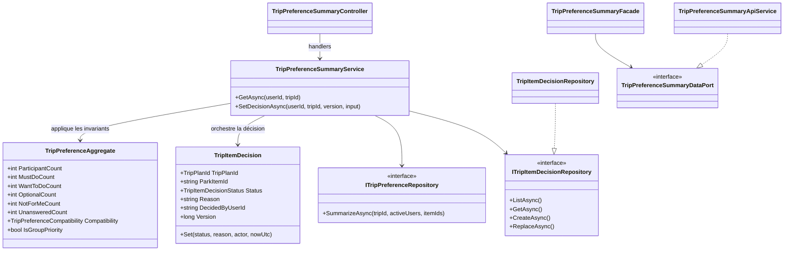
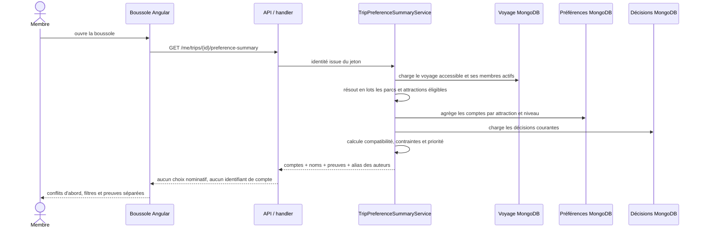
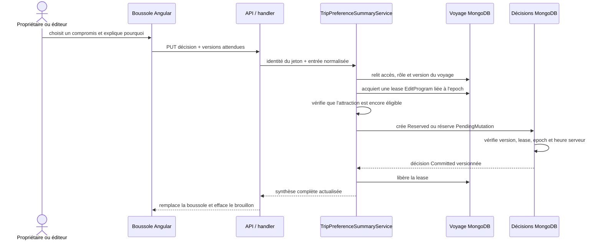

# TRIP-08 — Boussole collective, conflits et décisions

## 1. Résultat métier

`TRIP-08` transforme les préférences personnelles de `TRIP-07` en une lecture
collective compréhensible, sans publier le vote nominatif de chaque membre.
Pour chaque attraction encore éligible, le groupe voit :

- combien de personnes la jugent indispensable, souhaitée ou facultative ;
- combien ont indiqué « pas pour moi » ;
- combien n'ont pas encore répondu ;
- si la situation est un accord, un avis partagé, un inconnu ou un conflit ;
- l'état officiel de l'attraction, la date des données et leur source ;
- le compromis explicitement retenu par les organisateurs, s'il existe.

Une opposition ne disparaît jamais derrière trois avis positifs. Le produit ne
désigne aucun gagnant : il rend le désaccord visible, puis laisse le propriétaire
ou un coorganisateur choisir un compromis documenté.

## 2. Règles de synthèse

Le Core calcule la compatibilité à partir du nombre de membres actifs et des
comptages agrégés :

| État | Règle |
|---|---|
| `Conflict` | au moins un avis positif et au moins un `NotForMe` |
| `Consensus` | tous les membres actifs ont répondu positivement |
| `Unknown` | aucun membre n'a encore répondu |
| `Mixed` | tout autre mélange, notamment des réponses manquantes |

Une attraction ressort comme priorité lorsqu'au moins un membre l'a déclarée
indispensable et qu'aucune opposition n'est exprimée. Si des réponses manquent,
l'interface affiche simultanément que cette conclusion reste provisoire.

La décision manuelle peut être `Review`, `Retained`, `SplitGroup`, `Optional` ou
`Excluded`. Elle exige une raison de 3 à 500 caractères. Seuls `Owner` et
`Editor`, qui possèdent la permission `EditProgram`, peuvent la créer ou la
modifier. L'auteur est issu du compte authentifié et ne peut pas être fourni par
le client.

## 3. Architecture et responsabilités



Le Core possède les règles de compatibilité, de décision et de version.
Application vérifie l'accès, les permissions et l'éligibilité, orchestre les
lectures et la lease, puis ne renvoie que des agrégats. Infrastructure seule
connaît les pipelines et documents MongoDB. WebAPI ne fait que mapper les contrats
HTTP. Angular respecte `API -> port -> façade -> composant` ; le composant ne
dépend d'aucun service HTTP concret. Chaque classe ajoutée possède son fichier.

## 4. Schéma MongoDB

Les préférences demeurent dans `trip-item-preferences`. La synthèse exécute un
pipeline unique filtré par voyage, membres actifs, attractions éligibles et état
`Committed`, puis groupe par attraction et niveau. Elle ne charge donc pas les
documents individuels dans l'application et ne crée pas de requête par attraction.

Les compromis sont conservés dans `trip-item-decisions` :

```javascript
{
  _id: "opaque-decision-id",
  tripPlanId: "opaque-trip-id",
  parkItemId: "opaque-attraction-id",
  status: "Review | Retained | SplitGroup | Optional | Excluded",
  reason: "compromis lisible par le groupe",
  decidedByUserId: "account-id", // interne, jamais exposé au navigateur
  version: NumberLong(2),
  documentState: "Reserved | Committed",
  operationId: "opaque-operation-id",
  childMutationEpoch: NumberLong(9),
  leaseGeneration: NumberLong(3),
  leaseExpiresAtUtc: ISODate("..."),
  reservedExpiresAtUtc: ISODate("..."), // uniquement pendant la création
  pendingMutation: {                     // uniquement pendant une modification
    operationId: "opaque-operation-id",
    childMutationEpoch: NumberLong(9),
    leaseGeneration: NumberLong(3),
    leaseExpiresAtUtc: ISODate("...")
  },
  createdAt: ISODate("..."),
  updatedAt: ISODate("...")
}
```

Deux indexes protègent la collection :

1. unique `(tripPlanId, parkItemId)` pour garantir un compromis courant ;
2. TTL partiel sur `reservedExpiresAtUtc` pour retirer une coquille de création
   abandonnée.

Le déploiement crée la collection et les indexes avec
`MongoDatabaseInitializer`. Le schéma est additif et ne demande aucune commande
manuelle sur la base de production.

## 5. Lecture collective et confidentialité



Le contrat ne contient ni la préférence d'un membre identifié, ni le véritable
nom de l'auteur, ni son identifiant technique. Seul son alias public résolu côté
serveur accompagne la décision. Un participant peut consulter la synthèse ; un
lecteur ne reçoit aucun contrôle d'édition. Les boutons d'action ne sont donc pas
simplement désactivés : ils ne sont pas rendus lorsque la capacité manque.

## 6. Décision concurrente sûre



Une version différente renvoie un conflit au lieu d'écraser la décision récente.
La même décision rejouée est sans effet. Un changement de rôle ou un départ attend
les mutations en cours puis avance l'epoch ; une ancienne autorisation ne peut
donc pas écrire après la réponse. La suppression du voyage purge aussi les
décisions collectives.

## 7. Expérience responsive

La page « Boussole du groupe » est accessible depuis l'aperçu du voyage et depuis
les préférences personnelles. Elle propose :

- les conflits et accords résumés dès l'en-tête ;
- une recherche et quatre filtres métier ;
- les points de friction affichés avant les éléments consensuels ;
- l'image principale, les cinq compteurs et les réponses manquantes ;
- un volet distinct pour le statut officiel, la source et la date ;
- une carte de décision lisible par tous ;
- un éditeur replié, rendu uniquement pour les organisateurs.

Les grilles utilisent `minmax(0, 1fr)`, les textes peuvent se couper, les surfaces
restent bornées à `100%` et le débordement horizontal est masqué. Sur mobile, les
compteurs et décisions se réorganisent, tandis que les actions restent au-dessus
de la navigation basse et de la zone sûre. Le scénario Chromium réel vérifie les
largeurs 320, 360, 390, 768 et 1280 pixels.

## 8. Contrats HTTP

- `GET /me/trips/{tripPlanId}/preference-summary` : synthèse accessible au groupe ;
- `PUT /me/trips/{tripPlanId}/preference-summary/{parkItemId}/decision` : compromis
  réservé au propriétaire et aux éditeurs.

Les routes exigent un compte authentifié, activé et non bloqué. L'identité de
l'auteur vient toujours du contexte de sécurité. Les conflits de version sont
explicites et les attractions devenues inéligibles sont refusées.

## 9. Preuves automatisées

- Core : conflit avec opposition, consensus complet, état provisoire et
  validation/version des décisions ;
- Application : agrégation sans votes nominatifs, résolution de l'alias public et
  refus d'un participant avant toute lease ;
- Infrastructure : unicité et TTL des décisions, pipeline d'agrégation borné ;
- WebAPI : mapping de lecture et d'écriture sans identifiant d'auteur ;
- Angular : service API, façade, route, filtres, brouillons et conflits ;
- architecture : ports de façade et règle une classe par fichier ;
- responsive : assertions statiques et navigation Chromium aux cinq largeurs.

## 10. Limite volontaire et suite

`TRIP-08` ne modifie pas le calendrier et ne prétend pas vérifier les trajets. Le
jalon `TRIP-09` ajoutera les avertissements d'ouverture, de chevauchement, de
trajet et de données périmées en distinguant toujours les faits officiels des
choix du groupe. Une décision collective reste une décision humaine : aucun
avertissement futur ne la changera automatiquement.
