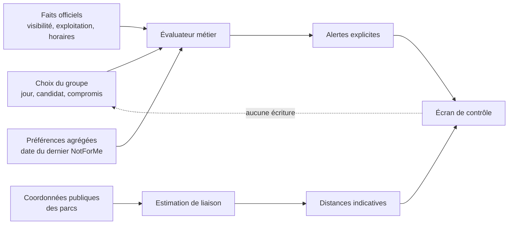
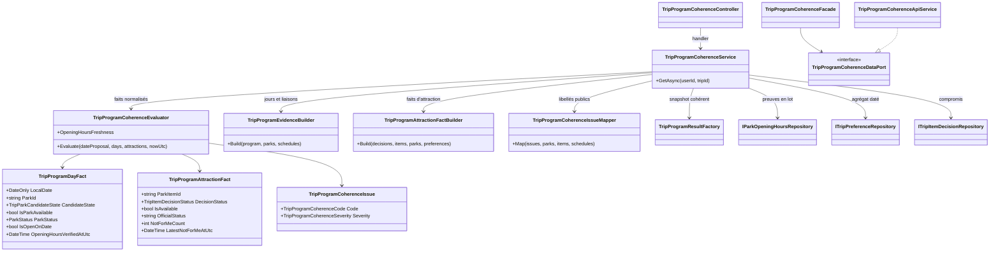
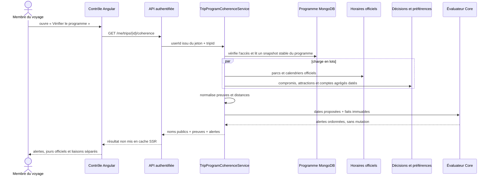

# TRIP-09 — Contrôle du programme et preuves officielles

## 1. Résultat métier

`TRIP-09` donne au groupe un écran de contrôle avant le départ. Il compare le
programme décidé avec les faits actuellement connus, sans confondre les deux et
sans modifier automatiquement le voyage.

Le groupe peut notamment savoir :

- si une journée sort des dates proposées ;
- si plusieurs parcs occupent la même journée ;
- si un parc planifié n'est plus sélectionné, visible ou en exploitation ;
- si son ouverture est confirmée, sa fermeture confirmée ou encore inconnue ;
- si les horaires officiels sont anciens ou ont été revérifiés après la décision ;
- si une attraction retenue est devenue fermée ou indisponible ;
- si un membre a exprimé « pas pour moi » après le compromis du groupe ;
- quelle distance indicative sépare deux parcs consécutifs.

L'alerte aide à décider, mais ne décide jamais. Le parc, le jour, l'attraction et
le compromis restent inchangés tant qu'un organisateur ne les modifie pas depuis
leurs écrans habituels.

## 2. Lecture des alertes

Les alertes sont classées selon l'action attendue :

| Niveau | Sens métier | Exemples |
|---|---|---|
| `Critical` | le programme contient un conflit factuel ou structurel | parc fermé, attraction retenue fermée, date hors séjour |
| `Attention` | une vérification ou une décision humaine est nécessaire | horaires inconnus ou anciens, candidat non sélectionné, nouvelle opposition |
| `Information` | un fait officiel a changé depuis la préparation | horaires revérifiés après la dernière modification du jour |

Une donnée d'horaires est considérée comme ancienne au-delà de 90 jours. Ce
seuil est une règle métier du Core, non un détail d'affichage Angular.

« Nouvelle opposition » signifie précisément qu'une préférence agrégée
`NotForMe` a une date de modification postérieure à la décision collective. Le
contrat n'indique ni l'identité du membre ni le contenu d'une contrainte privée.
Une décision `Review` ou `Excluded` n'est pas signalée comme incohérente avec
l'état d'une attraction, puisqu'elle ne promet pas de la faire.

## 3. Faits et choix restent séparés



L'endpoint est exclusivement en lecture. L'évaluation reçoit des valeurs
immuables `TripProgramDayFact` et `TripProgramAttractionFact`, puis retourne des
`TripProgramCoherenceIssue`. Elle ne possède aucun port d'écriture et ne peut
donc pas déplacer un jour, sélectionner un parc ou remplacer un compromis.

## 4. Architecture et responsabilités



- **Core** possède les seuils, priorités et règles de cohérence pures.
- **Application** contrôle l'accès, construit un snapshot cohérent, charge les
  faits en lots, calcule les liaisons et remplace les identifiants par les noms
  publics disponibles.
- **Infrastructure** lit MongoDB et agrège la dernière date des préférences.
- **WebAPI** mappe le résultat en contrat HTTP sans logique métier.
- **Angular** suit `service API -> port -> façade -> composant` et ne recalcule
  aucune règle métier.

Chaque classe ajoutée est dans son propre fichier.

## 5. Séquence de lecture



Le `TripProgramResultFactory` relit le compteur de mutations enfants avant et
après les candidats et les jours. Si une modification concurrente intervient,
le snapshot entier est repris ; une lecture hybride n'est pas présentée comme
un programme cohérent.

## 6. MongoDB et migration

Le jalon ne crée aucune nouvelle collection. Il réutilise :

- `trip-plans` pour les dates et les membres actifs ;
- `trip-park-candidates` et `trip-day-plans` pour le programme ;
- `trip-item-decisions` pour les compromis ;
- `trip-item-preferences` pour les oppositions agrégées ;
- les collections existantes de parcs, attractions et horaires officiels.

Le pipeline de `trip-item-preferences` reste borné au voyage, aux membres actifs,
aux attractions décidées et aux documents `Committed`. Son groupe MongoDB ajoute
seulement :

```javascript
{
  $group: {
    _id: { parkItemId: "$parkItemId", level: "$level" },
    count: { $sum: 1 },
    latestUpdatedAt: { $max: "$updatedAt" }
  }
}
```

Les documents possèdent déjà `updatedAt`. Il n'y a donc ni double système, ni
adaptateur temporaire, ni migration de données ou commande manuelle à exécuter
sur MongoDB.

## 7. Preuves d'ouverture

Pour chaque jour, le calendrier officiel existant est évalué exactement sur la
date locale du parc :

- une règle ou exception avec plage horaire donne `Open` ;
- une fermeture explicite ou une plage vide donne `Closed` ;
- l'absence de fait pour ce jour donne `Unknown`.

Le résultat conserve séparément l'URL de la source et sa date de dernière
vérification. L'interface n'invente pas d'ouverture en l'absence de preuve et ne
présente pas la date générale de modification d'un parc comme une date de
vérification d'horaires.

## 8. Distances et limite volontaire

Deux jours consécutifs affectés à deux parcs différents produisent une liaison
si les deux coordonnées publiques existent. La distance est la distance
géodésique entre ces points, arrondie au dixième de kilomètre. Une durée
indicative est calculée avec le service de distance partagé.

Ce résultat n'est pas un itinéraire routier : il n'intègre ni routes, ferries,
trafic, frontières, pauses ni horaires de transport. Le contrat publie la
méthode `GeodesicEstimate` et l'interface affiche cette limite. Si une coordonnée
manque, aucune valeur fictive n'est créée.

## 9. Contrat HTTP et confidentialité

`GET /me/trips/{tripPlanId}/coherence` exige un compte authentifié, activé et non
bloqué, puis vérifie que ce compte est membre actif du voyage. La réponse est
privée et non mise en cache côté transfert SSR.

Les identifiants techniques demeurent des clés de relation dans le contrat mais
ne servent jamais de libellés visuels. Un parc ou une attraction non résolue est
affiché comme indisponible, jamais sous son identifiant. La réponse ne contient
aucun identifiant de membre, aucun vote individuel et aucun texte de contrainte.

## 10. Expérience responsive

La page place les alertes avant les preuves jour par jour et les liaisons. Elle
reste lisible à partir de 320 pixels :

- toutes les grilles utilisent des pistes réductibles `minmax(0, 1fr)` ;
- cartes, textes et liens ont `min-width: 0` et peuvent revenir à la ligne ;
- les deux colonnes passent à une colonne avant 768 pixels ;
- l'icône et le calendrier se replacent verticalement à 360 pixels ;
- la marge basse inclut la navigation mobile et la zone sûre ;
- aucun contrôle désactivé ou donnée technique ne remplit inutilement l'écran.

Le scénario navigateur partagé contrôle 320, 360, 390, 768 et 1280 pixels, en
plus des assertions statiques du composant.

## 11. Preuves automatisées

- **Core** : date hors séjour, candidat non sélectionné, fermeture, ancienneté,
  fait plus récent, collision de parcs, attraction fermée, opposition nouvelle et
  exclusion volontaire ;
- **Application** : accès, snapshot stable, preuve officielle nommée, source
  conservée, absence de modification et absence d'identifiant utilisé comme nom ;
- **Infrastructure** : agrégation en lot avec dernière date `updatedAt` ;
- **Angular** : appel sans transfer cache, états chargement/erreur, tri non
  destructif des alertes, route authentifiée et règles responsive ;
- **Architecture** : ports de façade et une classe par fichier ;
- **Compilation** : contrats WebAPI et mappings typés de bout en bout.

## 12. Suite

`TRIP-09` signale les modifications intervenues après une décision, mais ne
constitue pas encore le journal complet de qui a modifié le voyage. `TRIP-10`
ajoutera la reconstitution des changements et renforcera les garanties de
concurrence, sans exposer les préférences privées des membres.
