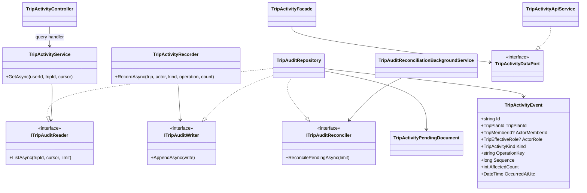
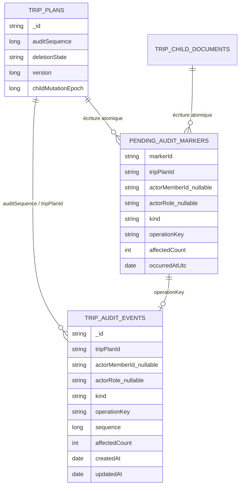
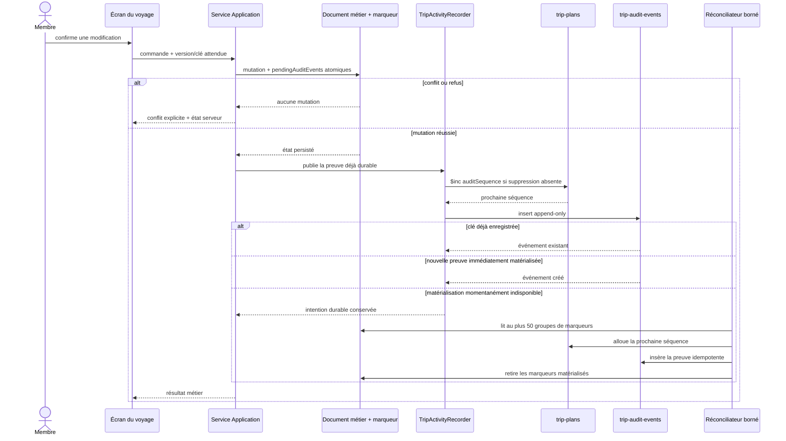
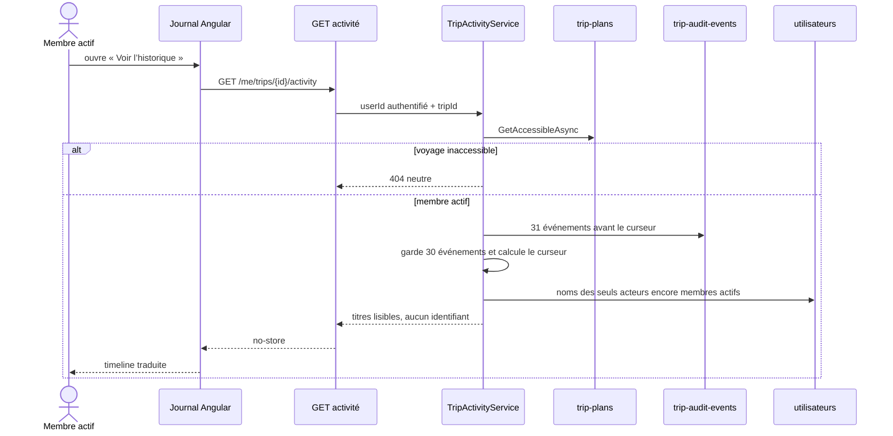

# TRIP-10 — Journal d’activité et concurrence explicite

## 1. Résultat métier

`TRIP-10` permet à chaque membre actif d’un voyage privé de comprendre les
changements importants du groupe : nature de l’action, auteur encore visible,
date et volume concerné. Le journal est accessible depuis la page du voyage et
présente les événements les plus récents en premier.

Le jalon ne crée pas un second moteur de concurrence. Il complète les garanties
déjà livrées par les versions optimistes, les leases enfant, les epochs de
suppression, les clés d’idempotence et les positions stables. Les écrans
continuent d’afficher les conflits et de recharger l’état serveur ; le journal
explique ensuite les mutations effectivement enregistrées.

Le journal couvre :

- création et renommage du voyage ;
- modification des dates ;
- ajout, mise à jour, déplacement et retrait d’un parc candidat ;
- ajout, mise à jour et retrait d’une journée ;
- création, révocation, acceptation et refus d’une invitation ;
- changement de rôle, transfert de l’organisation et départ d’un membre ;
- modification d’un lot de préférences, sans son contenu ;
- modification d’une décision collective.

L’historique commence au déploiement de `5.3.70`. Les actions antérieures ne sont
pas inventées ni reconstituées à partir de dates techniques incomplètes.

## 2. Ce que le journal est — et n’est pas

Le journal est une preuve narrative append-only. Il répond à « qui a fait quel
type de changement et quand ? ». L’état actuel reste porté par les collections
métier ; il n’est jamais recalculé en rejouant l’audit.

| Conservé dans MongoDB | Renvoyé à l’interface | Jamais conservé dans l’audit |
|---|---|---|
| voyage, membre interne éventuel, rôle au moment de l’action | libellé public de l’acteur s’il est encore membre actif | identifiant de compte, adresse e-mail ou jeton d’invitation |
| type, séquence, clé d’opération, quantité et date UTC | type, auteur lisible, quantité et date | préférence individuelle, raison privée ou note libre |
| identifiants nécessaires à l’idempotence | aucun identifiant technique | ancien ou nouveau titre, commentaire collectif |

Un ancien membre, un invité ayant refusé ou un compte qui n’est plus membre est
affiché sous le libellé localisé « Personne non affichée ». L’API transmet pour
cela un marqueur neutre et ne résout jamais son profil, afin de ne pas transformer
le journal en annuaire de personnes ayant quitté le voyage.

## 3. Architecture



- **Core** valide l’événement immuable, ses bornes et son rôle d’acteur.
- **Application** prépare la preuve avant l’écriture, la transmet au port de
  mutation puis déclenche sa matérialisation après réussite ; elle contrôle
  aussi l’accès à la lecture et minimise les identités visibles.
- Les modifications de détail et d’état d’un parc candidat sont isolées dans
  `TripCandidateMutationService`, afin que `TripProgramService` conserve une
  responsabilité et une taille bornées.
- **Infrastructure** attache chaque preuve au document métier modifié, alloue
  une séquence par voyage, garantit l’idempotence et répare en tâche de fond
  toute matérialisation interrompue. Un lot de préférences reste fermé à la
  matérialisation tant que sa lease enfant est active.
- **WebAPI** expose un contrat privé non mis en cache et sans identifiant.
- **Angular** respecte `service API -> port -> façade -> composant` ; la façade
  remplace la page récente et ajoute les pages anciennes sans doublon.

Chaque classe demeure dans son propre fichier.

## 4. Schéma MongoDB



Indexes de `trip-audit-events` :

```javascript
{ tripPlanId: 1, operationKey: 1 } // unique : même commande, même preuve
{ tripPlanId: 1, sequence: -1 }                 // unique : curseur stable
{ tripPlanId: 1, createdAt: -1, sequence: -1 } // ordre métier puis départage stable
```

Chaque collection source possède aussi un index sparse sur :

```javascript
{ "pendingAuditEvents.operationKey": 1 } // reprise bornée des preuves en attente
```

L’intention d’audit est ajoutée à `pendingAuditEvents` dans la même écriture
MongoDB que la mutation métier. Il n’existe donc aucune fenêtre où la donnée
peut être modifiée sans que sa preuve soit durable. Une panne pendant
l’allocation de séquence ou l’insertion du journal ne remet pas en cause le
résultat métier : le marqueur reste sur le document source et le réconciliateur
le reprend par lots de 50 au plus.
La matérialisation relit toujours le marqueur durable comme source canonique de
l’auteur, du rôle, du type, de la quantité et de l’heure. Une nouvelle tentative
ne peut donc pas réattribuer une action antérieure au membre qui la relance. Le
seul enrichissement admis complète l’acteur d’une acceptation d’invitation quand
le marqueur avait dû être enregistré avant que le nouveau membre soit relisible.
Si le worker a déjà matérialisé cet événement neutre, la publication de premier
plan complète atomiquement les deux champs d’acteur sans toucher à l’heure ni au
reste de la preuve.
Chaque marqueur possède un identifiant opaque propre au document source. Il
permet de déplacer sans perte ni duplication les preuves encore en attente
lorsqu’un membre quitte le voyage et que ses préférences privées doivent être
supprimées. Ces marqueurs sont d’abord réunis de façon idempotente sur le plan,
puis seulement les préférences du membre sont effacées. Le filtre de suppression
refuse tout document qui aurait reçu entre-temps un marqueur non déplacé ; le
ticket de nettoyage reste alors actif pour une reprise ultérieure. Le comptage
déduplique `markerId` si le réconciliateur observe simultanément la source et sa
copie sur le plan.
L’allocation incrémente atomiquement `trip-plans.auditSequence` uniquement si le
voyage n’est pas en suppression. Une répétition de la même opération retrouve
l’intention puis l’événement existants. Une tentative après le début d’une
suppression retire le marqueur sans recréer de donnée. Une journée supprimée
reste sous forme de tombstone privé jusqu’à matérialisation de sa preuve, puis
le réconciliateur la retire.
Le tombstone d’un parc candidat ne reçoit aucune échéance TTL tant que sa preuve
de retrait est en attente. Après matérialisation, l’échéance de rétention de
24 heures est posée et l’index TTL existant peut le nettoyer sans risque de
perdre le journal.
Une invitation portant un marqueur suspend de la même façon son échéance de
rétention. Après matérialisation, MongoDB restaure la fin normale de la fenêtre
de rejeu ou l’heure serveur courante si cette fenêtre est déjà dépassée.
Après l’insertion, le repository revérifie la barrière de suppression et retire
l’événement si la fermeture a gagné la course. Si la fermeture commence après
cette vérification, la purge voit déjà l’événement et le retire normalement.
La purge du voyage supprime les événements et tous les documents enfants, puis
vide explicitement `pendingAuditEvents` sur le tombstone du plan. Aucun identifiant
de membre porté par une preuve racine ne subsiste donc pendant la rétention du
tombstone.

Les anciens documents n’ont pas besoin de migration de données : l’absence de
`auditSequence` vaut zéro et l’absence de `pendingAuditEvents` vaut une liste
vide. Les indexes sont créés par l’initialiseur MongoDB au démarrage. Aucune
commande manuelle en production n’est requise.

## 5. Séquence d’écriture



La publication immédiate utilise `CancellationToken.None` après la réussite
métier ; une fermeture du navigateur ne peut de toute façon plus perdre la
preuve, déjà attachée à la mutation. Les clés stables des opérations idempotentes
empêchent un double événement lors d’une répétition. Les mutations enfant dont
le contenu peut redevenir identique, comme une journée A → B → A, ajoutent la
génération de lease à la clé : le dernier A reste donc un événement distinct du
premier. Pour un lot de préférences, chaque préférence réussie porte un marqueur
unitaire ; le journal publie ainsi le nombre réellement validé, même si un
conflit interrompt le lot. Le réconciliateur sélectionne au plus 50 opérations,
puis recharge tous les marqueurs de chacune d’elles avant le comptage : une
opération comportant 250 préférences n’est donc jamais tronquée à 50. Quand le
membre d’une invitation n’est pas encore relisible après une interruption, le
marqueur conserve les deux champs d’acteur à `null` plutôt qu’une identité
partielle invalide ; la publication immédiate les complète dès que possible.
Les marqueurs de préférences portent aussi l’identité complète de leur lease.
Le worker refuse de publier tant que cette lease est présente et non expirée,
afin de ne jamais photographier un lot encore en cours d’écriture.
Pour un transfert de propriété, le membre et son rôle sont capturés avant la
mutation de l’agrégat : l’auteur reste donc « propriétaire » dans le journal,
même s’il devient éditeur, participant ou lecteur juste après l’action.

## 6. Séquence de lecture et confidentialité



La pagination est bornée à 30 événements et utilise l’heure persistée de la
mutation en ordre décroissant. La séquence départage deux actions à la même
microseconde et permet de retrouver le point de reprise sans exposer un
identifiant MongoDB. `nextBeforeSequence` est donc un curseur opaque : le
repository relit sa date, puis applique le couple `(occurredAtUtc, sequence)`.
Une preuve ancienne réparée après une coupure retrouve ainsi sa vraie place
chronologique au lieu d’apparaître artificiellement comme la plus récente.

## 7. Concurrence réutilisée

Le jalon s’appuie sur les mécanismes déjà déployés :

1. `TripPlan.Version` protège les mutations de la racine ;
2. `TripChildMutationLease` porte opération, epoch et génération pour candidats,
   jours, préférences et décisions ;
3. les clés client protègent création du voyage, candidats et invitations ;
4. `SortPosition` évite de remplacer toute une liste pour un déplacement ;
5. la suppression ferme admissions et nouvelles leases avant la purge ;
6. les façades affichent les conflits et rechargent le serveur.

Aucun websocket ni SignalR n’est ajouté : une actualisation manuelle est
disponible et évite un coût permanent sur le VPS. Une notification de voyage
opt-in exige un contrat dédié lors de `TRIP-13` ; le domaine `WATCH` actuel suit
des changements factuels de parcs et ne doit pas être détourné pour des actions
privées de membres.

## 8. Expérience responsive et accessibilité

La timeline est conçue dès 320 pixels :

- `min-width: 0`, `max-width: 100%` et `overflow-wrap: anywhere` sur les zones
  contenant les pseudonymes et textes traduits ;
- colonnes `3rem minmax(0, 1fr)`, réduites sur les téléphones très étroits ;
- marge basse intégrant navigation fixe et safe area ;
- boutons d’actualisation et de pagination avec état occupé ;
- dates rendues avec la langue active et balise `time` ;
- erreurs initiales et erreurs de pagination distinguées ;
- aucune commande désactivée sans utilité ni identifiant technique visible.

Le contrôle Chromium partagé mesure 320, 360, 390, 768 et 1280 pixels et vérifie
le débordement horizontal de la page, des cartes, contrôles et liens.

## 9. Preuves automatisées

- **Core** : acteur invité sans membre, UTC, séquence et quantité bornées.
- **Application** : accès obligatoire, page bornée, curseur, nom des seuls membres
  actifs et anonymisation d’un ancien participant.
- **Infrastructure** : unicité opération/séquence, marqueurs sources atomiques,
  rechargement complet des opérations sélectionnées, déplacement idempotent des
  marqueurs avant nettoyage d’un membre, reprise bornée au démarrage du worker
  et absence d’identifiant de compte dans le journal comme dans les marqueurs
  Mongo.
- **WebAPI** : enum métier sérialisé en texte et absence de propriété `*Id`.
- **Angular** : URL encodée, `transferCache: false`, pagination sans doublon,
  actualisation, route authentifiée, façade/port et une classe par fichier.
- **Responsive** : assertions CSS et mesures dans un vrai Chromium.
- **i18n** : huit langues issues des fragments source et fichiers générés vérifiés.

## 10. Limites assumées

- le journal ne fabrique pas l’historique antérieur à `5.3.70` ;
- il explique une mutation, mais l’état métier courant reste la source de vérité ;
- il ne diffuse pas les événements en temps réel ;
- les exports seront traités séparément dans `TRIP-11`, avec des libellés métier
  et sans identifiants techniques isolés.
