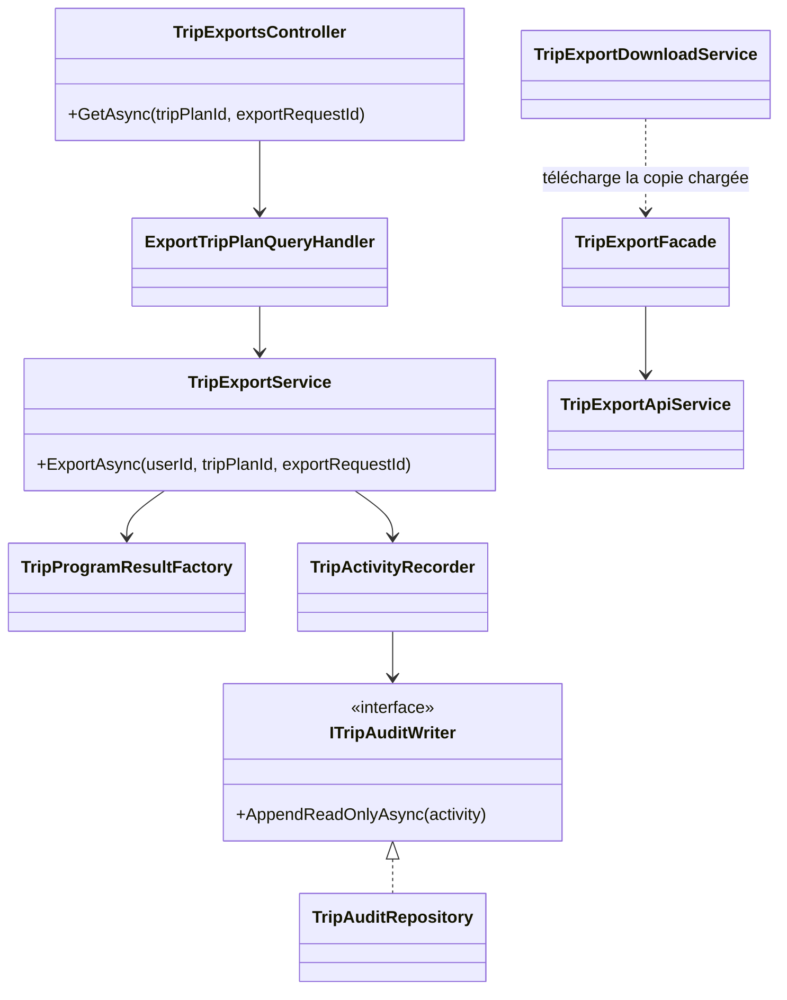
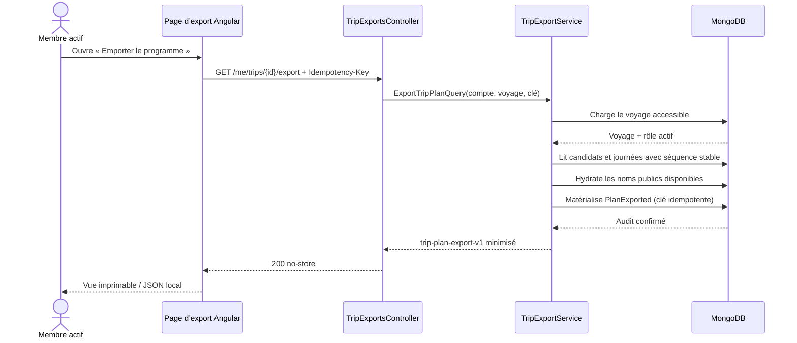

# TRIP-11 — Programme de voyage portable

Date d’implémentation : 25 septembre 2026
Roadmap : `docs/roadmaps/product-growth/06-collaborative-trip-planning-roadmap.md`

## Enjeu métier

Un programme préparé à plusieurs doit rester utile au moment du départ, y compris
hors de son écran d’édition. `TRIP-11` ajoute donc une vue dédiée que chaque membre
actif peut :

- consulter depuis le voyage ;
- imprimer ou enregistrer en PDF avec les fonctions natives du navigateur ;
- télécharger au format JSON lisible et versionné.

Ce jalon ne rend pas le voyage public. Il produit une copie privée du programme
collectif accessible au participant au moment de l’export.

## Périmètre exporté

Le contrat `trip-plan-export-v1` contient uniquement :

- le titre, les dates proposées, le fuseau et l’état du voyage ;
- les noms disponibles des parcs candidats, leur état, leurs dates et la note
  collective ;
- le programme par jour, l’heure d’arrivée, la note collective et les blocs ;
- les décisions collectives relatives aux attractions encore disponibles.

Sont exclus par construction du type de sortie :

- identifiants du voyage, des parcs, attractions, membres ou comptes ;
- noms et adresses des participants ;
- préférences individuelles, contraintes privées et données de profil ;
- versions techniques, positions de tri et clés d’idempotence.

Une référence devenue indisponible est affichée avec un libellé neutre. Son
identifiant interne n’est jamais utilisé comme solution de repli.

## Architecture



Les responsabilités restent séparées :

- Core décide qu’un rôle actif possède ou non la permission `Export` ;
- Application orchestre la lecture cohérente, la minimisation et l’audit ;
- Infrastructure matérialise l’événement d’audit dans MongoDB ;
- WebAPI valide l’identité et transporte un DTO sans identifiants ;
- Angular charge l’export par un port, l’affiche et déclenche les capacités natives
  d’impression ou de téléchargement.

## Séquence de sécurité et d’audit



Si l’audit ne peut pas être enregistré, l’Application échoue fermée et ne remet
pas le document. Une nouvelle tentative utilise une nouvelle clé ; la répétition
d’une même requête reste idempotente.

## Modèle MongoDB

`TRIP-11` ne crée aucune collection ni migration de données. Il réutilise :

```text
trip-plans                 1 ── n trip-park-candidates
     │                     1 ── n trip-day-plans
     │                     1 ── n trip-item-decisions
     └──────────────────── 1 ── n trip-activity-events
                                      kind = PlanExported
```

L’événement contient l’identifiant technique nécessaire à l’audit interne, mais
celui-ci n’entre jamais dans le DTO remis au navigateur. Aucun contenu de l’export
n’est dupliqué en base.

## Responsive, impression et performance

- la page et toutes ses grilles utilisent des colonnes `minmax(0, 1fr)` ;
- les textes longs peuvent revenir à la ligne et le conteneur coupe tout
  débordement horizontal ;
- les cartes passent à une colonne avant 36 rem et les détails à une colonne
  avant 22,5 rem ;
- la marge basse tient compte de la navigation mobile et de la zone sûre ;
- la feuille d’impression masque les actions, supprime les ombres et évite de
  couper une carte entre deux pages ;
- aucun générateur PDF ni dépendance lourde n’est ajouté : le navigateur produit
  le PDF, et le JSON réutilise exactement la copie déjà chargée ;
- l’export est `no-store` et exclu du transfer cache SSR.

## Preuves automatisées

- tests Application : autorisation, absence d’identifiants, lecture cohérente et
  échec fermé si l’audit échoue ;
- test WebAPI : format stable des dates/heures et contrat sans identifiants ;
- tests Angular : en-tête d’idempotence, façade, téléchargement JSON ;
- contrat responsive statique et navigateur réel aux largeurs 320, 360, 390,
  768 et 1280 px ;
- contrôle global « une classe = un fichier » et frontières façade/ports.
