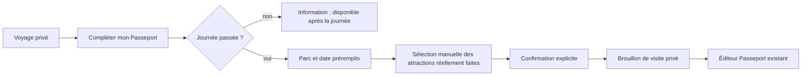
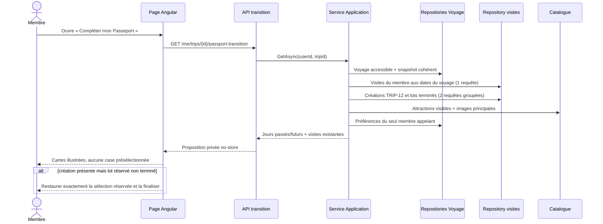
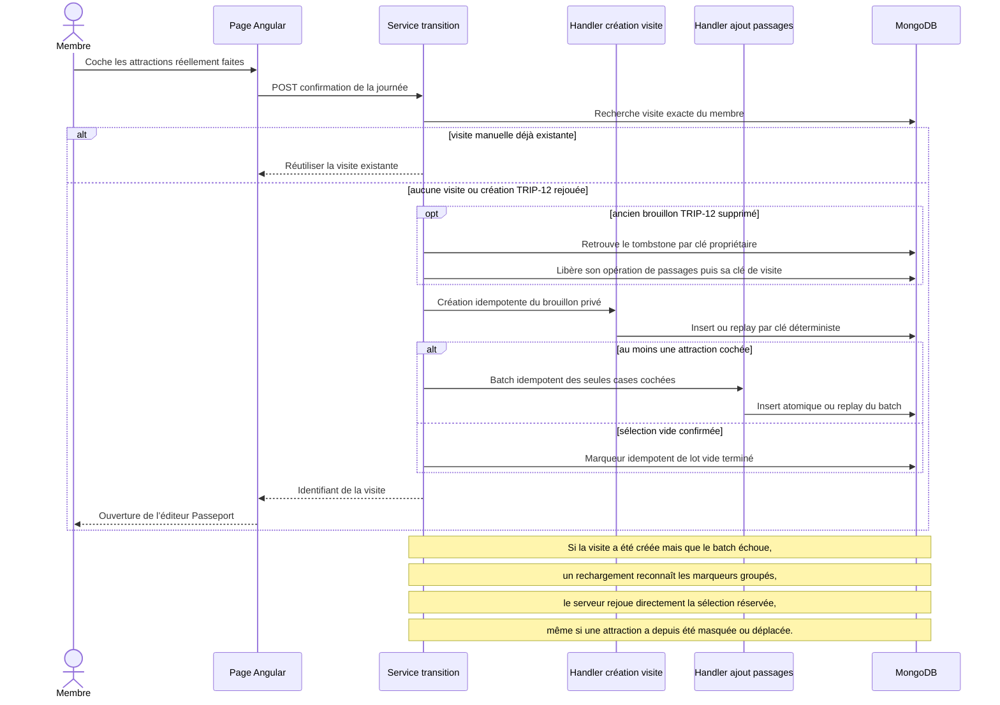
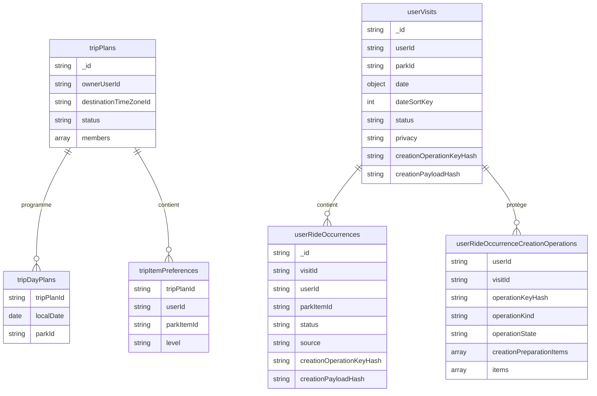

# TRIP-12 — Transition privée du voyage vers le Passeport

Date : 25 septembre 2026
Statut : implémenté

## 1. Enjeu métier

Une journée planifiée n’est pas une preuve de visite et une préférence n’est pas
une preuve de tour effectué. Après la date du voyage, chaque participant peut
donc repartir du programme pour créer **son propre brouillon privé** :

- le parc et la date sont préremplis ;
- aucune visite n’est créée avant une confirmation explicite ;
- aucune attraction n’est présélectionnée ;
- les préférences personnelles sont affichées uniquement comme aide-mémoire ;
- les choix et préférences des autres participants ne sont jamais copiés ;
- chaque attraction cochée devient un passage effectué uniquement après la
  confirmation du membre ;
- le voyage reste conservé : la transition ne le supprime pas et ne modifie pas
  son statut, y compris lorsqu’il est déjà archivé.

Le résultat est volontairement un brouillon. Le membre peut ensuite corriger,
noter, compléter ou terminer la visite avec le parcours Passeport existant.
La seule exception à l’absence de présélection est une reprise technique : si
un lot déjà réservé a été interrompu, les choix du membre sont restaurés à
l’identique et verrouillés le temps de finaliser le même lot idempotent.

## 2. Parcours utilisateur

Si une visite existe déjà pour le même membre, le même parc et la même date,
l’interface propose de l’ouvrir au lieu d’en créer une seconde.

## 3. Frontières d’architecture

### Core

Le domaine Passeport reste propriétaire de la signification d’un passage. La
source `TripTransition` complète `RideLogSource` pour conserver la provenance
de la déclaration sans introduire une règle Voyage dans l’entité `Visit`. Sa
valeur HTTP dédiée reste distincte de `SystemMigration`, afin qu’aucun passage
issu d’un voyage ne puisse être présenté comme une migration technique.

`TripPassportTransitionPolicy` centralise l’éligibilité d’une journée : le parc
doit être disponible et la date locale doit être strictement passée dans le
fuseau de destination. La consultation et la confirmation réutilisent ainsi la
même règle métier du Core.

### Application

Deux services applicatifs ciblés orchestrent les deux parcours sans mélanger lecture et écriture :

- `TripPassportTransitionReader` construit la proposition privée ;
- `TripPassportTransitionConfirmer` transforme une sélection explicite en brouillon de visite.

1. vérification de l’accès au voyage ;
2. lecture cohérente de son programme ;
3. calcul de la date courante dans le fuseau de destination ;
4. lecture groupée des visites existantes ;
5. lecture du catalogue public et des seules préférences de l’appelant ;
6. création par les handlers Passeport existants ;
7. ajout idempotent des attractions explicitement sélectionnées.

Les validations, l’audit, les verrous de contenu et les règles de brouillon ne
sont pas contournés : la transition réutilise `CreateVisitCommand` et
`AddRideOccurrencesBatchCommand`.

### Infrastructure

La recherche des visites aux dates du voyage utilise une seule requête MongoDB
bornée par le propriétaire et `dateSortKey`. Aucun parcours complet de
collection ni requête par journée n’est ajouté. Deux lectures groupées par
empreintes d’opération distinguent ensuite une création TRIP-12 et un lot de
passages réservé, en cours ou finalisé. La réservation conserve aussi les
identifiants des attractions dans leur ordre canonique afin de restaurer
exactement la sélection après une coupure. Une confirmation volontairement
vide écrit un marqueur de fin sans créer de passage. Ces opérations réutilisent
les index d’idempotence existants et ne chargent ni notes privées ni contenu de
visite. Les recherches par date excluent toujours les visites supprimées.
Lorsqu’un ancien brouillon TRIP-12 a lui-même été supprimé, le tombstone est
d’abord identifié. Son opération de passages est libérée avant sa clé de
création de visite : une coupure entre les étapes reste donc rejouable.
L’historique supprimé reste conservé, mais ne peut ni être rejoué ni bloquer
les index uniques.

### WebAPI

Le contrôleur authentifié expose une proposition privée et une confirmation
pour une journée précise. Les réponses ont `no-store`. Les identifiants restent
des clés d’action ; les libellés visibles utilisent les noms hydratés. Le champ
`canResume` distingue explicitement un brouillon interrompu d’une visite déjà
complète ou créée manuellement.

### Angular

La page lazy-loaded suit le découpage `API service → data port → facade → page`.
Le composant ne contient que l’état de sélection visuel et la navigation vers
le brouillon créé.

## 4. Diagramme de classes

```mermaid
classDiagram
    class TripPassportTransitionsController {
      +GetAsync(tripPlanId)
      +ConfirmAsync(tripPlanId, localDate, request)
    }
    class GetTripPassportTransitionQueryHandler
    class ConfirmTripPassportTransitionCommandHandler
    class TripPassportTransitionReader {
      +GetAsync(userId, tripPlanId)
    }
    class TripPassportTransitionConfirmer {
      +ConfirmAsync(userId, tripPlanId, localDate, parkItemIds)
    }
    class TripPassportTransitionPolicy {
      +CanConfirmDay(localDate, destinationToday, isParkAvailable) bool
    }
    class TripProgramResultFactory {
      +BuildSnapshotAsync(tripPlanId)
    }
    class IUserVisitRepository {
      +ListOwnedByExactDatesAsync(userId, dates)
      +ListOwnedCreationOperationVisitIdsAsync(userId, operationIds)
      +ResolveExistingCreationAsync(visit, operationId)
      +GetOwnedAsync(visitId, userId)
      +GetDeletedCreationOperationVisitIdAsync(userId, operationId)
      +ReleaseDeletedCreationOperationAsync(userId, operationId)
    }
    class IRideOccurrenceRepository {
      +ListBatchCreationOperationStatesAsync(userId, operationIds)
      +CompleteEmptyBatchCreationOperationAsync(userId, visitId, operationId)
      +ReleaseBatchCreationOperationAsync(userId, visitId, operationId)
    }
    class CreateVisitCommandHandler
    class AddRideOccurrencesBatchCommandHandler
    class TripPassportTransitionApiService
    class TripPassportTransitionDataPort
    class TripPassportTransitionFacade
    class TripPassportTransitionPageComponent

    TripPassportTransitionsController --> GetTripPassportTransitionQueryHandler
    TripPassportTransitionsController --> ConfirmTripPassportTransitionCommandHandler
    GetTripPassportTransitionQueryHandler --> TripPassportTransitionReader
    ConfirmTripPassportTransitionCommandHandler --> TripPassportTransitionConfirmer
    TripPassportTransitionReader --> TripProgramResultFactory
    TripPassportTransitionReader --> TripPassportTransitionPolicy
    TripPassportTransitionReader --> IUserVisitRepository
    TripPassportTransitionReader --> IRideOccurrenceRepository
    TripPassportTransitionConfirmer --> TripProgramResultFactory
    TripPassportTransitionConfirmer --> TripPassportTransitionPolicy
    TripPassportTransitionConfirmer --> IUserVisitRepository
    TripPassportTransitionConfirmer --> CreateVisitCommandHandler
    TripPassportTransitionConfirmer --> AddRideOccurrencesBatchCommandHandler
    TripPassportTransitionPageComponent --> TripPassportTransitionFacade
    TripPassportTransitionFacade --> TripPassportTransitionDataPort
    TripPassportTransitionDataPort <|.. TripPassportTransitionApiService
```

## 5. Séquence de consultation

## 6. Séquence de confirmation et reprise sur incident

Les clés d’opération sont dérivées par SHA-256 de l’identifiant du voyage, du
membre, du parc planifié et de la date. Elles ne contiennent donc pas
directement ces valeurs, restent stables entre deux tentatives et distinguent
deux parcs successivement programmés le même jour.

## 7. Schéma MongoDB utilisé

Aucune collection ni migration supplémentaire n’est nécessaire. La transition
réutilise les documents Passeport et leurs index existants.

La proposition lit `tripItemPreferences` avec `tripPlanId + userId`. Elle ne
charge pas le résumé collectif et ne reçoit jamais les préférences d’un autre
participant.

## 8. Invariants et preuves

| Invariant | Preuve d’implémentation |
|---|---|
| aucune création automatique | seule la route POST appelle les handlers de création |
| journée strictement passée | politique Core unique `TripPassportTransitionPolicy`, partagée par lecture et confirmation |
| visite privée et en brouillon | création par le handler Passeport, dont les valeurs initiales sont `Private` et `Draft` |
| aucune priorité transformée automatiquement | la préférence n’est qu’un badge ; une nouvelle sélection Angular commence vide |
| aucune donnée d’un autre participant | appel unique à `ListForUserAsync(tripId, currentUserId)` |
| aucune attraction d’un autre parc | validation serveur contre le catalogue visible du parc de la journée |
| pas de doublon de visite | détection membre/parc/date puis clés d’idempotence déterministes |
| reprise après échec partiel | lectures groupées des empreintes et de l’état du batch, restauration verrouillée des identifiants réservés, exposition `canResume`, puis replay du même brouillon |
| sélection vide réellement terminée | marqueur idempotent `completed` sans occurrence, relu comme une fin et non comme une reprise |
| suppression sans blocage fantôme | le filtre exact propriétaire/date exclut les documents avec tombstone |
| suppression d’un brouillon TRIP-12 | résolution du tombstone puis libération ciblée de l’opération de passages avant celle de la visite ; une interruption reste rejouable et le tombstone n’est ni restauré ni supprimé physiquement |
| catalogue modifié après réservation | le serveur reprend le payload réservé complet sans le reconstruire depuis les seules attractions encore visibles |
| parc reprogrammé le même jour | le parc fait partie des deux clés d’opération ; la transition du nouveau parc ne rejoue pas celle de l’ancien |
| pas de fuite SSR/cache | route authentifiée et réponse `no-store` |
| plan conservé | aucune mutation ou suppression du voyage pendant la transition |

## 9. Responsive et accessibilité

- largeur bornée par `min-width: 0`, `max-width: 100%` et `overflow-x: clip` ;
- cartes en deux colonnes sur grand écran puis une colonne sous 768 px ;
- image ramenée à 5 rem sur téléphone ;
- actions empilées avant 576 px ;
- variante 320 px dédiée ;
- marge basse tenant compte de la navigation fixe et de la safe area ;
- cartes de sélection rendues comme boutons avec `aria-pressed` ;
- état sélectionné communiqué par le texte, la bordure et une icône ;
- le parcours reste entièrement utilisable sans glisser-déposer.

Le contrôle Chromium vérifie les largeurs 320, 360, 390, 768 et 1280 px, les
dépassements horizontaux et le dégagement de la navigation mobile.

## 10. Validation

- tests Application : proposition passée/future, préférence personnelle,
  sélection explicite, reprise avec sélection restaurée, lot déjà finalisé et
  confirmation vide marquée comme terminée ;
- tests Infrastructure : requêtes bornées au propriétaire, aux empreintes
  demandées, aux états de création utiles, exclusion des visites supprimées et
  libération ciblée de leur ancienne clé ;
- tests Angular : endpoints, filtrage défensif de la facade, erreur de
  confirmation, route authentifiée ;
- contrat responsive statique ;
- contrôle réel Chromium multi-viewport ;
- contrôle i18n sur huit langues ;
- contrôles d’architecture facade/port et une classe par fichier.
