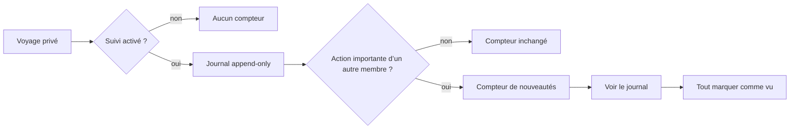
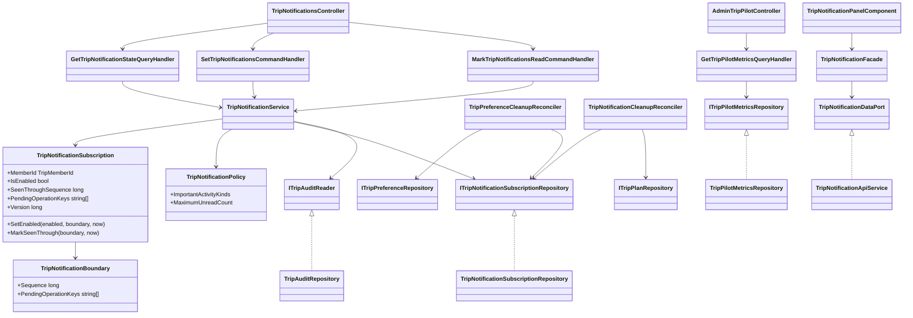
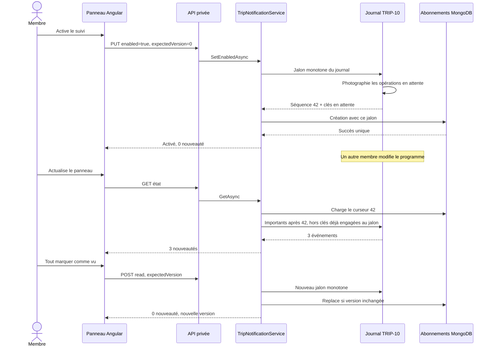

# TRIP-13 — Pilote collaboratif et suivi privé

Date : 25 septembre 2026
Statut : implémenté

## 1. Enjeu métier

Un voyage partagé peut évoluer sans que chaque membre consulte constamment le
programme. Le suivi TRIP-13 permet donc à chaque participant de choisir, pour
chaque voyage, s’il souhaite voir les changements importants qu’il n’a pas
lui-même réalisés.

Le comportement est volontairement simple :

- le suivi est désactivé par défaut ;
- son activation est individuelle et privée ;
- les événements antérieurs à l’activation ne sont pas présentés comme nouveaux ;
- seuls les changements collaboratifs importants sont comptés ;
- les propres actions du membre ne gonflent pas son compteur ;
- le journal existant donne le détail sans recopier les données ;
- une actualisation manuelle suffit : aucun websocket, push ou polling permanent ;
- quitter un voyage ou supprimer celui-ci efface les abonnements concernés.



## 2. Ce qui constitue une nouveauté

Sont suivis : titre, dates, parcs candidats, programme journalier, invitations,
participants et rôles, préférences, transfert de propriété et décisions
collectives.

Ne sont pas suivis :

- la création initiale du voyage, antérieure à tout abonnement utile ;
- l’export, qui est une lecture privée sans modification du plan ;
- les actions réalisées par le membre lui-même.

La politique est définie dans le Core par `TripNotificationPolicy`. Elle n’est
donc ni dupliquée dans MongoDB, ni décidée par le contrôleur ou Angular.

## 3. Architecture

### Core

`TripNotificationSubscription` porte les invariants : abonnement individuel,
identité exacte de l’appartenance, curseur monotone, activation sans historique
rétroactif, opérations durables encore en attente au moment du jalon et version
optimiste. `TripNotificationBoundary` réunit cette séquence et ces identités
d’opération sans dépendre de l’horloge d’un serveur.
`TripNotificationPolicy` centralise les types d’activité significatifs et borne
le compteur visible à 99, avec un indicateur `99+`.

### Application

`TripNotificationService` :

1. vérifie l’accès actif au voyage ;
2. charge l’abonnement du membre ;
3. demande au journal les événements importants après sa séquence monotone,
   hors opérations qui étaient encore en attente au moment du jalon ;
4. exclut l’identité membre courante au niveau de la requête ;
5. applique une écriture optimiste lors de l’activation, désactivation ou lecture.

Les handlers restent minces. Le départ, la suppression immédiate et son
réconciliateur révoquent les abonnements via le port applicatif dédié.

Le handler de pilotage lit un instantané agrégé : voyages actifs, voyages avec
au moins deux membres actifs, plans ayant des préférences ou décisions,
invitations expirées encore retenues, suivis activés, volume d’audit, marqueurs
d’audit en attente et répartition des types d’activité. Son contrat ne contient
ni identifiant membre, ni titre, ni note.

### Infrastructure

MongoDB conserve uniquement un curseur par couple voyage/membre. Aucun document
de notification n’est dupliqué pour chaque événement : le journal TRIP-10 reste
la preuve canonique. Ce choix réduit les écritures, la rétention et la charge du
VPS.

Le tableau de bord utilise des comptages MongoDB, deux lectures distinctes de
voyages effectuées par des agrégations `group/count` côté serveur et des
agrégations par type d’activité. Il ne rapatrie ni les identifiants distincts,
ni aucun document métier complet, et ne déclenche aucune requête par voyage ou
par membre.

La lecture est bornée à 100 événements (`99 + preuve qu’il en reste`) et utilise
les index du journal sur `tripPlanId`, `sequence` et `createdAt`. Lors de
l’activation ou de « tout marquer comme vu », le repository photographie d’abord
les clés des marqueurs durables encore en attente dans les six collections du
voyage, puis lit la dernière séquence matérialisée. La séquence écarte ainsi tout
ce qui est déjà journalisé ; les clés photographiées écartent les mêmes opérations
si elles ne sont matérialisées que plus tard. Une opération créée pendant la
photographie est soit déjà couverte par la dernière séquence, soit considérée
comme postérieure au jalon. Cette borne ne compare aucune horloge et reste donc
sûre entre plusieurs instances. Chaque photographie commence par l’identité du
voyage indexée (`_id` pour le plan, `tripPlanId` pour ses enfants) avant de filtrer
les marqueurs embarqués : son coût dépend du voyage visé, pas du corpus global.
L’unicité de l’abonnement est protégée par un index MongoDB, pas par une
vérification en mémoire.

### WebAPI

Les trois opérations privées sont :

- `GET /me/trips/{tripPlanId}/notifications` ;
- `PUT /me/trips/{tripPlanId}/notifications` ;
- `POST /me/trips/{tripPlanId}/notifications/read`.

Elles exigent un compte activé, refusent un voyage inaccessible et répondent
avec `no-store`. La version courante est renvoyée lors d’un conflit optimiste.

L’instantané agrégé est exposé séparément par
`GET /admin/trip-pilot/metrics`, strictement réservé au rôle administrateur,
limité en débit et également `no-store`.

### Angular

Le panneau suit la chaîne `API service → data port → facade → composant`. Il se
trouve en haut du voyage, explique clairement l’opt-in, montre le compteur,
ouvre le journal et permet de tout marquer comme vu. Il n’expose aucun
identifiant technique. Son effet initial ne suit que l’identifiant du voyage :
les signaux de chargement de la façade sont lus hors suivi réactif afin de ne
jamais transformer l’actualisation manuelle en polling involontaire. Chaque
requête reçoit en outre une génération locale : une ancienne actualisation qui
termine après une activation ou une lecture ne peut pas rétablir l’ancien état.
Lors d’une navigation vers un autre voyage, l’ancien état est immédiatement
retiré et toutes les mutations restent neutralisées jusqu’à la réponse du nouveau
voyage ; une version appartenant au voyage précédent ne peut donc jamais être
envoyée avec le nouvel identifiant.

La page d’administration « Pilote des voyages » est lazy-loaded et présente les
indicateurs agrégés, l’état du rattrapage d’audit et une répartition graphique
légère des activités. Les barres utilisent des libellés agrégés dédiés, sans
acteur ni variable issue du journal individuel. Elle ne rejoint jamais les
comptes ou les textes privés.

## 4. Schéma MongoDB

```javascript
trip-notification-subscriptions {
  _id: string,                 // opaque, jamais exposé
  tripPlanId: string,          // clé du voyage privé
  memberId: string,            // appartenance précise ayant activé le suivi
  userId: string,              // propriétaire de l’opt-in
  isEnabled: boolean,
  seenThroughSequence: long,   // dernière séquence globale reconnue
  pendingOperationKeys: string[], // opérations déjà engagées mais pas matérialisées au jalon
  version: long,               // concurrence optimiste
  createdAt: date,
  updatedAt: date              // date UTC de la dernière mutation de l’abonnement
}

trip-plans {
  // marqueur historique TRIP-06 désormais retiré seulement après toutes les
  // purges privées du membre, y compris son abonnement TRIP-13
  departedPreferenceCleanupUserIds: string[]
}
```

Index :

```text
UNIQUE (tripPlanId ASC, userId ASC)  uq_trip_notification_plan_user
       (userId ASC, isEnabled ASC)   ix_trip_notification_user_enabled
```

Le déploiement crée automatiquement la collection et ses index. Aucune
migration manuelle de données n’est nécessaire : l’absence de document signifie
simplement « suivi non activé ».

## 5. Diagramme de classes



## 6. Séquence d’activation et de consultation



## 7. Concurrence et reprise

Deux onglets ne peuvent pas écraser silencieusement la préférence : chaque
écriture cible l’identifiant, le voyage, le membre et la version attendue. Une
version différente produit un conflit `trip.notification.changed-concurrently`.
La façade recharge alors l’état serveur.

Après une première création, le service relit l’appartenance. Si le membre a
quitté le voyage ou si celui-ci a été supprimé pendant la course, il compense
immédiatement l’insertion avant de répondre. Si le départ intervient après
cette relecture, le nettoyage obligatoire du départ supprime l’abonnement. La
relecture et la compensation utilisent un jeton non annulable : une fermeture
de l’appel HTTP ne peut pas laisser un abonnement orphelin.

Le marqueur durable de nettoyage d’un membre parti n’est retiré qu’après les
deux purges privées, préférences puis abonnement. Le réconciliateur rejoue ces
opérations idempotentes dans le même ordre. Une panne MongoDB entre les deux
laisse donc le marqueur en place et déclenche une nouvelle tentative, au lieu
de conserver silencieusement un suivi devenu inaccessible.

Tant que ce marqueur subsiste, MongoDB refuse atomiquement une nouvelle
admission du même compte dans le voyage. Le membre peut revenir dès que la
purge est terminée, mais une ancienne tentative ne peut jamais supprimer les
préférences ou l’abonnement de sa nouvelle appartenance.

Une seconde protection traite la course plus rare où le départ ou la suppression
du voyage se termine juste avant la création de l’abonnement, puis où sa
compensation MongoDB échoue. Le document d’abonnement lui-même sert alors de
marqueur durable. Un réconciliateur parcourt au plus 25 abonnements par minute,
par identifiant opaque croissant, revérifie l’accès actif et l’identifiant exact
de l’appartenance qui avait consenti au suivi, puis supprime les documents
devenus inaccessibles ou rattachés à une ancienne appartenance. Une réadmission
ultérieure repart donc toujours désactivée. Son curseur n’avance qu’après la
réussite complète du lot ; un échec rejoue la même page, et la fin de collection
ramène le prochain passage au début. Ce balayage borné évite une collection
secondaire, une charge soudaine et tout abandon silencieux après redémarrage.
La suppression compare l’identifiant du document, le voyage, l’appartenance,
le compte et la version lus par le balayage. Si un nouvel abonnement remplace
l’ancien pendant cette vérification, il ne peut donc pas être supprimé par la
purge devenue obsolète.

Le jalon de lecture combine la séquence monotone du journal et l’identité des
opérations durables encore en attente. Un marqueur créé avant l’activation ou
avant « tout marquer comme vu », mais matérialisé en retard, reçoit une séquence
supérieure sans devenir artificiellement une nouveauté : sa clé faisait déjà
partie du jalon. Une vraie modification engagée après la photographie ne possède
pas cette clé et reste visible, indépendamment de l’heure des instances ou de la
précision BSON. À l’inverse, une action
personnelle est filtrée mais sa séquence peut être franchie sans risque, puisque
le curseur est global au journal du voyage.

`updatedAt` reste une information d’exploitation, jamais une borne d’ordre. Si
l’horloge d’une instance recule, le domaine conserve la dernière valeur connue
au lieu de rejeter une mutation légitime ; la séquence et la version optimiste
restent les seules références de concurrence.

## 8. Confidentialité, sécurité et performance

- opt-in explicite, jamais activé automatiquement ;
- aucune adresse, jeton d’invitation, note ou préférence détaillée dans la réponse ;
- contrôle d’appartenance avant chaque lecture ou mutation ;
- réponse `no-store` ;
- compteur borné et pas de N+1 ;
- aucune boucle de polling ni connexion permanente ;
- suppression ciblée lors du départ, purge complète avant suppression du voyage ;
- domaine `WATCH` public inchangé : aucun mélange entre faits publics et actions privées.

## 9. Responsive et accessibilité

Le panneau et le tableau de bord admin sont contenus dès 320 pixels :
`min-width: 0`, rupture des textes longs, grilles `minmax(0, 1fr)` et actions
empilées sous 36 rem. Le compteur est annoncé dans une zone `aria-live`, les
erreurs utilisent `role="alert"` et tous les boutons conservent un libellé
textuel. Les huit langues sont fournies. La fixture Chromium réelle couvre les
deux nouveaux écrans à 320, 360, 390, 768 et 1280 pixels.

## 10. Observabilité et gate pilote

Le journal append-only constitue la preuve produit : créations, ajouts de parc,
invitations, acceptations/refus, préférences, décisions, participants et volume
d’audit sont reconstituables sans donnée publique ni visite réelle. Les conflits
optimistes restent identifiables par leurs codes applicatifs stables.

Le tableau de bord admin rend directement visibles les indicateurs actuellement
prouvables, dont les invitations expirées présentes durant leur période de
rétention, ainsi que les marqueurs d’audit qui n’ont pas encore été
matérialisés. Les métriques non persistées historiquement, telles qu’une latence
d’interface précise ou un conflit seulement vu côté client, ne sont pas
inventées : leur instrumentation nécessitera un contrat dédié si elles deviennent
un critère de décision réel.

La condition communautaire de cohorte réelle a été explicitement retirée du
chemin bloquant par décision produit. La gate TRIP-13 atteste donc les capacités
techniques et métier testables ; elle ne fabrique pas une preuve d’adoption.

## 11. Preuves

- 9 tests Core : activation, réactivation, curseur monotone, renouvellement de
  la clôture des opérations en attente, recul d’horloge et politique ;
- 14 tests Application dédiés : opt-in, absence de rétroactivité, compteur,
  concurrence, compensations de départ/annulation, réconciliation des
  abonnements orphelins ou issus d’une ancienne appartenance et métriques
  agrégées sans contenu privé ;
- 27 tests Application du périmètre : notifications, départ, reprise de purge
  et pilotage ;
- 25 tests Infrastructure du périmètre : index, pagination de purge, clôture
  d’admission pendant une purge, filtre privé, photographie ciblée des opérations
  en attente, comptages scalaires et agrégations, résolution du
  nettoyage en tâche de fond ;
- 1 test WebAPI du contrat agrégé ;
- 23 tests Angular ciblés : façades, effet sans polling, réponse tardive
  neutralisée, navigation entre voyages isolée et non actionnable pendant son
  chargement, erreur de mutation conservée
  après reprise, libellés agrégés, navigation admin et
  contrats responsive ;
- build WebAPI Release réussi ;
- build Angular production/SSR réussi ;
- architecture façade/ports et règle une classe par fichier réussies ;
- i18n générée et validée pour les huit langues.
