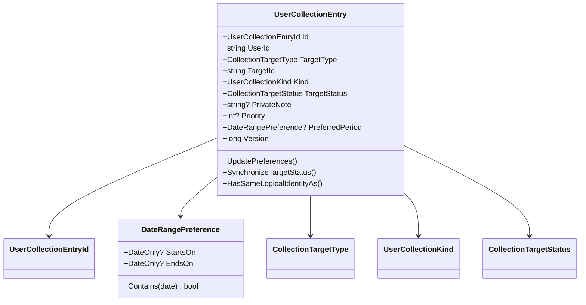
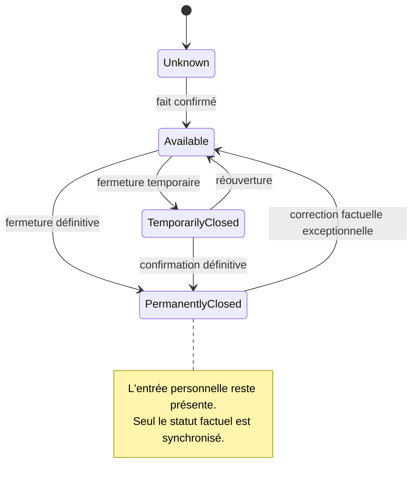
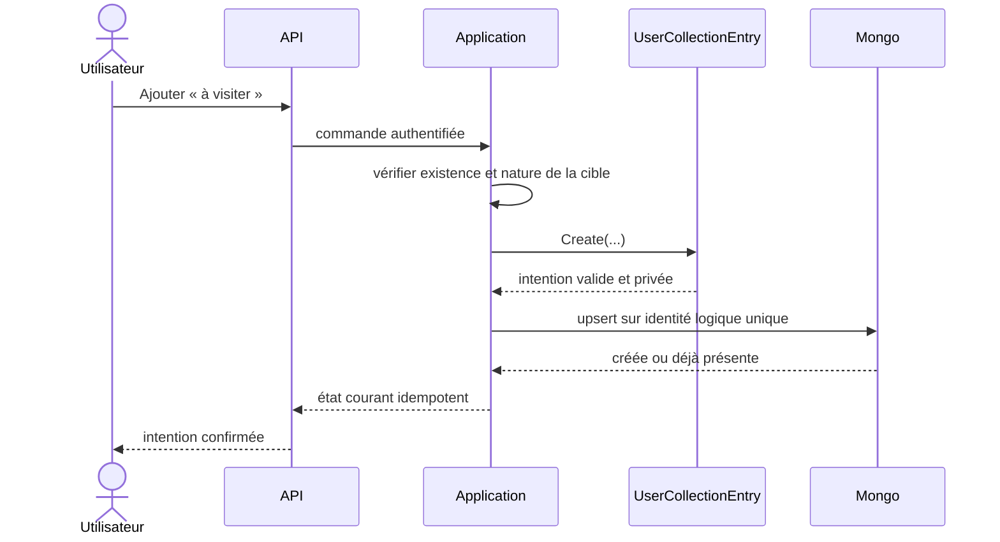

# WATCH-01 — Domaine des collections personnelles

> Version cible : `5.3.39`
>
> Date : 15 septembre 2026
>
> Portée : domaine pur et tests ; aucune API, persistance ou interface n'est ouverte par ce jalon.

## Résultat métier

Une collection personnelle ne se résume plus à un cœur ambigu. Le domaine distingue
quatre intentions :

- `Favorite` : l'utilisateur apprécie particulièrement la cible ;
- `WantToVisit` : il souhaite découvrir un parc ;
- `WantToExperience` : il souhaite essayer un élément de parc ;
- `Planned` : la cible fait partie d'un projet concret.

Une même cible peut porter plusieurs intentions. Deux entrées ne représentent le
même choix logique que si le propriétaire, le type de cible, la cible et l'intention
sont tous identiques. Cette identité formera l'index unique de la persistance dans
`WATCH-02`.

Les détails de préparation restent privés par construction : note, priorité et
période ne portent aucun indicateur de publication et ne sont reliés à aucun modèle
de partage. Une future publication devra passer explicitement par la politique
centralisée `SHARE`.

## Invariants

- `WantToVisit` cible exclusivement un parc ;
- `WantToExperience` cible exclusivement un élément de parc ;
- `Favorite` et `Planned` acceptent les deux types de cible ;
- la priorité facultative est bornée de 1 à 5 ;
- la note privée facultative est normalisée et limitée à 2 000 caractères ;
- une période possède au moins une borne et ne peut pas finir avant de commencer ;
- les horodatages sont UTC, ordonnés et accompagnés d'une version optimiste positive ;
- une mutation identique ne change ni version ni date ;
- la fermeture temporaire ou définitive d'une cible met à jour son état sans effacer
  l'intention de l'utilisateur ;
- aucune consultation publique ne crée d'entrée implicitement.

## Diagramme de classes

## Compatibilité intention/cible

| Intention | Parc | Élément de parc |
|---|---:|---:|
| Favori | oui | oui |
| À visiter | oui | non |
| À essayer | non | oui |
| Planifié | oui | oui |

Cette matrice est une règle du Core. Une API, une interface ou un import ne pourra
donc pas la contourner.

## Cycle de la cible

Le domaine autorise une correction exceptionnelle depuis tout état : la source de
vérité factuelle sera contrôlée par la couche Application et auditée dans les jalons
suivants.

## Séquence prévue pour WATCH-02

## Persistance cible du jalon suivant

La collection MongoDB prévue reste `user-collection-entries`, avec :

- un index unique `(UserId, TargetType, TargetId, Kind)` ;
- un index de lecture `(UserId, UpdatedAtUtc)` ;
- une version optimiste pour les modifications de note, priorité et période ;
- aucune TTL sur une intention active ;
- suppression par propriétaire uniquement et participation aux exports/suppressions
  de compte.

## Preuves automatisées

Les tests Core couvrent :

- les six associations intention/cible autorisées ;
- les deux associations interdites ;
- l'identité logique identique ou distincte selon l'intention ;
- la normalisation des identifiants et de la note privée ;
- les périodes invalides et leurs bornes inclusives ;
- les priorités hors limites ;
- l'idempotence d'une modification identique ;
- la conservation de l'entrée après fermeture définitive ;
- les mutations antidatées et les restaurations incohérentes.

## Limites assumées

- aucun bouton n'est encore visible : l'usage Web appartient à `WATCH-02` ;
- l'unicité multi-requêtes sera garantie par MongoDB dans `WATCH-02` ;
- `Planned` prépare l'intégration aux voyages, sans créer prématurément le modèle
  collaboratif de `TRIP` ;
- surveiller des changements factuels reste un abonnement distinct, introduit par
  `WATCH-03`, et ne sera jamais déclenché par un simple favori.
