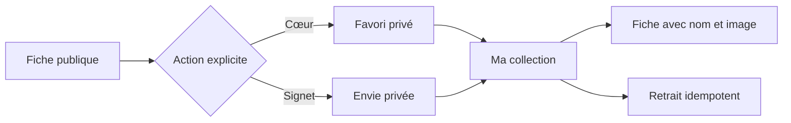
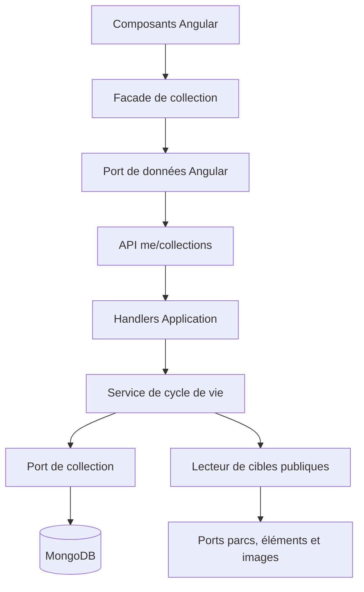

# WATCH-02 — Collections privées utilisables

## Résultat métier

Un membre connecté peut désormais marquer un parc ou une attraction comme favori,
indiquer son envie de visiter un parc ou d'essayer une attraction, puis retrouver
ces choix depuis son profil. Cette collection est privée. Une intention de collection
ne vaut jamais consentement à recevoir une notification ; la surveillance reste le
jalon séparé `WATCH-03`.

## Parcours



Les actions sont disponibles sur les fiches de parc et d'élément. Le profil ouvre
une page dédiée, filtrable par intention. Une cible devenue temporairement ou
définitivement fermée reste conservée et porte son état factuel. Une cible masquée
ne divulgue plus son nom : la page explique seulement que le choix privé est gardé.
Chaque consultation synchronise par lot le dernier état d'une cible encore visible,
avec contrôle de version, afin que ce dernier fait connu reste juste si elle disparaît ensuite.

## Architecture



- le contrôleur ne contient aucune règle métier ;
- Application vérifie la cible publique et enrichit les résultats par lots pour
  éviter les requêtes N+1 ;
- Core garde les invariants de compatibilité entre intention et type de cible ;
- Infrastructure seule connaît MongoDB ;
- les facades Angular dépendent d'un port, jamais du service HTTP concret.

## Schéma MongoDB

Collection `user-collection-entries` :

```text
UserCollectionEntryDocument
├── id
├── userId
├── targetType + targetId + kind     (identité logique unique)
├── targetStatus
├── privateNote? + priority?
├── preferredStartsOn? + preferredEndsOn?
├── ownerSlot                        (plafond de 500 entrées)
├── version
└── createdAt + updatedAt
```

Deux index uniques protègent les doubles clics et la concurrence :

- `(userId, targetType, targetId, kind)` interdit un doublon logique ;
- `(userId, ownerSlot)` rend le plafond par membre sûr même en concurrence.

L'initialiseur Mongo crée automatiquement la collection et ses index au déploiement ;
aucune intervention manuelle en base n'est nécessaire.

## Contrat responsive

La page utilise des grilles avec `minmax(0, 1fr)`, des largeurs maximales à 100 %,
des textes cassables et une bascule en colonne unique sous 36 rem. Les actions de
fiche et de carte deviennent pleine largeur sur mobile. Des tests de contrat dédiés
empêchent le retour d'un dépassement horizontal du viewport.
Les liens sont aussi recalculés lors d'un changement de langue sans recréer la page.
