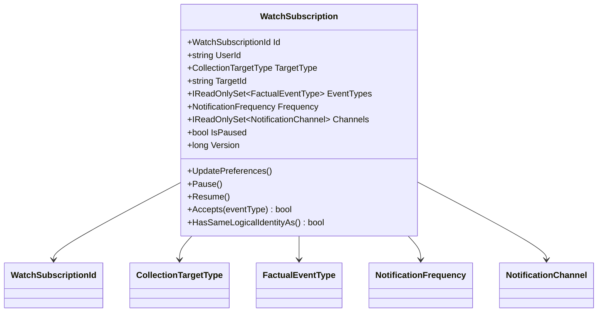
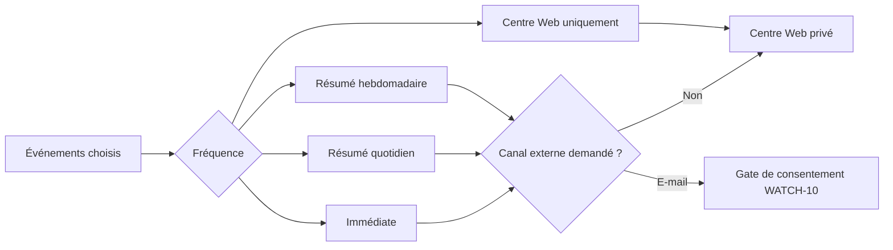
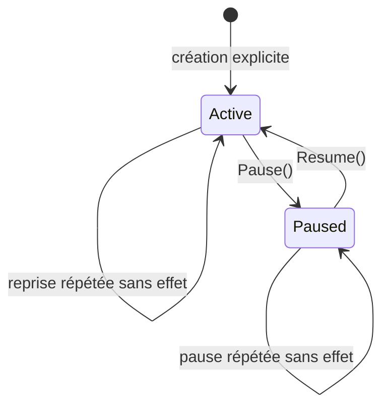
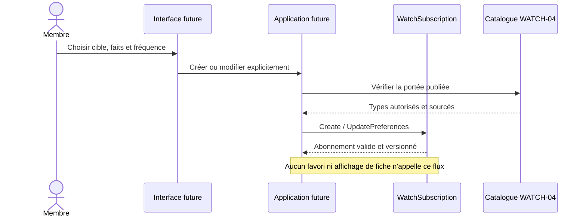

# WATCH-03 — Domaine des surveillances explicites

> Version cible : `5.3.45`
>
> Date : 15 septembre 2026
>
> Portée : domaine pur et tests ; aucune API, persistance, notification ou interface
> n'est ouverte par ce jalon.

## Résultat métier

Une surveillance devient un choix personnel identifiable, modifiable et révocable.
Elle indique sans ambiguïté :

- qui souhaite suivre l'information ;
- le parc ou l'élément de parc concerné ;
- les changements factuels choisis un par un ;
- la fréquence souhaitée ;
- l'éventuel canal externe demandé ;
- si la surveillance est active ou volontairement en pause.

La surveillance n'est jamais déduite d'un favori, d'une envie, d'un projet, d'une
visite ou de l'ouverture d'une fiche. Une cible ne possède qu'un abonnement logique
par membre : les types d'événements sont regroupés dans cet abonnement et peuvent
être remplacés explicitement.

## Séparation des intentions

| Geste | Sens | Peut déclencher une alerte |
|---|---|---:|
| Favori | « J'aime cette cible » | non |
| Envie | « Je souhaite la découvrir » | non |
| Projet | « Je l'envisage concrètement » | non |
| Surveillance | « Informe-moi de ces faits précis » | oui, après les gates de vérification |

`WatchSubscription` réutilise `CollectionTargetType` pour partager un vocabulaire
unique des cibles `Park` et `ParkItem`, sans créer de dépendance vers
`UserCollectionEntry` ni dupliquer ses intentions.

## Invariants

- l'identité logique est `(UserId, TargetType, TargetId)` ;
- au moins un type d'événement explicite est obligatoire ;
- les valeurs d'énumération inconnues sont rejetées avant toute persistance ;
- une attraction ne peut pas demander un événement réservé au parc ;
- un parc peut sélectionner un événement d'attraction : cela exprime explicitement
  l'intérêt pour ce type de changement parmi ses éléments enfants ;
- une sélection `WebOnly` ne peut pas demander d'e-mail ;
- l'absence de canal externe conserve l'usage futur du centre Web privé ;
- demander le canal `Email` exprime une préférence, jamais une preuve de
  consentement : le consentement vérifié reste obligatoire dans `WATCH-10` ;
- pause et reprise sont explicites, idempotentes et ne modifient pas les autres
  préférences ;
- une mise à jour identique ne change ni la version ni l'horodatage ;
- toutes les dates sont UTC, ordonnées et chaque mutation réelle incrémente la
  version optimiste ;
- les ensembles exposés sont immuables, même si l'appelant modifie ses collections
  d'entrée après la création.

## Diagramme de classes



## Portée des événements

Les valeurs numériques sont stables et réparties en familles pour préparer la
persistance et le catalogue versionné de `WATCH-04` :

```text
1..11     faits propres au parc
101..110  faits propres aux éléments de parc
201..204  faits éditoriaux ou corrections
```

| Cible de l'abonnement | Faits parc | Faits éléments | Faits éditoriaux |
|---|---:|---:|---:|
| Parc | oui | oui, pour ses enfants | oui |
| Élément de parc | non | oui | oui |

Cette compatibilité borne la demande du membre. `WATCH-04` ajoutera la définition
versionnée de chaque événement, sa provenance et les règles permettant de relier un
fait publié à la cible exacte ou à son parc parent.

## Fréquence et canaux



Le centre Web reste la destination privée de base. Aucun e-mail n'est envoyé par ce
jalon et aucune préférence de canal ne contournera la vérification d'adresse, la
preuve de consentement ni le désabonnement.

## Cycle de vie



Une mise à jour des événements, de la fréquence ou des canaux ne réactive donc
jamais silencieusement une surveillance en pause.

## Séquence d'exploitation préparée



## Persistance prévue

`WATCH-03` n'ajoute aucune collection MongoDB et ne demande donc aucune migration.
Le jalon d'application persistera `WatchSubscription` dans `watch-subscriptions`
avec :

- un index unique `(UserId, TargetType, TargetId)` ;
- un index de routage par cible et type d'événement ;
- un contrôle de version optimiste ;
- aucune TTL sur un abonnement actif ou en pause ;
- inclusion dans l'export et la suppression de compte de `WATCH-11`.

## Preuves automatisées

Les tests Core vérifient notamment :

- normalisation des identifiants et identité logique ;
- sélection obligatoire et ensembles défensivement immuables ;
- rejet des types, fréquences, canaux et cibles inconnus ;
- compatibilité des familles d'événements avec la cible ;
- centre Web sans canal externe et incompatibilité Web-only/e-mail ;
- remplacement des préférences sans reprise implicite ;
- idempotence des ensembles, de la pause et de la reprise ;
- filtrage des événements non choisis et des abonnements en pause ;
- versions, horodatages UTC et mutations antidatées ;
- identifiants opaques, normalisés et distincts.

## Limites assumées

- aucun abonnement n'est encore persisté ou exposé par HTTP ;
- aucune notification n'est créée ;
- la source, la vérification, la révision et la rétractation d'un fait appartiennent
  à `WATCH-04` ;
- la résolution automatique, l'outbox et la déduplication appartiennent à
  `WATCH-05` ;
- l'e-mail reste impossible sans le consentement explicite de `WATCH-10`.
