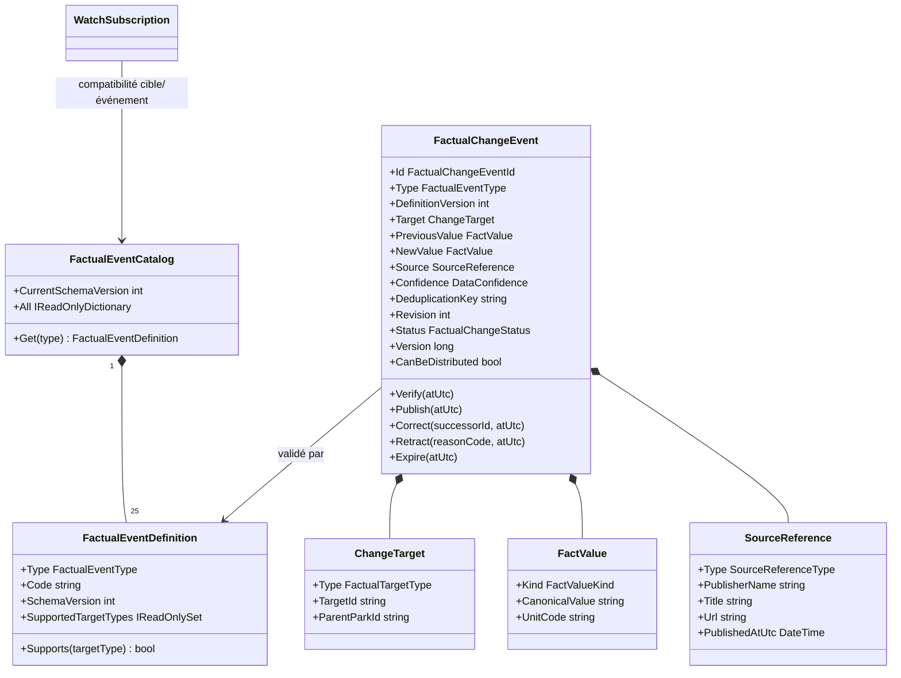
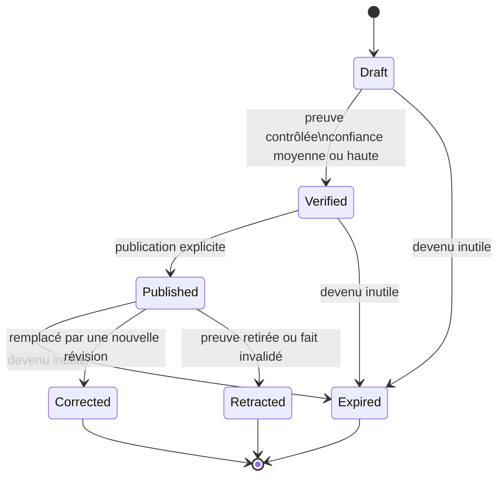
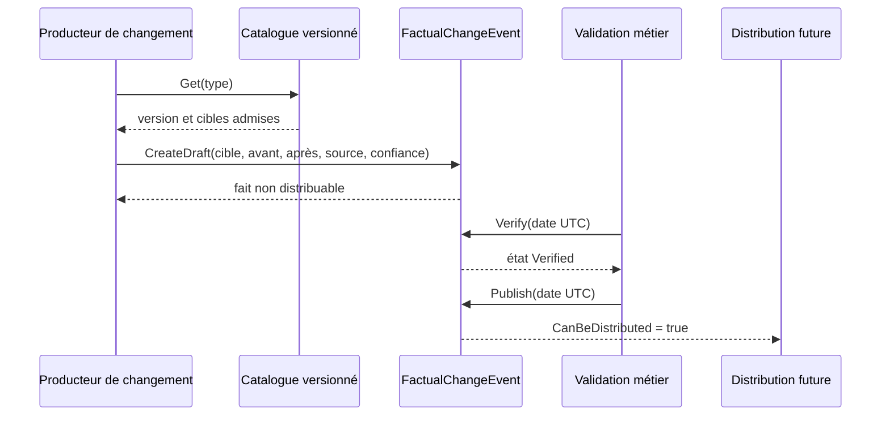

# WATCH-04 — Catalogue des faits surveillables et provenance

## Résultat métier

Ce jalon définit ce que le produit a le droit d'appeler un changement factuel. Un
favori ou un abonnement ne déclenche donc pas une alerte à partir d'un texte libre :
il attend un fait typé, sourcé, daté et validé.

Les 25 événements prévus par la roadmap sont inscrits dans un catalogue versionné.
Le catalogue précise si chaque événement concerne un parc, un élément de parc ou
les deux. Cette même règle alimente les abonnements et le contrôle des faits afin
d'éviter deux interprétations concurrentes.

Un fait conserve :

- sa cible et, pour un élément, son parc parent ;
- une valeur structurée avant et après le changement ;
- la publication qui sert de preuve et son type ;
- un niveau de confiance ;
- les dates d'occurrence, de vérification et de publication ;
- une clé de déduplication et une révision ;
- son état, sa version optimiste et la référence d'une éventuelle correction.

## Frontières d'architecture

Tout le comportement est placé dans `AmusementPark.Core` : il s'agit d'invariants
métier purs, sans MongoDB, contrôleur, transport HTTP, traduction ni envoi d'e-mail.
Les couches Application et Infrastructure pourront persister et orchestrer ces
objets lors des prochains jalons sans réécrire leurs règles.

Chaque type possède son propre fichier. Les valeurs exposées par les définitions et
les préférences sont gelées : un appelant ne peut pas modifier le catalogue ou un
ensemble après création.

## Modèle de classes

## Cycle de vie

Seul `Published` est distribuable. `Draft` et `Verified` ne peuvent jamais alimenter
une alerte. Une correction pointe vers le nouvel événement au lieu de modifier
silencieusement l'ancien ; une rétractation exige un code de raison stable.

## Séquence de validation d'un fait

## Invariants couverts par les tests

- chaque valeur d'énumération possède exactement une définition et un code unique ;
- les événements de parc et d'élément ne peuvent pas changer de périmètre ;
- une valeur est canonique, culture-indépendante et cohérente avec son type ;
- une source utilise une URL HTTP(S) absolue et une date UTC ;
- une absence de changement, une chronologie impossible ou une révision invalide est rejetée ;
- une preuve à faible confiance ne peut pas être vérifiée ;
- les transitions rejouées à l'identique restent idempotentes ;
- une correction référence son successeur et une rétractation conserve sa raison ;
- seul un fait publié reste distribuable.

## Persistance et migration

Ce jalon ne crée encore aucune collection MongoDB ni route publique. Il ne nécessite
donc aucune migration de données en production. `WATCH-05` ajoutera la persistance,
le calcul de différences et l'outbox durable avec déduplication à partir de ce modèle
unique ; aucun second système transitoire n'est prévu.
