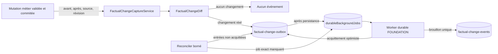
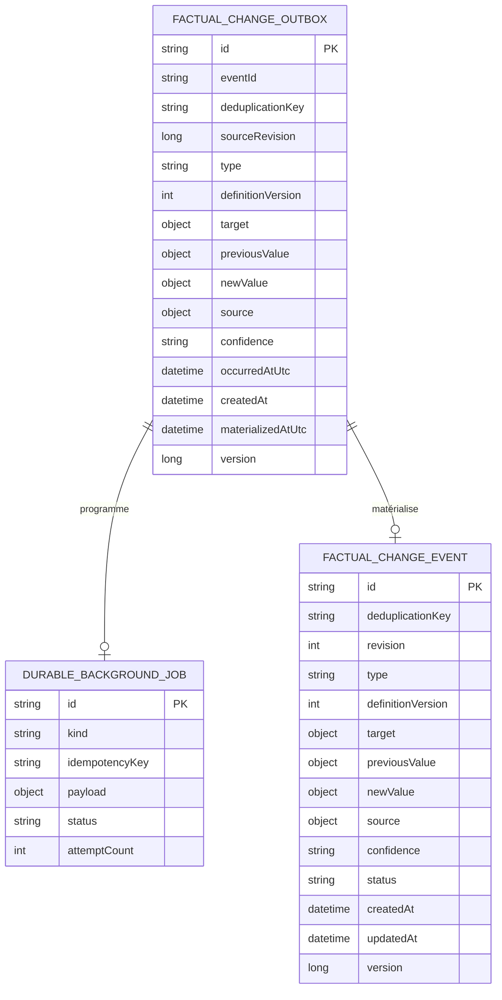
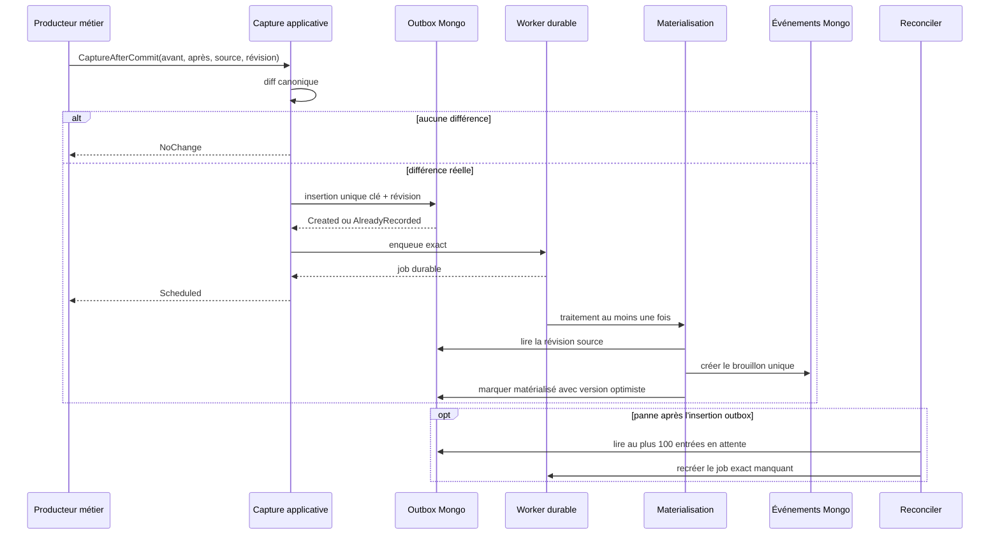

# WATCH-05 — Diff factuel, outbox durable et déduplication

## Résultat métier

Une modification validée peut désormais devenir un fait suivi sans dépendre de la
disponibilité immédiate du worker. Le système compare des valeurs structurées,
ignore les sauvegardes sans changement réel et conserve la révision source avant de
programmer le traitement. Une même clé métier et une même révision ne peuvent créer
qu'un seul événement logique.

Ce jalon ne notifie encore personne. Il prépare des brouillons factuels fiables pour
la vérification administrative de `WATCH-06`, puis pour le centre Web de `WATCH-07`.

## Architecture retenue

Les responsabilités restent séparées :

- le Core calcule le diff canonique et conserve les invariants du fait ;
- l'Application orchestre la capture après commit, la planification et la
  matérialisation ;
- l'Infrastructure persiste les deux collections Mongo, initialise leurs index et
  exécute le reconciler ;
- la WebAPI et le frontend ne connaissent pas encore ces primitives internes.

## Modèle MongoDB

Index critiques :

- unicité outbox `(deduplicationKey, sourceRevision)` ;
- lecture bornée des entrées sans `materializedAtUtc` ;
- unicité événement `(deduplicationKey, revision)` ;
- lecture des événements par état et par cible ;
- unicité du job exact grâce à une clé SHA-256 stable et bornée.

L'initialiseur crée les nouvelles collections et leurs index au déploiement. Il
n'existe aucune donnée historique équivalente à migrer et aucun ancien mécanisme ne
coexiste avec celui-ci.

## Séquence nominale et reprise

Une panne de planification n'annule donc pas le fait déjà enregistré. Une panne
entre la création de l'événement et l'acquittement est rejouée : l'index unique
retrouve le même événement, puis l'acquittement reprend. Un contenu différent sous
la même clé et la même révision est un conflit explicite et part en dead-letter ; il
n'est jamais écrasé silencieusement.

## Performance et exploitation

- le scan de réparation est limité à 100 entrées par minute ;
- les lectures utilisent un index partiel réservé aux entrées en attente ;
- le traitement est léger et limité à deux exécutions concurrentes ;
- les tentatives sont bornées à cinq avec backoff jusqu'à dix minutes ;
- les conflits irréparables utilisent la dead-letter administrative déjà fournie
  par FOUNDATION ;
- aucun broker externe, polling agressif ou charge frontend n'est ajouté.

## Preuves automatisées

Les tests couvrent :

- l'équivalence canonique et les créations/suppressions de valeur ;
- l'absence totale d'écriture quand le diff est vide ;
- la conservation de l'outbox quand la mise en file échoue ;
- la clé de job déterministe et bornée même avec une clé métier maximale ;
- la poursuite du reconciler lorsqu'une entrée échoue ;
- la matérialisation d'un seul brouillon et le rejeu sans doublon ;
- la dead-letter en cas de collision sémantique ;
- le round-trip Mongo des valeurs, sources et versions ;
- la présence des index d'unicité et de reprise.
