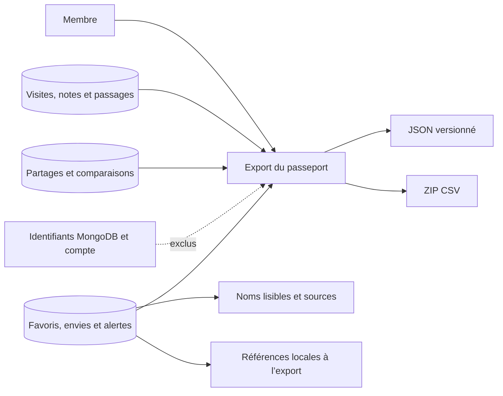
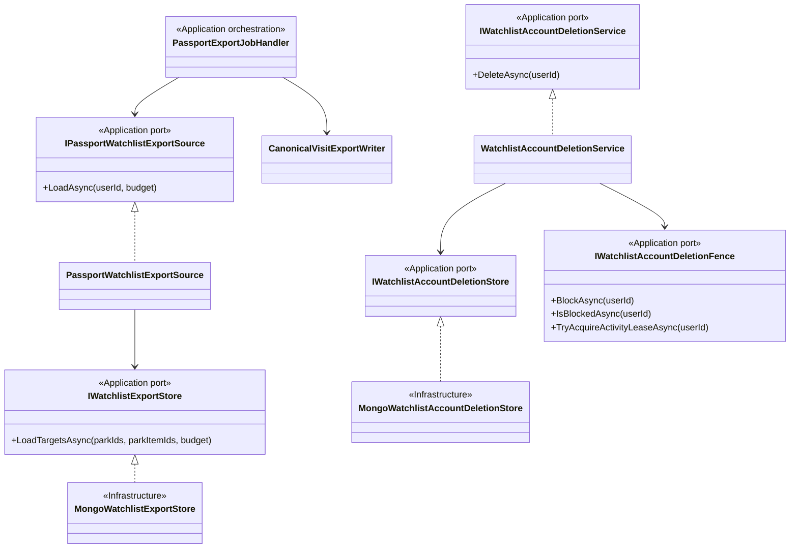
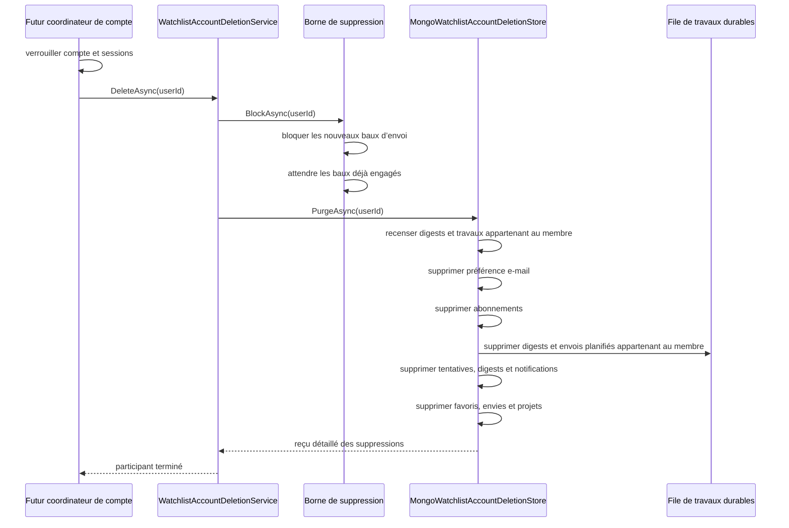
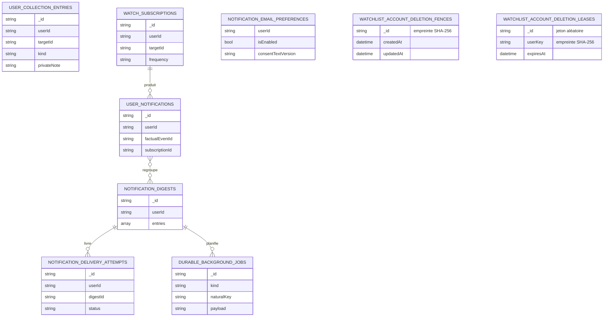

# WATCH-11 — Cycle de vie des favoris, envies et alertes

## Résultat métier

Le membre retrouve désormais dans l’export existant de son passeport l’ensemble de
ses favoris, envies, projets de visite, surveillances et alertes. L’export conserve
les informations utiles — noms des parcs et attractions, notes privées, dates
souhaitées, fréquence, sources factuelles, consentement e-mail et état des
livraisons — sans exposer les identifiants MongoDB, ceux du compte ou ceux des
cibles.

Le même sous-système sait aussi effacer toutes ces données à la demande du futur
coordinateur global de suppression de compte. L’ordre est volontairement
protecteur : il coupe d’abord tout nouvel e-mail et toute surveillance, retire les
travaux planifiés qui appartiennent au membre, puis purge les données historiques.
Une reprise est idempotente et retourne simplement zéro quand tout a déjà disparu.

Le projet ne propose pas encore d’action globale de suppression du compte.
`IWatchlistAccountDeletionService` reste donc un port Application interne, comme le
participant de suppression des partages. Le futur coordinateur devra verrouiller le
compte, appeler les participants passeport, partages et alertes, révoquer les
sessions, puis supprimer l’identité. Cette frontière empêche de présenter une
suppression partielle comme une suppression complète.

## Export centralisé

Le format canonique du passeport passe en schéma `4`. Il reste l’unique export
personnel : WATCH-11 l’enrichit au lieu de créer un second téléchargement.

Le JSON ajoute les sections `collections`, `watchSubscriptions`, `notifications`,
`notificationDigests`, `notificationEmailPreference` et
`notificationDeliveryAttempts`. Le ZIP ajoute sept tables portant les mêmes
responsabilités, dont une table distincte pour les entrées de digest. Les liens
entre tables utilisent des références locales déterministes telles que
`collection-0001`, `watch-0001` ou `digest-0001`.

Les parcs et attractions sont résolus par une projection MongoDB légère dédiée à
l’export. Elle ne charge que le nom, la visibilité et les statuts nécessaires au
domaine, sans descriptions, images ni détails techniques. Chaque projection
consomme le budget mémoire partagé avant son mapping. Une cible qui n’est plus
publiquement disponible reste exportable sous un libellé neutre, sans que son
identifiant technique ne serve de nom de secours. Les notifications exportent la
preuve factuelle disponible : valeur précédente, nouvelle valeur, éditeur, titre,
URL, dates et statut de vérification. Les cibles et les preuves consomment donc le
même budget borné que les autres documents de l’export : aucune lecture annexe ne
peut contourner la limite avant la génération. Le JSON et la table CSV des
notifications conservent tous deux le statut, la confiance, les dates de
vérification, publication ou terminaison et le motif de correction ou de
rétractation.

## Frontières d’architecture

- Core reste propriétaire des intentions, abonnements, consentements, digests et
  états de livraison.
- Application orchestre l’enrichissement des cibles, le budget de taille, le format
  canonique et l’ordre de suppression.
- Infrastructure charge et efface les collections MongoDB sans décider des règles
  métier.
- WebAPI conserve les routes d’export existantes ; aucun contrat parallèle ni
  endpoint de suppression partielle n’est ajouté.

## Séquence de suppression

La borne est posée avant la première suppression. Les écritures de notifications,
de digests, de travaux d’e-mail et de tentatives la contrôlent avant et après leur
mutation. Si la suppression démarre pendant une écriture déjà louée, cette
écriture est compensée immédiatement. La persistance d’un digest et l’envoi SMTP
acquièrent en plus un bail d’activité borné : la suppression attend une mutation ou
un envoi déjà engagé, ou empêche son démarrage si sa borne est déjà posée. Même si
le worker est annulé après l’acceptation de l’écriture MongoDB, le bail est libéré
indépendamment de son jeton puis la purge reprend et efface le digest. Les travaux
compensés sont supprimés physiquement, charge utile comprise, et restent
strictement reliés au membre ou à l’un de ses digests.

## Collections MongoDB concernées

Aucune migration MongoDB manuelle n’est requise. L’initialiseur crée les collections
de bornes et de baux ainsi que leurs index de recherche et de rétention. Aucune ne
conserve l’identifiant brut du membre. Les baux sont retirés à la fin de la mutation
protégée ou automatiquement à leur expiration. Les autres collections et index
restent inchangés.

## Preuves automatisées

- le format JSON et le ZIP CSV contiennent les intentions privées, les noms lisibles
  et la preuve de consentement ;
- les deux formats refusent les identifiants de collection, d’abonnement et de
  compte persistés ;
- la source d’export résout les noms par projections légères, débite ces projections
  du budget commun et conserve la note privée ;
- le service de suppression normalise l’identité et restitue un reçu complet ;
- le service pose la borne avant la purge, les workers cessent leur travail pour
  un membre supprimé et compensent une écriture commencée pendant la course ;
- la borne persistée est stable sans exposer l’identifiant du membre ;
- le bail d’activité ferme les courses autour de l’écriture d’un digest et de
  l’appel SMTP, y compris quand le jeton du worker est annulé ;
- un travail compensé est supprimé avec sa charge utile, pas seulement annulé ;
- les cibles et les preuves factuelles consomment le même budget de source que le
  reste de l’export ;
- la sélection des travaux durables accepte seulement un digest appartenant au
  membre et rejette une autre nature de travail ou une charge illisible ;
- les contrôles d’architecture continuent d’imposer un fichier par classe et les
  dépendances par ports.
