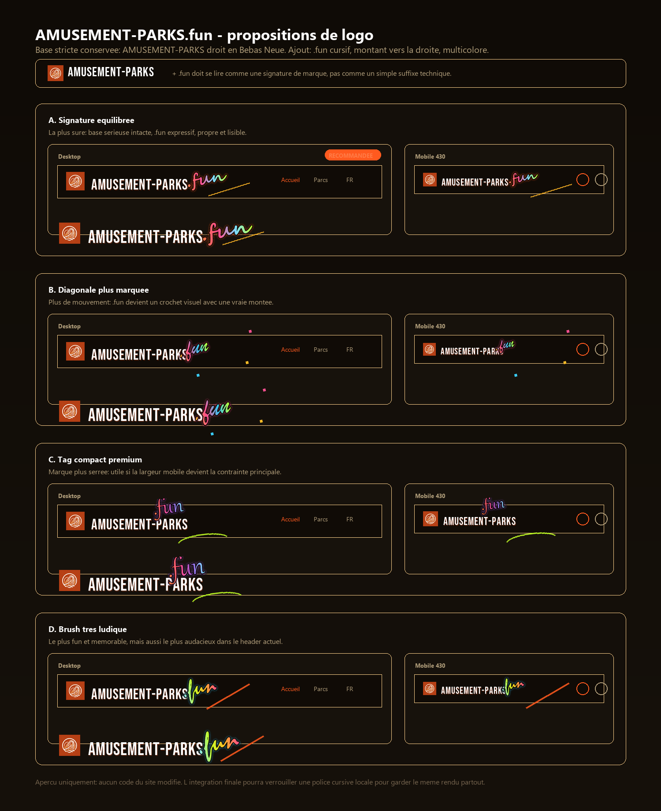

# AMUSEMENT-PARKS.fun wordmark

## Decision

The public brand wordmark is now `AMUSEMENT-PARKS.fun`.

- `AMUSEMENT-PARKS` keeps the existing straight display style to preserve the serious, structured side of the project.
- `.fun` is treated as a small handwritten signature, rising to the right and using the existing orange, rose, sky and lime accents.
- The dot is aligned with the base wordmark baseline, with a small visual gap before the cursive `fun`.
- The final implementation is text plus SCSS, not a raster logo, so it remains responsive and accessible.

## Proposal Board

The selected direction is variant A, with a slightly stronger multicolor treatment for `.fun`.

