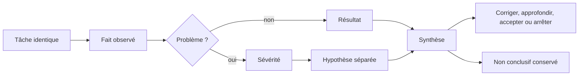
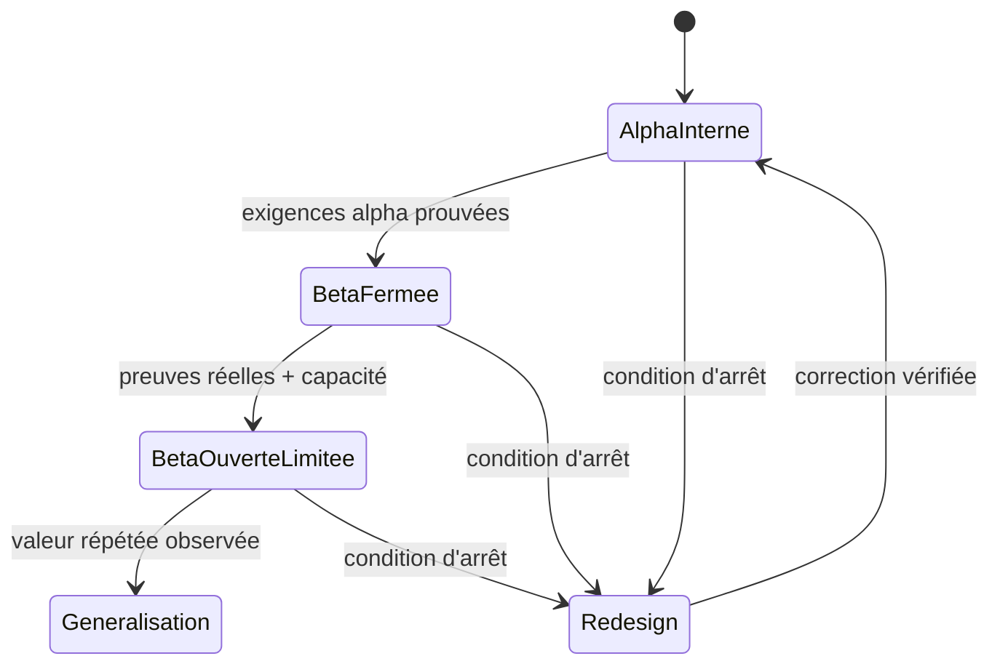
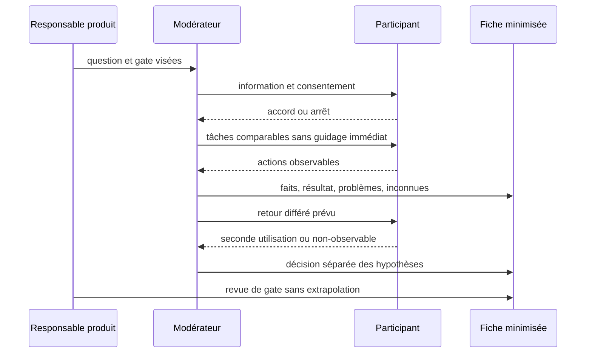

# Protocole commun de recherche produit

Ce dossier est l'autorité de `QUAL-10` pour les programmes `RANK`, `PASS`,
`SHARE`, `FIT`, `WATCH`, `TRIP`, `HIST` et `LIVE`. Il rend les sessions
comparables sans prétendre que des observations terrain ont déjà eu lieu.

Le [catalogue](catalog.json) porte les profils, les tâches communes, les contextes
propres à chaque produit, les preuves attendues et les quatre gates de bêta. La
[fiche de session](session-result-template.md) est le seul format de synthèse à
copier. Le protocole détaillé du Passeport reste une extension de `PASS` et non une
seconde définition des statuts ou des preuves.

## 1. Ce que signifie l'état actuel

- `protocolStatus: ready` : une session peut être organisée avec des consignes et
  des critères stables ;
- `fieldEvidenceStatus: pending` : aucune preuve d'usage réel n'est revendiquée ;
- `blocksDelivery: false` : l'absence temporaire de cohorte ne suspend pas les
  travaux techniques et métier dont les propres garanties sont vérifiées ;
- `allowGeneralizationWithoutEvidence: false` : un gate terrain ou une valeur
  répétée ne peut jamais être déclaré acquis à partir de la documentation seule.

Cette séparation évite deux erreurs opposées : bloquer indéfiniment la roadmap en
attendant une communauté, ou transformer un protocole prêt en faux résultat.

## 2. Préparer une session

1. Choisir une question métier et un seul programme dans le catalogue.
2. Recruter selon les profils canoniques du programme, sans présenter un petit
   groupe comme représentatif de tout le public.
3. Préparer un jeu de données réversible, sans donnée privée réelle qui ne soit pas
   nécessaire à la tâche.
4. Expliquer la finalité, les données conservées, l'usage éventuel d'une citation
   et le droit d'arrêter ; obtenir le consentement avant d'observer.
5. Attribuer un code de session local qui ne contient ni nom, ni e-mail, ni ID de
   compte, visite, parc, attraction ou partage.
6. Conserver le même ordre de tâches communes pour rendre les sessions
   comparables ; seul le `taskContext` du programme change.

Un enregistrement audio ou vidéo n'est jamais le comportement par défaut. S'il est
réellement nécessaire, il exige un consentement distinct, une rétention décidée
avant la session et un emplacement d'accès restreint. Le dépôt ne reçoit ni
enregistrement, ni export membre, ni capture contenant une donnée privée.

## 3. Conduire les huit tâches

Le modérateur suit `commonTasks` dans l'ordre du catalogue et injecte le contexte
du programme :

1. consentement ;
2. premier succès métier sans indiquer le chemin ;
3. distinction des concepts centraux ;
4. compréhension des libellés déterminants ;
5. portée de l'export et de la suppression, ou constat explicite d'absence de
   donnée personnelle ;
6. interprétation d'une donnée inconnue, ancienne ou insuffisante ;
7. scénario principal au clavier ou avec la technologie habituelle, puis sur un
   appareil ou réseau modeste ;
8. retour différé sans rappel guidé.

Le modérateur n'aide pas immédiatement. Lorsqu'une aide devient nécessaire, il
note d'abord le blocage observable, puis utilise l'indice minimal et classe le
résultat `assisted`. Les quatre résultats autorisés sont :

- `unassisted` : objectif atteint sans indice ;
- `assisted` : objectif atteint après au moins un indice ;
- `failed` : objectif non atteint ou résultat incorrect ;
- `not-observable` : la preuve exige un retour différé ou un état indisponible.

## 4. Séparer les faits des décisions



Une citation courte n'est conservée que si elle est autorisée et utile pour
comprendre le fait. Un avis isolé ne devient pas une vérité produit. La fréquence
ne se déduit que de plusieurs sessions comparables ; la sévérité dépend de
l'impact, notamment confidentialité, ownership, perte de données, accessibilité ou
compréhension trompeuse.

## 5. Passer une gate de bêta



Le passage d'une gate exige les seules exigences de cette phase, leurs preuves
observables et l'absence de condition d'arrêt ouverte. Les
`generalizationEvidence` propres au programme ne deviennent obligatoires que pour
proposer `general-availability` : l'alpha et les bêta servent précisément à rendre
leur collecte possible. Une métrique quantitative, un dashboard `Candidate` ou le
simple succès d'une CI ne remplace jamais les observations consenties.
Inversement, une observation terrain en attente n'empêche pas de livrer un jalon
technique ou métier indépendant.

## 6. Conditions d'arrêt communes

Réduire, arrêter ou redessiner la phase si :

- la valeur reste incomprise après des tests et corrections répétés ;
- la deuxième utilisation n'existe pas malgré une première activation réussie ;
- les données nécessaires ne peuvent pas être obtenues honnêtement ;
- la modération ou le support dépassent les moyens disponibles ;
- la charge, le coût ou les performances sont disproportionnés pour le VPS ;
- la confidentialité exige plus de données ou de complexité que la valeur ne le
  justifie ;
- une condition d'arrêt propre au programme est observée.

Le constat est consigné même lorsqu'il suspend une généralisation. Il n'autorise
pas à effacer les résultats défavorables ni à modifier rétroactivement l'objectif
d'une session.

## 7. Cycle de preuve



## 8. Validation automatisée

Depuis `FRONT/AmusementPark` :

```bash
npm run research:readiness:test
npm run research:readiness
```

La CI bloque un programme absent, un profil inconnu, un contexte de tâche vide, un
document extérieur au périmètre, une gate incomplète ou une politique qui
autoriserait la généralisation sans preuve terrain.
